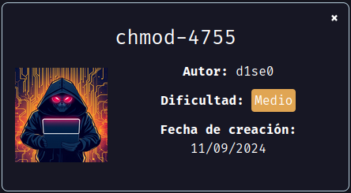
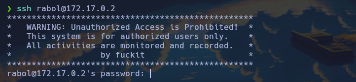

Maquina "chmod-4755" de [DockerLabs](https://dockerlabs.es)

Autor: [d1se0](https://github.com/D1se0)

Dificultad: Medio



# RECONOCIMIENTO

Comenzamos con un escaneo de nmap:

```css
nmap -p- -n -vvv -sSVC -Pn --open --min-rate 5000 <ip> -oN escaneo.txt
```

```ruby
# Nmap 7.94SVN scan initiated Wed Sep 11 16:08:42 2024 as: nmap -p- -n -vvv -sSVC -Pn --open --min-rate 5000 -oN escaneo.txt 172.17.0.2
Nmap scan report for 172.17.0.2
Host is up, received arp-response (0.000015s latency).
Scanned at 2024-09-11 16:08:43 -03 for 18s
Not shown: 65532 closed tcp ports (reset)
PORT    STATE SERVICE     REASON         VERSION
22/tcp  open  ssh         syn-ack ttl 64 OpenSSH 9.6p1 Ubuntu 3ubuntu13.5 (Ubuntu Linux; protocol 2.0)
| ssh-hostkey: 
|   256 a8:62:07:af:8e:77:13:6d:25:0a:2f:43:63:de:38:38 (ECDSA)
| ecdsa-sha2-nistp256 AAAAE2VjZHNhLXNoYTItbmlzdHAyNTYAAAAIbmlzdHAyNTYAAABBBPvlsYraBYgqzElhqzR/6GlZ0gAbBuy3nUrH0u8O4G68PExkaWPSO8ATEeFqIWAZoRqTyaMReBgWj6VP10OYYog=
|   256 93:93:a8:35:0e:fa:3e:05:04:27:70:2e:fc:22:e8:99 (ED25519)
|_ssh-ed25519 AAAAC3NzaC1lZDI1NTE5AAAAIKeVGLX15qhLLEvxDX7dqYceT/ZVU65ATiVqJClh2P2k
139/tcp open  netbios-ssn syn-ack ttl 64 Samba smbd 4.6.2
445/tcp open  netbios-ssn syn-ack ttl 64 Samba smbd 4.6.2
MAC Address: 02:42:AC:11:00:02 (Unknown)
Service Info: OS: Linux; CPE: cpe:/o:linux:linux_kernel

Host script results:
| p2p-conficker: 
|   Checking for Conficker.C or higher...
|   Check 1 (port 21783/tcp): CLEAN (Couldn't connect)
|   Check 2 (port 23866/tcp): CLEAN (Couldn't connect)
|   Check 3 (port 58197/udp): CLEAN (Failed to receive data)
|   Check 4 (port 64770/udp): CLEAN (Timeout)
|_  0/4 checks are positive: Host is CLEAN or ports are blocked
| smb2-security-mode: 
|   3:1:1: 
|_    Message signing enabled but not required
|_clock-skew: 0s
| smb2-time: 
|   date: 2024-09-11T19:08:57
|_  start_date: N/A

Read data files from: /usr/bin/../share/nmap
Service detection performed. Please report any incorrect results at https://nmap.org/submit/ .
# Nmap done at Wed Sep 11 16:09:01 2024 -- 1 IP address (1 host up) scanned in 19.06 seconds
```

Los puertos abiertos son:

`22: OpenSSH 9.6p1`

`139 y 445: Samba smbd 4.6.2` 


Como no está el puerto 80, empezaremos con el puerto de samba. Para esto podemos usar `smbmap` y ver que hay en el recurso compartido:

```css
smbmap -u "" -p "" -d workgroup -H <ip>
```

```css
[+] IP: 172.17.0.2:445	Name: 172.17.0.2                                        
[-] Working on it...
                                
	Disk                                                  	Permissions	Comment
	----                                                  	-----------	-------
	print$                                            	NO ACCESS	Printer Drivers
	share_secret_only                                 	NO ACCESS	
	IPC$                                              	NO ACCESS	IPC Service (031287d3efae server (Samba, Ubuntu))

```

no tenemos acceso a "share_secret_only", por lo que ahora usaremos `enum4linux` para ver si encontramos algún usuario:

```css
enum4linux <ip>
```

```css
Starting enum4linux v0.9.1 ( http://labs.portcullis.co.uk/application/enum4linux/ ) on Wed Sep 11 16:16:14 2024

 =========================================( Target Information )=========================================

Target ........... 172.17.0.2
RID Range ........ 500-550,1000-1050
Username ......... ''
Password ......... ''
Known Usernames .. administrator, guest, krbtgt, domain admins, root, bin, none


 =============================( Enumerating Workgroup/Domain on 172.17.0.2 )=============================


[E] Can't find workgroup/domain


 =================================( Nbtstat Information for 172.17.0.2 )=================================

Looking up status of 172.17.0.2
No reply from 172.17.0.2

 ====================================( Session Check on 172.17.0.2 )====================================


[+] Server 172.17.0.2 allows sessions using username '', password ''


 =================================( Getting domain SID for 172.17.0.2 )=================================

Domain Name: WORKGROUP
Domain Sid: (NULL SID)

[+] Can't determine if host is part of domain or part of a workgroup


 ====================================( OS information on 172.17.0.2 )====================================


[E] Can't get OS info with smbclient


[+] Got OS info for 172.17.0.2 from srvinfo: 
	031287D3EFAE   Wk Sv PrQ Unx NT SNT 031287d3efae server (Samba, Ubuntu)
	platform_id     :	500
	os version      :	6.1
	server type     :	0x809a03


 ========================================( Users on 172.17.0.2 )========================================

index: 0x1 RID: 0x3e8 acb: 0x00000010 Account: smbuser	Name: smbuser	Desc: 

user:[smbuser] rid:[0x3e8]

 ==================================( Share Enumeration on 172.17.0.2 )==================================

smbXcli_negprot_smb1_done: No compatible protocol selected by server.

	Sharename       Type      Comment
	---------       ----      -------
	print$          Disk      Printer Drivers
	share_secret_only Disk      
	IPC$            IPC       IPC Service (031287d3efae server (Samba, Ubuntu))
Reconnecting with SMB1 for workgroup listing.
Protocol negotiation to server 172.17.0.2 (for a protocol between LANMAN1 and NT1) failed: NT_STATUS_INVALID_NETWORK_RESPONSE
Unable to connect with SMB1 -- no workgroup available

[+] Attempting to map shares on 172.17.0.2

//172.17.0.2/print$	Mapping: DENIED Listing: N/A Writing: N/A
//172.17.0.2/share_secret_only	Mapping: DENIED Listing: N/A Writing: N/A

[E] Can't understand response:

NT_STATUS_CONNECTION_REFUSED listing \*
//172.17.0.2/IPC$	Mapping: N/A Listing: N/A Writing: N/A

 =============================( Password Policy Information for 172.17.0.2 )=============================


[+] Attaching to 172.17.0.2 using a NULL share

[+] Trying protocol 139/SMB...

[+] Found domain(s):

	[+] 031287D3EFAE
	[+] Builtin

[+] Password Info for Domain: 031287D3EFAE

	[+] Minimum password length: 5
	[+] Password history length: None
	[+] Maximum password age: 37 days 6 hours 21 minutes 
	[+] Password Complexity Flags: 000000

		[+] Domain Refuse Password Change: 0
		[+] Domain Password Store Cleartext: 0
		[+] Domain Password Lockout Admins: 0
		[+] Domain Password No Clear Change: 0
		[+] Domain Password No Anon Change: 0
		[+] Domain Password Complex: 0

	[+] Minimum password age: None
	[+] Reset Account Lockout Counter: 30 minutes 
	[+] Locked Account Duration: 30 minutes 
	[+] Account Lockout Threshold: None
	[+] Forced Log off Time: 37 days 6 hours 21 minutes 


[+] Retieved partial password policy with rpcclient:


Password Complexity: Disabled
Minimum Password Length: 5


 ========================================( Groups on 172.17.0.2 )========================================


[+] Getting builtin groups:


[+]  Getting builtin group memberships:


[+]  Getting local groups:


[+]  Getting local group memberships:


[+]  Getting domain groups:


[+]  Getting domain group memberships:


 ===================( Users on 172.17.0.2 via RID cycling (RIDS: 500-550,1000-1050) )===================


[I] Found new SID: 
S-1-22-1

[I] Found new SID: 
S-1-5-32

[I] Found new SID: 
S-1-5-32

[I] Found new SID: 
S-1-5-32

[I] Found new SID: 
S-1-5-32

[+] Enumerating users using SID S-1-5-21-2509376286-1411130066-2109750586 and logon username '', password ''

S-1-5-21-2509376286-1411130066-2109750586-501 031287D3EFAE\nobody (Local User)
S-1-5-21-2509376286-1411130066-2109750586-513 031287D3EFAE\None (Domain Group)
S-1-5-21-2509376286-1411130066-2109750586-1000 031287D3EFAE\smbuser (Local User)

[+] Enumerating users using SID S-1-22-1 and logon username '', password ''

S-1-22-1-1000 Unix User\smbuser (Local User)
S-1-22-1-1001 Unix User\rabol (Local User)

[+] Enumerating users using SID S-1-5-32 and logon username '', password ''

S-1-5-32-544 BUILTIN\Administrators (Local Group)
S-1-5-32-545 BUILTIN\Users (Local Group)
S-1-5-32-546 BUILTIN\Guests (Local Group)
S-1-5-32-547 BUILTIN\Power Users (Local Group)
S-1-5-32-548 BUILTIN\Account Operators (Local Group)
S-1-5-32-549 BUILTIN\Server Operators (Local Group)
S-1-5-32-550 BUILTIN\Print Operators (Local Group)

 ================================( Getting printer info for 172.17.0.2 )================================

No printers returned.


enum4linux complete on Wed Sep 11 16:17:04 2024
```

Como vemos, tenemos dos usuarios:

```css
[+] Enumerating users using SID S-1-22-1 and logon username '', password ''

S-1-22-1-1000 Unix User\smbuser (Local User)
S-1-22-1-1001 Unix User\rabol (Local User)
```

el cual "smbuser" probablemente sea del smb y "rabol" de ssh. Si probamos en conectarnos por ssh veremos este mensaje:



WRITEUP EN PROGRESO :)