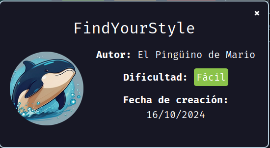
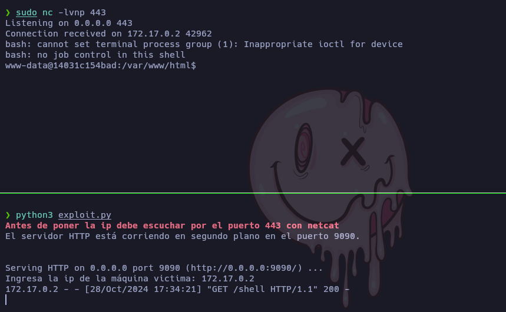
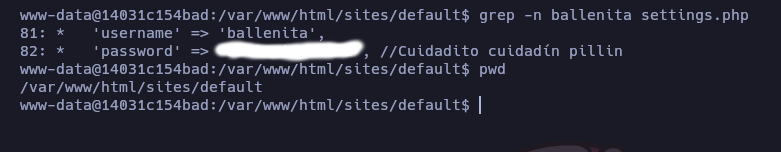
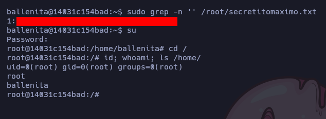

Máquina "FindYourStyle" de [DockerLabs](https://dockerlabs.es).

Autor: [El Pingüino de Mario](https://www.youtube.com/channel/UCGLfzfKRUsV6BzkrF1kJGsg)

Dificultad: Fácil



# RECONOCIMIENTO

Comenzamos con un escaneo de `nmap`:

```css
nmap -sSVC -p- -Pn --open --min-rate 5000 -n -vvv 172.17.0.2 -oN escaneo.txt
```

```ruby
# Nmap 7.95 scan initiated Mon Oct 28 17:26:10 2024 as: nmap -sSVC -p- -Pn --open --min-rate 5000 -n -vvv -oN escaneo.txt 172.17.0.2
Nmap scan report for 172.17.0.2
Host is up, received arp-response (0.000011s latency).
Scanned at 2024-10-28 17:26:11 -03 for 12s
Not shown: 65534 closed tcp ports (reset)
PORT   STATE SERVICE REASON         VERSION
80/tcp open  http    syn-ack ttl 64 Apache httpd 2.4.25 ((Debian))
|_http-title: Welcome to Find your own Style | Find your own Style
| http-methods: 
|_  Supported Methods: GET POST HEAD OPTIONS
|_http-favicon: Unknown favicon MD5: CF2445DCB53A031C02F9B57E2199BC03
|_http-generator: Drupal 8 (https://www.drupal.org)
|_http-server-header: Apache/2.4.25 (Debian)
| http-robots.txt: 22 disallowed entries 
| /core/ /profiles/ /README.txt /web.config /admin/ 
| /comment/reply/ /filter/tips/ /node/add/ /search/ /user/register/ 
| /user/password/ /user/login/ /user/logout/ /index.php/admin/ 
| /index.php/comment/reply/ /index.php/filter/tips/ /index.php/node/add/ 
| /index.php/search/ /index.php/user/password/ /index.php/user/register/ 
|_/index.php/user/login/ /index.php/user/logout/
MAC Address: 02:42:AC:11:00:02 (Unknown)

Read data files from: /usr/bin/../share/nmap
Service detection performed. Please report any incorrect results at https://nmap.org/submit/ .
# Nmap done at Mon Oct 28 17:26:23 2024 -- 1 IP address (1 host up) scanned in 12.70 seconds
```

El único puerto abierto es el 80 y corre `Apache httpd 2.4.25`, y por lo que se ve estamos frente a un `Drupal 8` en la web.

# INTRUSIÓN

Si buscamos algún exploit ejecutando `searchsploit drupal 8.0`, veremos algunos que dicen de un RCE y un poc, ahora mismo no usaremos ninguno de esos (aunque se puede ya que funcionan), si no uno que creé yo que hace exactamente lo mismo, solo que en vez de ejecutar comandos nos envía una reverse shell. [Exploit](https://github.com/Maciferna/DockerLabs/blob/main/maquina-findyourstyle/scripts/exploit.py) 

Para hacerlo simplemente debemos seguir estos pasos.

Primero nos ponemos en escucha por el puerto 443 usando netcat:

```css
sudo nc -lvnp 443
```

luego de eso ejecutamos el exploit con `python3 exploit.py`, este nos pedirá una ip y al pasarle la de la víctima subirá una reverse shell que nos llegará directamente:



luego presionamos "CTRL+C" en el exploit y ya estaremos dentro.

# ESCALADA DE PRIVILEGIOS

### www-data

Antes que nada realizamos un tratamiento de la tty. [¿Como Hacerlo?](https://github.com/Maciferna/DockerLabs/blob/main/tratamientoTTY.md)

Ahora que estamos totalmente cómodos, podemos continuar. Luego de revisar los usuarios, veo que tenemos los siguientes:

​	• Ballenita

También luego de revisar los archivos de configuración de drupal, encuentro lo siguiente:



Por lo que solo escalamos ejecutando `su ballenita` y poniendo su contraseña.


### Ballenita

Siendo ballenita, al ejecutar `sudo -l` veo que se puede ejecutar como root los binarios `ls` y `grep`. Luego de listar el directorio "/root/" veo un archivo llamado "secretitomaximo.txt", por lo que para leerlo solo ejecutamos lo siguiente:

```css
sudo grep -n '' /root/secretitomaximo.txt
```

y obtendremos la contraseña.

### Root



Gracias por leer...